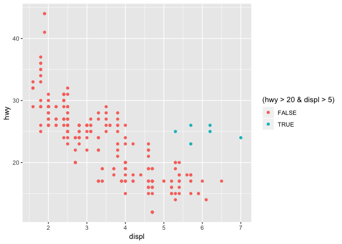
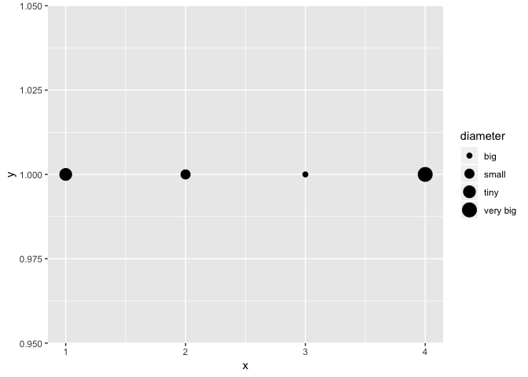
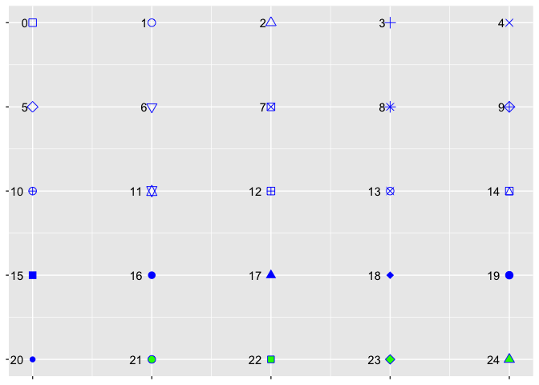
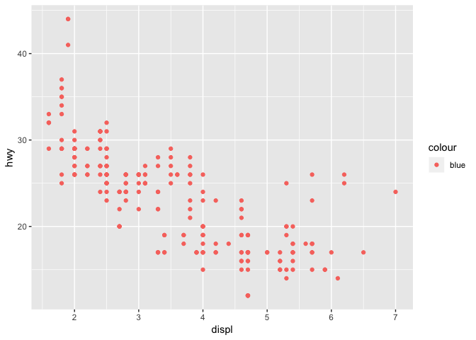

Data visualisation using ggplot2
================
Taavi Päll
2018-09-25

Here we get started with R from the standpoint of visualisation.

Sources
-------

-   This tutorial is heavily based on "Data visualisation with ggplot2" chapter in [R4DS](http://r4ds.had.co.nz/data-visualisation.html) by G. Grolemund and H. Wickham.
-   [lectures/graafilised-lahendused](https://rstats-tartu.github.io/lectures/graafilised-lahendused.html) and [learn-r/ggplot2](https://tpall.github.io/learn-r/#ggplot2) by Ülo Maiväli and Taavi Päll

ggplot2
-------

**ggplot2** is an R package for producing statistical graphics based on the grammar of graphics (hence the gg!).

Let's start by loading tidyverse (meta) library which provides us with set of necessary packages to start with data analysis and visualisations. Importantly, also **ggplot2** library is loaded.

``` r
library(tidyverse)
```

    ## ── Attaching packages ────────────────────────────────── tidyverse 1.2.1 ──

    ## ✔ ggplot2 3.0.0     ✔ purrr   0.2.5
    ## ✔ tibble  1.4.2     ✔ dplyr   0.7.6
    ## ✔ tidyr   0.8.1     ✔ stringr 1.3.1
    ## ✔ readr   1.1.1     ✔ forcats 0.3.0

    ## ── Conflicts ───────────────────────────────────── tidyverse_conflicts() ──
    ## ✖ dplyr::filter() masks stats::filter()
    ## ✖ dplyr::lag()    masks stats::lag()

As you can see, running this line of code loads eight different packages (libraries) and warns that some of the functions (filter(), lag()) that were just loaded into namespace have identical name to functions that were already present in namespace. These new functions masked old ones and, in case you want to use these masked functions, you need to call them explicitly by using package where it comes from `stats::filter()`.

If you get error message "there is no package called 'tidyverse'", then you need to install this package and run again `library()`:

``` r
install.packages("tidyverse")
library(tidyverse)
```

Data to visualise
-----------------

We need data to create plots! As for start, let's use **ggplot2** built in dataset *mpg* with fuel economy data from 1999 and 2008 for 38 models of car:

``` r
mpg # aka ggplot::mpg
```

    ## # A tibble: 234 x 11
    ##    manufacturer model    displ  year   cyl trans   drv     cty   hwy fl   
    ##    <chr>        <chr>    <dbl> <int> <int> <chr>   <chr> <int> <int> <chr>
    ##  1 audi         a4         1.8  1999     4 auto(l… f        18    29 p    
    ##  2 audi         a4         1.8  1999     4 manual… f        21    29 p    
    ##  3 audi         a4         2    2008     4 manual… f        20    31 p    
    ##  4 audi         a4         2    2008     4 auto(a… f        21    30 p    
    ##  5 audi         a4         2.8  1999     6 auto(l… f        16    26 p    
    ##  6 audi         a4         2.8  1999     6 manual… f        18    26 p    
    ##  7 audi         a4         3.1  2008     6 auto(a… f        18    27 p    
    ##  8 audi         a4 quat…   1.8  1999     4 manual… 4        18    26 p    
    ##  9 audi         a4 quat…   1.8  1999     4 auto(l… 4        16    25 p    
    ## 10 audi         a4 quat…   2    2008     4 manual… 4        20    28 p    
    ## # ... with 224 more rows, and 1 more variable: class <chr>

If you worry where this dataset comes from, then there is no magic -- it's bundled with ggplot2 package and will be invisibly loaded every time when ggplot2 library is loaded. mpg invisibility means that, differently from your own R objects, it will not show up in your Environment panel.

For us, key variables in mpg dataset are:

-   `displ` -- engine displacement (L),
-   `hwy` -- highway miles per gallon
-   `class` -- class/type of the car

Creating a ggplot
-----------------

Simple scatter plot to explore relationship between fuel consumption in highway traffic (hwy) and engine size (displ) is created like this. Here we put displ on the x-axis and hwy on the y-axis:

Here you can see negative relationship between engine size and fuel consumption. It's probably no news to anyone that cars with big engines guzzle more fuel.

Composing a ggplot
------------------

-   **ggplot2 works iteratively** -- you start with a layer showing the raw data and then add layers of geoms, annotations, and statistical summaries.

To compose plots, you have to supply minimally:

-   **Data** that you want to visualize and
-   **aes**thetic **mappings** -- what's on x-axis, what's on y-axis, and how to you want to group and color your data. Mapped arguments must be found in your data!
-   **Layers** made up of **geom**etric elements: points, lines, boxes, etc. What's shown on plot.

visualisation of these three components within ggplot context looks like this:

    ggplot(data = <DATA>) +
      <GEOM_FUNCTION>(mapping = aes(<MAPPINGS>))

### Excercises

1.  Run ggplot(data = mpg). What do you see?

2.  How many rows are in mtcars dataset? How many columns? Run "mpg"

3.  What does the drv variable describe? Read help for ?mpg to find out.

4.  Make scatterplot of *hwy* vs *cyl* using mpg data:

5.  What happens when you make a scatterplot of *class* versus *drv* using mpg data:

Is such plot useful?

Aesthetic mappings
------------------

hwy ~ displ scatter plot tells us that there is linear relationship between engine size and fuel consumption: bigger engines use more fuel and are therefore less efficient. Nevertheless, if we look at the cars with huge engines (&gt;5L), it's apparent that there are some outliers (plot below) that perform better than cars in this engine class in general.

What are those cars? Do they have something in common?

``` r
ggplot(data = mpg) +
  geom_point(mapping = aes(x = displ, y = hwy, color = (hwy > 20 & displ > 5)))
```



To get a clue about the nature of these outliers, we would like add more info present in our mpg dataset to plot. To add more variables to 2D scatterplot, we can use additional aesthetic mappings.

Aesthetics like *color, shape, fill, and size* can be used to add additional variables to a plot.

By mapping displ to x-axis and hwy to y-axis let's map additionally color of the points to class variable in mpg dataset to reveal the class of each car:

We can see that most of the cars with large motors with better fuel efficiency belong to sports cars (2seaters).

Let's recreate previous plot with class mapped to size of each point:

Ouch, we get warning... seems its not a good idea. Why? What's wrong with the next plot where we have four categories ("tiny", "small", "big", "very big") of, let's say diameters, and we want to map size aesthetic to diameter:

``` r
ggplot(data = data_frame(x = c(1:4), y = 1, diameter = c("tiny", "small", "big", "very big"))) +
  geom_point(mapping = aes(x = x, y = y, size = diameter))
```

    ## Warning: Using size for a discrete variable is not advised.

 Maybe this plot explains why it's generally not a good idea to map categorical variable to size aesthetic.

### Excercise

Update code. Map *alpha* aesthetic to class:

``` r
ggplot(data = mpg) + 
  geom_point(mapping = aes(x = displ, y = hwy))
```


Map *size* aesthetic to class:

``` r
ggplot(data = mpg) + 
  geom_point(mapping = aes(x = displ, y = hwy))
```


Is everything OK with shapes?

> When you set your aesthetic via mapping, ggplot automatically takes care of the rest: it finds best scale to display selected aesthetic and draws a legend. Note that this happens only when you map aesthetic within aes() function.

Set aesthetic manually
----------------------

You can change the appearance of your plot also manually: change the color or shape of all the points.

For example, let's suppose you want to make all points in plot blue:

``` r
ggplot(data = mpg) + 
  geom_point(mapping = aes(x = displ, y = hwy)) # try HEX code "#0000ff" or rgb(0,0,1)
```


Here, the color is not connected to the variable in your dataset, but just changes the appearance of the plot. Therefore, to change the appearance of the plot, you need to assign value to aesthetic **outside** aes() in geom function.

You just have to pick a value that makes sense for that aesthetic:

-   the name/code of the color as a character string ("blue", "\#0000ff")
-   size of a point in mm
-   shape of a point as a number

### Shape codes

While colors and sizes are intuitive, it seems impossible to remember available point shape codes in R. The quickest way out of this is to know how to generate an example plot of the first 25 shapes quickly. Numbers next to shapes denote R shape number.

``` r
ggplot(data = data_frame(x = rep(1:5, 5), y = rep(5:1, each = 5), shape = c(0:24))) + 
  geom_point(mapping = aes(x = x, y = y, shape = shape), fill = "green", color = "blue", size = 3) +
  geom_text(mapping = aes(x = x, y = y, label = shape), hjust = 1.7) +
  scale_shape_identity() +
  theme(axis.text = element_blank(),
        axis.title = element_blank())
```



Let's map more than 6 shapes to class and we use fill="green", color="blue", to change the appearance of the points, and also adjust size of the points (size=3) for better visibility.

``` r
ggplot(data = mpg) + 
  geom_point(mapping = aes(x = displ, y = hwy)) +
  scale_shape_manual(values = 0:6)
```


Note the differences how fill and color work on different point shapes! Which is the default point shape in ggplot?

### Excercises

1.  What's wrong with this plot? Why are points not blue? Can you fix the code?

``` r
ggplot(data = mpg) +
  geom_point(mapping = aes(x = displ, y = hwy, color = "blue"))
```



1.  Which variables in mpg are categorical? Which variables are continuous? (type ?mpg to read the documentation for the dataset). How can you see when you run mpg?
