Data visualisation using ggplot2
================
Taavi Päll
2019-03-04

We start learning R from data visualisation.

Here we learn:

  - how to make basic scatterplot and
  - how to map variables to point color, size, or shape.

## Sources

  - This tutorial is based on “Data visualisation with ggplot2” chapter
    in [R4DS](http://r4ds.had.co.nz/data-visualisation.html) by G.
    Grolemund and H.
    Wickham.
  - [lectures/graafilised-lahendused](https://rstats-tartu.github.io/lectures/graafilised-lahendused.html)
    and [learn-r/ggplot2](https://tpall.github.io/learn-r/#ggplot2) by
    Ülo Maiväli and Taavi Päll

## ggplot2

**ggplot2** is an R package for producing statistical graphics based on
the grammar of graphics (hence the gg\!).

Let’s start by loading tidyverse (meta) library which provides us with
set of necessary packages to start with data analysis and
visualisations. Importantly, also **ggplot2** library is loaded.

``` r
# library(ggplot2)
library(tidyverse)
```

    ## ── Attaching packages ─────────────────────────────── tidyverse 1.2.1 ──

    ## ✔ ggplot2 3.1.0       ✔ purrr   0.3.0  
    ## ✔ tibble  2.0.1       ✔ dplyr   0.8.0.1
    ## ✔ tidyr   0.8.2       ✔ stringr 1.4.0  
    ## ✔ readr   1.3.1       ✔ forcats 0.4.0

    ## ── Conflicts ────────────────────────────────── tidyverse_conflicts() ──
    ## ✖ dplyr::filter() masks stats::filter()
    ## ✖ dplyr::lag()    masks stats::lag()

As you can see, running this line of code loads eight different packages
(libraries) and warns that some of the functions (filter(), lag()) that
were just loaded into namespace have identical name to functions that
were already present in namespace.

These new functions masked old ones and, in case you want to use these
masked functions, you need to call them explicitly by using package
where it comes from `stats::filter()`.

If you get error message “there is no package called ‘tidyverse’”, then
you need to install this package and run again `library()`:

``` r
install.packages("tidyverse")
library(tidyverse)
```

## Data to visualise

We need data to create plots\! As for start, let’s use **ggplot2** built
in dataset *mpg* with fuel economy data from 1999 and 2008 for 38 models
of car:

``` r
mpg # aka ggplot::mpg
```

    ## # A tibble: 234 x 11
    ##    manufacturer model displ  year   cyl trans drv     cty   hwy fl    class
    ##    <chr>        <chr> <dbl> <int> <int> <chr> <chr> <int> <int> <chr> <chr>
    ##  1 audi         a4      1.8  1999     4 auto… f        18    29 p     comp…
    ##  2 audi         a4      1.8  1999     4 manu… f        21    29 p     comp…
    ##  3 audi         a4      2    2008     4 manu… f        20    31 p     comp…
    ##  4 audi         a4      2    2008     4 auto… f        21    30 p     comp…
    ##  5 audi         a4      2.8  1999     6 auto… f        16    26 p     comp…
    ##  6 audi         a4      2.8  1999     6 manu… f        18    26 p     comp…
    ##  7 audi         a4      3.1  2008     6 auto… f        18    27 p     comp…
    ##  8 audi         a4 q…   1.8  1999     4 manu… 4        18    26 p     comp…
    ##  9 audi         a4 q…   1.8  1999     4 auto… 4        16    25 p     comp…
    ## 10 audi         a4 q…   2    2008     4 manu… 4        20    28 p     comp…
    ## # … with 224 more rows

If you worry where this dataset comes from, then there is no magic –
it’s bundled with ggplot2 package and will be invisibly loaded every
time when ggplot2 library is loaded. mpg invisibility means that,
differently from your own R objects, it will not show up in your
Environment panel.

For us, key variables in mpg dataset are:

  - `displ` – engine displacement (L),
  - `hwy` – highway miles per gallon
  - `class` – class/type of the car

## Creating a ggplot

Let’s create simple scatter plot to explore relationship between fuel
consumption in highway traffic (hwy) and engine size (displ) is created
like this.

We put displ on the x-axis and hwy on the y-axis:

``` r
ggplot(data = mpg) + 
  geom_point(mapping = aes(x = displ, y = hwy))
```

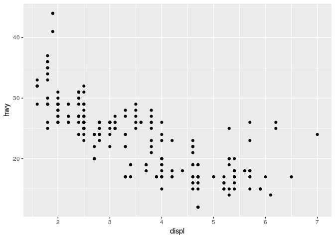<!-- -->

If plot creation is successful, you can see negative relationship
between engine size and fuel consumption (miles per gallon).

It’s probably no news to anyone that cars with big engines use more
fuel.

## Composing a ggplot

  - **ggplot2 works iteratively** – you start with a layer showing the
    raw data and then add layers of geoms, annotations, and statistical
    summaries.

To compose plots, you have to supply minimally:

  - **Data** that you want to visualize and
  - **aes**thetic **mappings** – what’s on x-axis, what’s on y-axis, and
    how to you want to group and color your data. Mapped arguments must
    be found in your data\!
  - **Layers** made up of **geom**etric elements: points, lines, boxes,
    etc. What’s shown on plot.

visualisation of these three components within ggplot context looks like
this:

    ggplot(data = <DATA>) +
      <GEOM_FUNCTION>(mapping = aes(<MAPPINGS>))

### Excercises

1.  Run ggplot(data = mpg). What do you see?

<!-- end list -->

``` r
ggplot(data = mpg)
```

<!-- -->

2.  How many rows are in mpg dataset? How many columns? Run “mpg”

<!-- end list -->

``` r
mpg
```

    ## # A tibble: 234 x 11
    ##    manufacturer model displ  year   cyl trans drv     cty   hwy fl    class
    ##    <chr>        <chr> <dbl> <int> <int> <chr> <chr> <int> <int> <chr> <chr>
    ##  1 audi         a4      1.8  1999     4 auto… f        18    29 p     comp…
    ##  2 audi         a4      1.8  1999     4 manu… f        21    29 p     comp…
    ##  3 audi         a4      2    2008     4 manu… f        20    31 p     comp…
    ##  4 audi         a4      2    2008     4 auto… f        21    30 p     comp…
    ##  5 audi         a4      2.8  1999     6 auto… f        16    26 p     comp…
    ##  6 audi         a4      2.8  1999     6 manu… f        18    26 p     comp…
    ##  7 audi         a4      3.1  2008     6 auto… f        18    27 p     comp…
    ##  8 audi         a4 q…   1.8  1999     4 manu… 4        18    26 p     comp…
    ##  9 audi         a4 q…   1.8  1999     4 auto… 4        16    25 p     comp…
    ## 10 audi         a4 q…   2    2008     4 manu… 4        20    28 p     comp…
    ## # … with 224 more rows

3.  What does the drv variable describe? Read help for ?mpg to find out.

<!-- end list -->

``` r
?mpg
```

4.  Make scatterplot of *hwy* vs *cyl* using mpg data:

<!-- end list -->

``` r
ggplot(data = mpg) +
  geom_point(mapping = aes(x = hwy, y = cyl), position = position_jitter(width = 0.1, seed = 11))
```

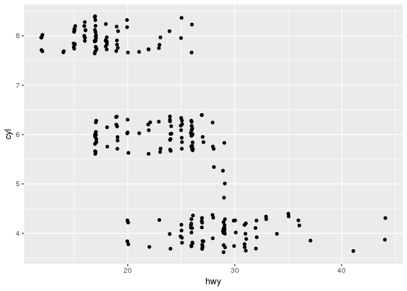<!-- -->

What happens if you add some noise to points? Hint: use geom\_jitter
instead

``` r
ggplot(data = mpg) +
  geom_jitter(mapping = aes(x = hwy, y = cyl))
```

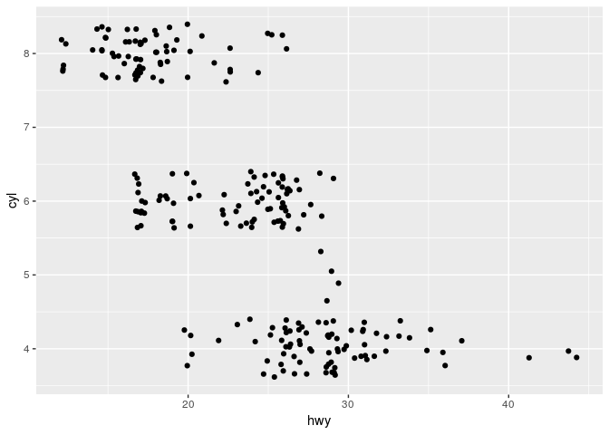<!-- -->

5.  What happens when you make a scatterplot of *class* versus *drv*
    using mpg data:

<!-- end list -->

``` r
ggplot(data = mpg) +
  geom_point(mapping = aes(x = class, y = drv))
```

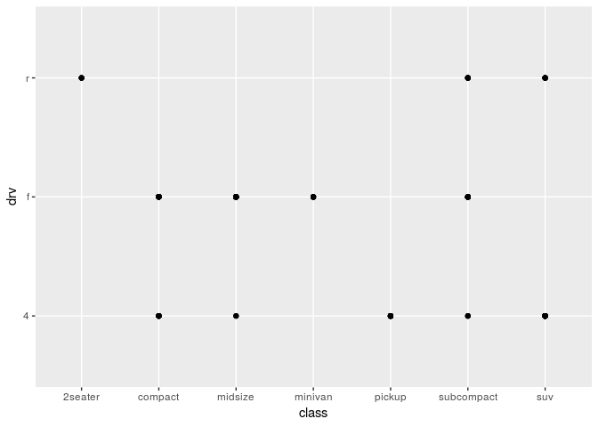<!-- -->

Is such plot useful?

## Aesthetic mappings

hwy ~ displ scatterplot tells us that there is linear relationship
between engine size and fuel consumption: bigger engines use more fuel
and are therefore less efficient.

Nevertheless, if we look at the cars with huge engines (\>5L), it’s
apparent that there are some outliers (plot below) that perform better
than cars in this engine class in general.

What are those cars? Do they have something in common?

``` r
ggplot(data = mpg) +
  geom_point(mapping = aes(x = displ, y = hwy, color = (hwy > 20 & displ > 5)))
```

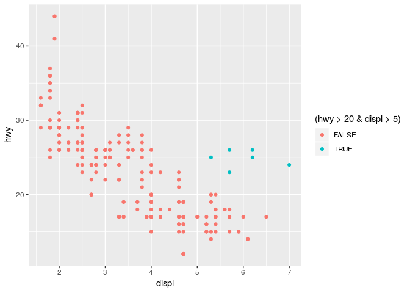<!-- -->

To better understand the nature of these outliers, we would like add
more info present in our mpg dataset to plot. To add more variables to
2D scatterplot, we can use additional aesthetic mappings.

> Aesthetics like color, shape, fill, and size can be used to add
> additional variables to a plot.

By mapping displ to x-axis and hwy to y-axis let’s map additionally
color of the points to class variable (color = class) in mpg dataset to
reveal the class of each car:

``` r
ggplot(data = mpg) +
  geom_point(mapping = aes(x = displ, y = hwy, color = class))
```

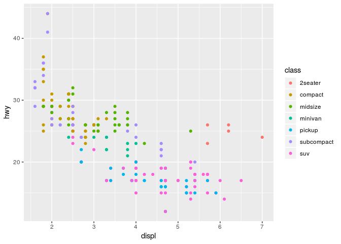<!-- -->

We can see that most of the cars with large motors and somewhat better
fuel efficiency belong to sports cars (“2seaters”).

Recreate previous plot with class mapped to size of each point:

``` r
ggplot(data = mpg) +
  geom_point(mapping = aes(x = displ, y = hwy, size = class))
```

    ## Warning: Using size for a discrete variable is not advised.

<!-- -->

We get warning… seems its not a good idea. Why?

What’s wrong with the next plot where we have four categories (“tiny”,
“small”, “big”, “very big”) of, let’s say diameters, and we want to
map size aesthetic to diameter.

Here we create toy data frame where we have categorical variable
diameter for four x values whereas y is all
same.

``` r
diameter <- tibble(x = 1:4, y = 1, diameter = c("tiny", "small", "big", "very big"))
diameter
```

    ## # A tibble: 4 x 3
    ##       x     y diameter
    ##   <int> <dbl> <chr>   
    ## 1     1     1 tiny    
    ## 2     2     1 small   
    ## 3     3     1 big     
    ## 4     4     1 very big

Create scatterplot y~x and map diameter to point **size**:

``` r
ggplot(data = diameter) +
  geom_point(mapping = aes(x = x, y = y, size = diameter))
```

    ## Warning: Using size for a discrete variable is not advised.

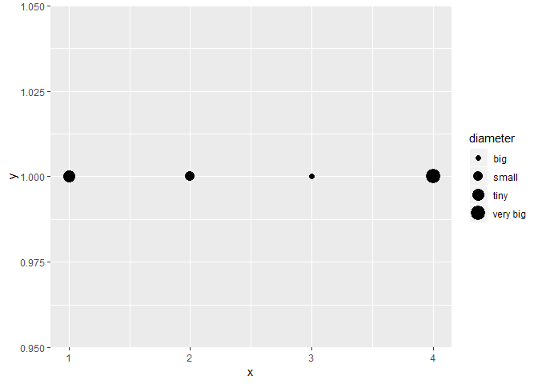<!-- -->

This plot should explain why it’s generally not a good idea to map
categorical variable to size aesthetic.

### Excercise

1.  Update code. Map ***alpha*** aesthetic to class:

<!-- end list -->

``` r
ggplot(data = mpg) + 
  geom_point(mapping = aes(x = displ, y = hwy, alpha = class))
```

    ## Warning: Using alpha for a discrete variable is not advised.

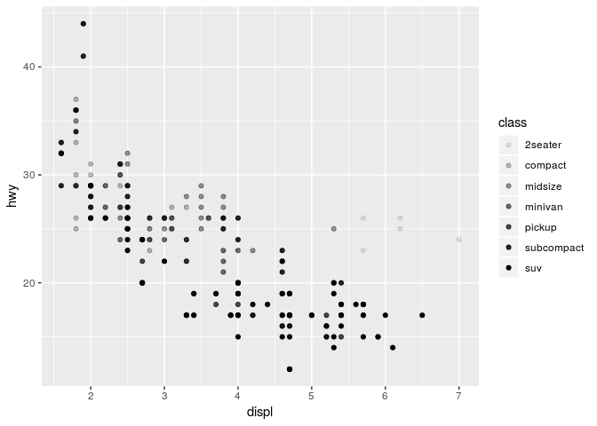<!-- -->

2.  Update code. Map *shape* aesthetic to class. Update code so that
    there will be 7 shapes instead of default 6:

<!-- end list -->

``` r
ggplot(data = mpg) + 
  geom_point(mapping = aes(x = displ, y = hwy, shape = class)) +
  scale_shape_manual(values = 1:7)
```

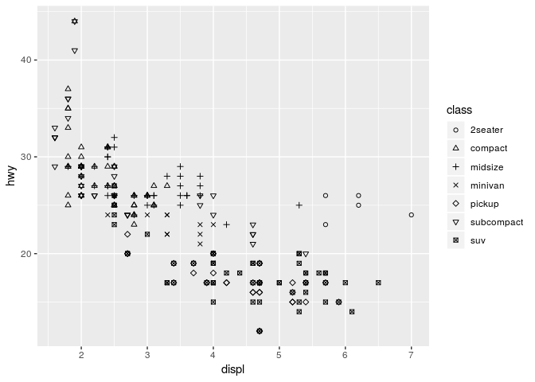<!-- -->

Is everything OK with shapes?

3.  Using **dplyr** built-in **starwars** dataset (hint: starwars) make
    height~mass scatterplot and map one continuous variable to size:

First print out starwars dataset:

``` r
starwars
```

    ## # A tibble: 87 x 13
    ##    name  height  mass hair_color skin_color eye_color birth_year gender
    ##    <chr>  <int> <dbl> <chr>      <chr>      <chr>          <dbl> <chr> 
    ##  1 Luke…    172    77 blond      fair       blue            19   male  
    ##  2 C-3PO    167    75 <NA>       gold       yellow         112   <NA>  
    ##  3 R2-D2     96    32 <NA>       white, bl… red             33   <NA>  
    ##  4 Dart…    202   136 none       white      yellow          41.9 male  
    ##  5 Leia…    150    49 brown      light      brown           19   female
    ##  6 Owen…    178   120 brown, gr… light      blue            52   male  
    ##  7 Beru…    165    75 brown      light      blue            47   female
    ##  8 R5-D4     97    32 <NA>       white, red red             NA   <NA>  
    ##  9 Bigg…    183    84 black      light      brown           24   male  
    ## 10 Obi-…    182    77 auburn, w… fair       blue-gray       57   male  
    ## # … with 77 more rows, and 5 more variables: homeworld <chr>,
    ## #   species <chr>, films <list>, vehicles <list>, starships <list>

Make height~mass scatterplot and map one continuous variable to size:

``` r
ggplot(data = starwars) +
  geom_point(mapping = aes(x = height, y = mass, size = birth_year))
```

    ## Warning: Removed 51 rows containing missing values (geom_point).

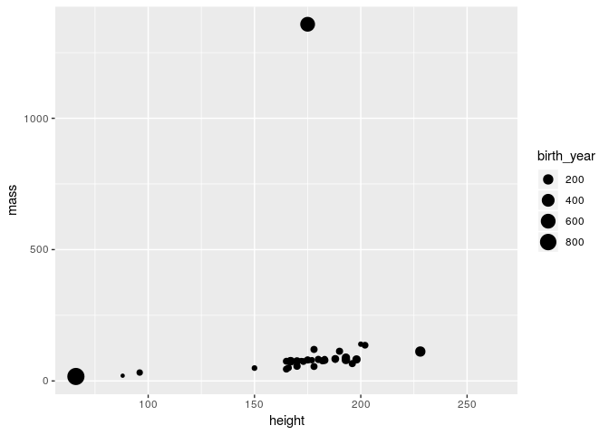<!-- -->

Extra: there is apparent outlier. Try using geom\_label to add name to
this point:

``` r
ggplot(data = starwars) +
  geom_point(mapping = aes(x = height, y = mass, size = birth_year)) +
  geom_label(mapping = aes(x = height, y = mass, label = name))
```

    ## Warning: Removed 51 rows containing missing values (geom_point).

    ## Warning: Removed 28 rows containing missing values (geom_label).

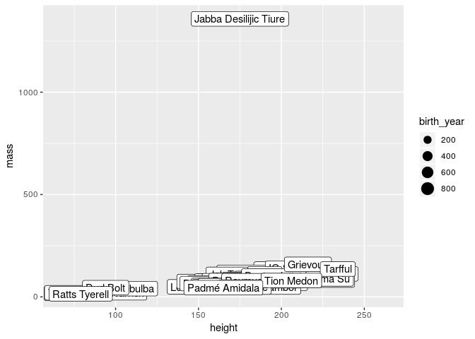<!-- -->

(We can use a much nicer function geom\_label\_repel(), and map the
birth year to color.)

> When you set your aesthetic via mapping, ggplot automatically takes
> care of the rest: it finds best scale to display selected aesthetic
> and draws a legend. Note that this happens only when you map aesthetic
> within aes() function.

## Set aesthetic manually

You can change the appearance of your plot also manually: change the
color or shape of all the points.

For example, let’s suppose you want to make all points in plot blue in
displ~hwy scatterplot using mpg data:

``` r
ggplot(data = mpg) +
  geom_point(mapping = aes(x = displ, y = hwy), color = "#0000ff", size = 10) # try HEX code "#0000ff" or rgb(0,0,1)
```

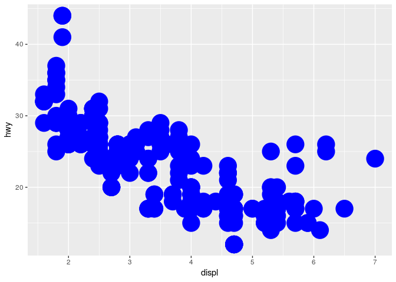<!-- -->

Here, the color is not connected to the variable in your dataset as it
is assigned outside aes(), but it just changes the appearance of the
plot.

Therefore, to change the appearance of the plot, you need to assign
value to aesthetic **outside** aes() in geom function.

You just have to pick a value that makes sense for that aesthetic:

  - the name/code of the color as a character string (“blue”,
    “\#0000ff”)
  - size of a point in mm
  - shape of a point as a number

Examples\!

Update code: change size of all points:

``` r
ggplot(data = mpg) +
  geom_point(mapping = aes(x = displ, y = hwy, color = class), size = 0.1)
```

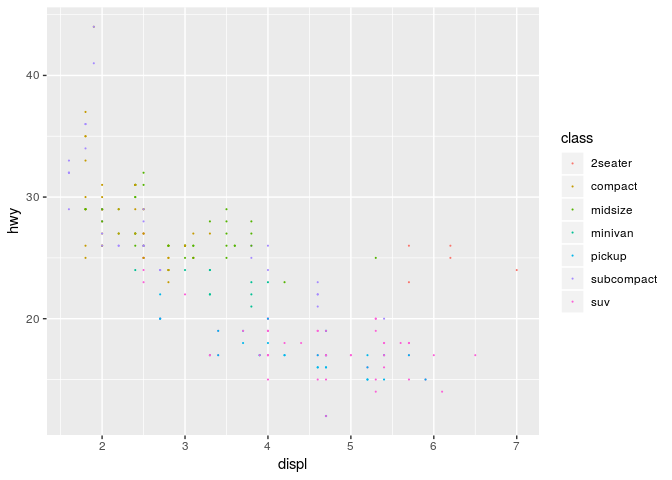<!-- -->

### Shape codes

While colors and sizes are intuitive, it seems impossible to remember
available point shape codes in R.

The quickest way out of this is to know how to generate an example plot
of the first 25 shapes quickly.

Numbers next to shapes denote R shape
number.

``` r
ggplot(data = data_frame(x = rep(1:5, 5), y = rep(5:1, each = 5), shape = c(0:24))) + 
  geom_point(mapping = aes(x = x, y = y, shape = shape), fill = "green", color = "blue", size = 3) +
  geom_text(mapping = aes(x = x, y = y, label = shape), hjust = 1.7) +
  scale_shape_identity() +
  theme(axis.text = element_blank(),
        axis.title = element_blank())
```

    ## Warning: `data_frame()` is deprecated, use `tibble()`.
    ## This warning is displayed once per session.

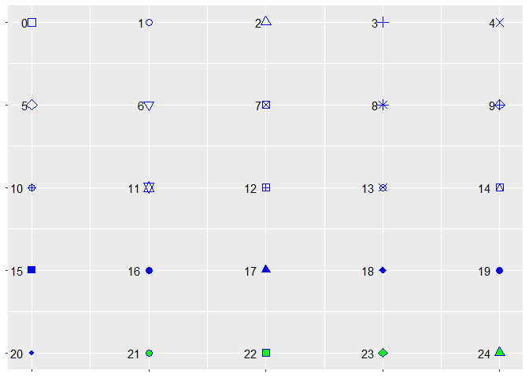<!-- -->

Update code:

  - Let’s map more than 6 shapes to class and
  - use fill = “green”, color = “blue”, to change the appearance of the
    ALL points, and
  - adjust size of the ALL points (size = 3) for better visibility.

<!-- end list -->

``` r
ggplot(data = mpg) + 
  geom_jitter(mapping = aes(x = displ, y = hwy, shape = class), fill = "green", color = "blue", size = 3) +
  scale_shape_manual(values = c(16:19, 21:24))
```

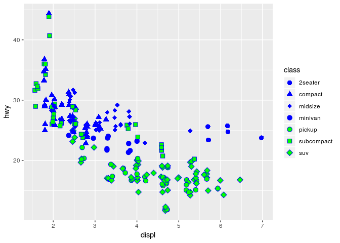<!-- -->

Note the differences how fill and color work on different point shapes\!
Which is the default point shape in ggplot?

### Excercises

1.  What’s wrong with this plot? Why are points not blue? Can you fix
    the code?

<!-- end list -->

``` r
ggplot(data = mpg) +
  geom_point(mapping = aes(x = displ, y = hwy), color = "blue")
```

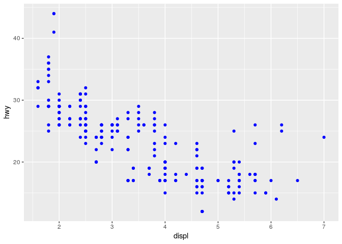<!-- -->

2.  Which variables in mpg are categorical? Which variables are
    continuous? (type ?mpg to read the documentation for the dataset).
    How can you see when you run mpg?
