Data visualisation using ggplot2
================
Taavi Päll
19 3 2018

Visualisation of your analysis results or data is not only the matter of taste but must be effective and present your results and data honestly.

Sources
-------

-   This tutorial is heavily based on "Data visualization with ggplot2" chapter in [R4DS](http://r4ds.had.co.nz/data-visualisation.html) by G. Grolemund and H. Wickham.
-   [lectures/graafilised-lahendused](https://rstats-tartu.github.io/lectures/graafilised-lahendused.html) and [learn-r/ggplot2](https://tpall.github.io/learn-r/#ggplot2) by Ülo Maiväli and Taavi Päll

ggplot2
-------

**ggplot2** is an R package for producing statistical graphics based on the grammar of graphics (hence the gg!).

Let's start by loading tidyverse (meta) library which provides us with set of necessary packages to start with data analysis and visualizations.

``` r
library(tidyverse)
```

    ## ── Attaching packages ──────────────────────────────────────────────────────── tidyverse 1.2.1 ──

    ## ✔ ggplot2 2.2.1.9000     ✔ purrr   0.2.4     
    ## ✔ tibble  1.4.2          ✔ dplyr   0.7.4     
    ## ✔ tidyr   0.8.0          ✔ stringr 1.2.0     
    ## ✔ readr   1.1.1          ✔ forcats 0.2.0

    ## ── Conflicts ─────────────────────────────────────────────────────────── tidyverse_conflicts() ──
    ## ✖ dplyr::filter() masks stats::filter()
    ## ✖ dplyr::lag()    masks stats::lag()

As you can see, running this line of code loads eight different packages (libraries) and warns that some of the functions (filter(), lag()) that were just loaded into namespace have identical name to functions that were already present in namespace. These new functions masked old ones and, in case you want to use these masked functions, you need to call them explicitly by using package where it comes from `stats::filter()`.

If you get error message "there is no package called 'tidyverse'", then you need to install this package and run again `library()`:

``` r
install.packages("tidyverse")
library(tidyverse)
```

First steps
-----------

We need data..., ok, let's use ggplot2 built in dataset **mpg** with fuel economy data from 1999 and 2008 for 38 models of car:

``` r
mpg # aka ggplot::mpg
```

    ## # A tibble: 234 x 11
    ##    manufacturer model    displ  year   cyl trans   drv     cty   hwy fl   
    ##    <chr>        <chr>    <dbl> <int> <int> <chr>   <chr> <int> <int> <chr>
    ##  1 audi         a4        1.80  1999     4 auto(l… f        18    29 p    
    ##  2 audi         a4        1.80  1999     4 manual… f        21    29 p    
    ##  3 audi         a4        2.00  2008     4 manual… f        20    31 p    
    ##  4 audi         a4        2.00  2008     4 auto(a… f        21    30 p    
    ##  5 audi         a4        2.80  1999     6 auto(l… f        16    26 p    
    ##  6 audi         a4        2.80  1999     6 manual… f        18    26 p    
    ##  7 audi         a4        3.10  2008     6 auto(a… f        18    27 p    
    ##  8 audi         a4 quat…  1.80  1999     4 manual… 4        18    26 p    
    ##  9 audi         a4 quat…  1.80  1999     4 auto(l… 4        16    25 p    
    ## 10 audi         a4 quat…  2.00  2008     4 manual… 4        20    28 p    
    ## # ... with 224 more rows, and 1 more variable: class <chr>

If you worry where this dataset comes from, then there is no magic -- it's bundled with ggplot2 package and will be invisibly loaded every time when ggplot2 library is loaded. mpg invisibility means that, differently from your own R objects, it will not show up in your Environment panel.

For us, key variables in mpg dataset are:

-   `displ` -- engine displacement (L),
-   `hwy` -- highway miles per gallon

Creating a ggplot
-----------------

Simple scatter plot to explore relationship between fuel consumption in highway traffic (hwy) and engine size (displ) is created like this. Here we put displ on the x-axis and hwy on the y-axis:

``` r
ggplot(data = mpg) + 
  geom_point(mapping = aes(x = displ, y = hwy))
```


Here you can see negative relationship between engine size and fuel consumption. It's probably no news to anyone that cars with big engiens guzzle more fuel.

-   **ggplot2 works iteratively** -- you start with a layer showing the raw data and then add layers of geoms, annotations, and statistical summaries.

To compose plots, you have to supply minimally:

-   **Data** that you want to visualise and
-   **aes**thetic **mappings** -- what's on x-axis, what's on y-axis, and how to you want to group and color your data. Mapped arguments must be found in your data!
-   **Layers** made up of **geom**etric elements: points, lines, boxes, etc. What's shown on plot.

Visualization of these three components within ggplot context looks like this:

    ggplot(data = <DATA>) +
      <GEOM_FUNCTION>(mapping = aes(<MAPPINGS>))

### Excercises

1.  Run ggplot(data = mpg). What do you see?

2.  How many rows are in mtcars dataset? How many columns?

3.  What does the drv variable describe? Read help for ?mpg to find out.

4.  Make scatterplot of *hwy* vs *cyl* using mpg data:

5.  What happens when you make a scatterplot of *class* versus *drv* using mpg data:

Is it useful?

Aesthetic mappings
------------------

hwy ~ displ scatter plot tells us that there is linear relationship between engine size and fuel consumption: bigger engines use more fuel and are therefore less efficient. Nevertheless, if we look at the cars with huge engines (&gt;5L), it's apparent that there are some outliers (plot below) that perform better than cars in thit engine class in general.

What are those cars? Do they have something in common?

``` r
ggplot(data = mpg) +
  geom_point(mapping = aes(x = displ, y = hwy, color = (hwy > 20 & displ > 5)))
```

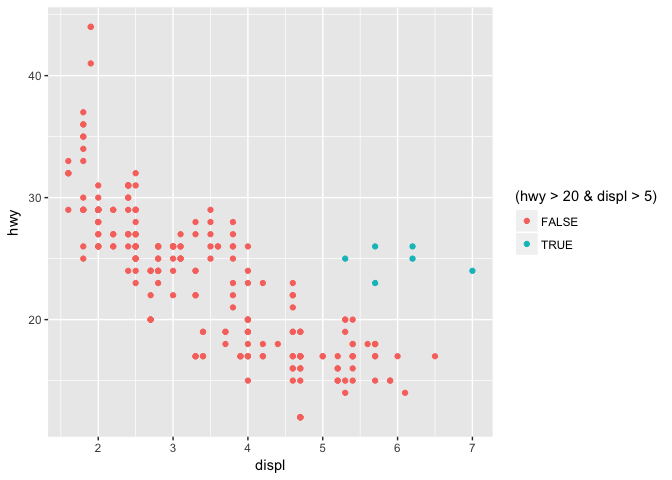

To get a clue about the nature of these outliers, we would like add more info present in our mpg dataset to plot. To add more variables to 2D scatterplot, we can use additional aesthetic mappings.

Aesthetics like color, shape, fill, and size can be used to add additional variables to a plot.

Let's map color of the points to class variable in mpg dataset to reveal the class of each car:

``` r
ggplot(data = mpg) + 
  geom_point(mapping = aes(x = displ, y = hwy, color = class))
```

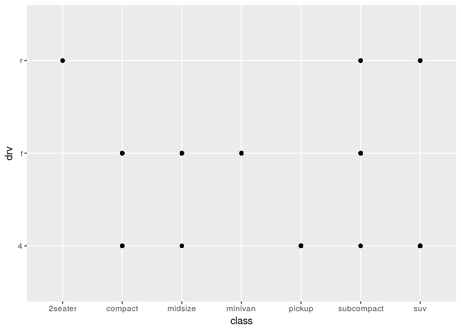

We can see that most of the cars with large motors with better fuel efficency belong to sportscars (2seaters).

Let's recreate previous plot with class mapped to size of each point:

``` r
ggplot(data = mpg) + 
  geom_point(mapping = aes(x = displ, y = hwy, size = class))
```

    ## Warning: Using size for a discrete variable is not advised.

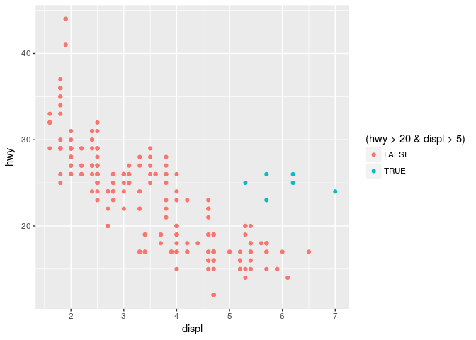

Ouch, we get warning... seems its not a good idea. Why? What's wrong with the next plot where we have four, let's say diameter, categories ("tiny", "small", "big", "very big") and we want to map size aesthetic to diameter

``` r
ggplot(data = data_frame(x = c(1:4), y = 1, diameter = c("tiny", "small", "big", "very big"))) +
  geom_point(mapping = aes(x = x, y = y, size = diameter))
```

    ## Warning: Using size for a discrete variable is not advised.

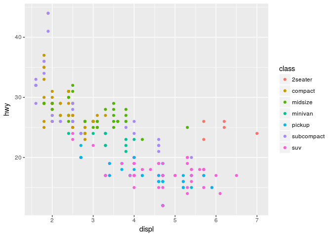 Maybe this plot explains why it's generally not a good idea to map categorical variable to size aesthetic.

Map **alpha** aesthetic to class:

Map **size** aesthetic to class:

Is everything ok with shapes?

> When you set your aesthetic via mapping, ggplot automatically takes care of the rest: it finds best scale to display selected aesthetic and draws a legend. Note that this happens only when you map aesthetic within aes() function.

### Set aesthetic manually

You can change the appearance of your plot also manually: change the color or shape of all the points.

For example, let's suppose you want to make all points in plot blue:

``` r
ggplot(data = mpg) + 
  geom_point(mapping = aes(x = displ, y = hwy), color = "blue") # try HEX code "#0000ff" or rgb(0,0,1)
```


Here, the color is not connected to the variable in your dataset, but just changes the appearance of the plot. Therefore, to change the appearance of the plot, you need to assign value to aesthetic **outside** aes() in geom function.

You just have to pick a value that makes sense for that aesthetic:

-   the name/code of the color as a character string ("blue", "\#0000ff")
-   size of a point in mm
-   shape of a point as a number

### Shape codes.

While colors and sizes are intuitive, it seems impossible to remember available point shape codes in R. The quickest way out of this is to know how to generate an example plot of the first 25 shapes quickly. Numbers next to shapes denote R shape number.

``` r
ggplot(data = data_frame(x = rep(1:5, 5), y = rep(5:1, each = 5), shape = c(0:24))) + 
  geom_point(mapping = aes(x = x, y = y, shape = shape), fill = "green", color = "blue", size = 3) +
  geom_text(mapping = aes(x = x, y = y, label = shape), hjust = 1.7) +
  scale_shape_identity() +
  theme(axis.text = element_blank(),
        axis.title = element_blank())
```

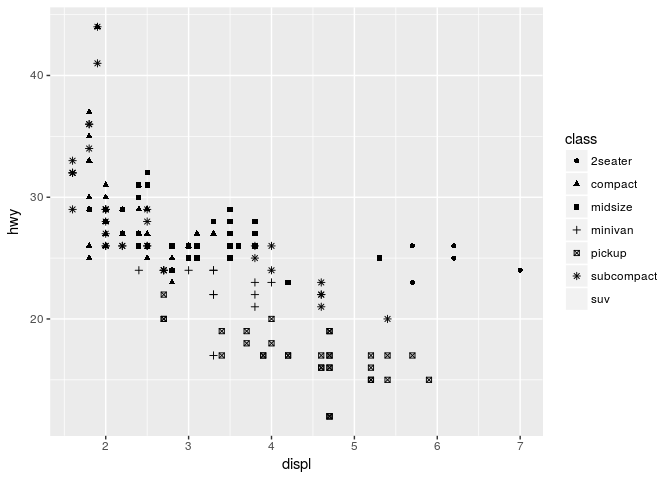

Here, we used fill="green", color="blue", to change the appearance of the points, and also adjusted size of the points (size=3) for better visibility. Note the differences how fill and color work on different point shapes! Which is the default point shape in ggplot?

### Excercises

1.  What's wrong with this plot? Why are points not blue? Can you fix the code?

``` r
ggplot(data = mpg) +
  geom_point(mapping = aes(x = displ, y = hwy, color = "blue"))
```

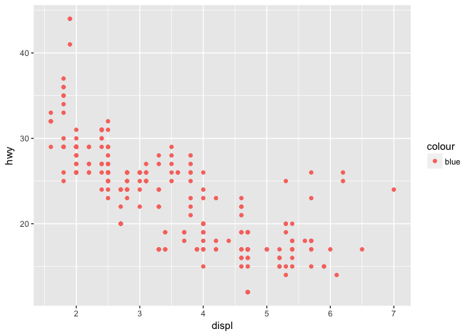

1.  Which variables in mpg are categorical? Which variables are continuous? (type ?mpg to read the documentation for the dataset). How can you see when you run mpg?

2.  Map a continuous variable to color, size, and shape. How do these aesthetics behave differently for categorical vs. continuous variables?

3.  What happens if you map the same variable to multiple aesthetics?

4.  What does the stroke aesthetic do? What shapes does it work with? (Hint: use ?geom\_point)

5.  What happens if you map an aesthetic to something other than a variable name, like aes(colour = displ &lt; 5)?

Facetting
---------

Another possibility to add more variables is to split your plot into small facets that each display one subset of the data. To split your plot by one variable use facet\_wrap:

``` r
ggplot(data = mpg) +
  geom_point(mapping = aes(x = displ, y = hwy)) +
  facet_wrap(~ class, nrow = 2)
```

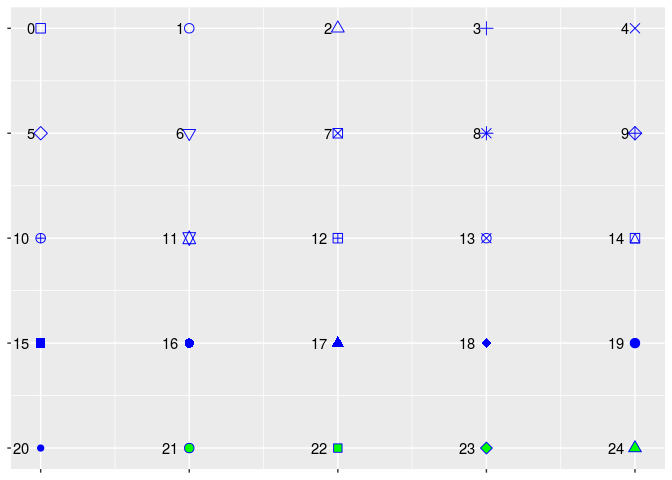 To specify name of a variable precede it by ~

Two-way table, split by two variables, can be created using facet\_grid command:

``` r
ggplot(data = mpg) +
  geom_point(mapping = aes(x = displ, y = hwy)) +
  facet_grid(drv ~ cyl) # (rows ~ columns)
```

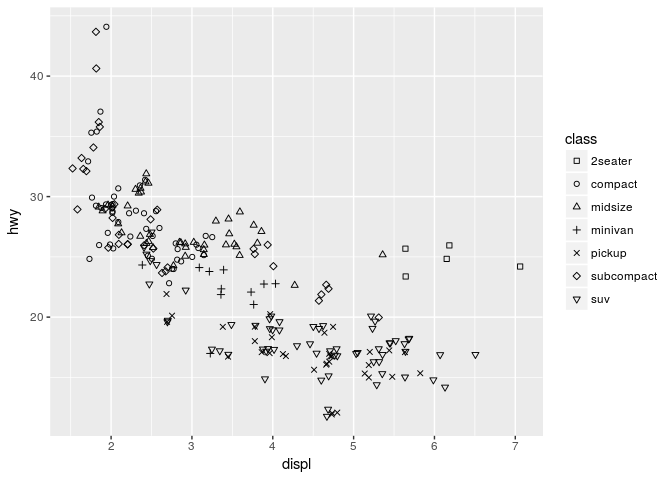

If you prefer to not facet in the rows or columns dimension, use a . instead of a variable name, e.g. + facet\_grid(. ~ cyl).

``` r
ggplot(data = mpg) +
  geom_point(mapping = aes(x = displ, y = hwy)) +
  facet_grid(. ~ cyl) 
```

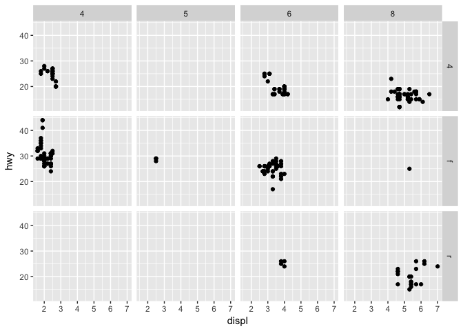

### Excercises

1.  What happens if you facet on a continuous variable?

2.  What do the empty cells in plot with facet\_grid(drv ~ cyl) mean? How do they relate to this plot?

``` r
ggplot(data = mpg) + 
  geom_point(mapping = aes(x = drv, y = cyl))
```


1.  What plots does the following code make? What does . do?

``` r
ggplot(data = mpg) + 
  geom_point(mapping = aes(x = displ, y = hwy)) +
  facet_grid(drv ~ .)
```

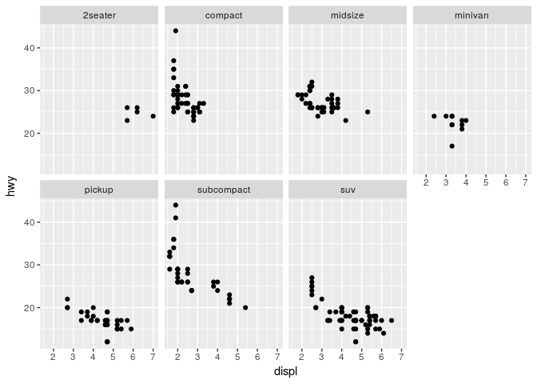

``` r
ggplot(data = mpg) + 
  geom_point(mapping = aes(x = displ, y = hwy)) +
  facet_grid(. ~ cyl)
```

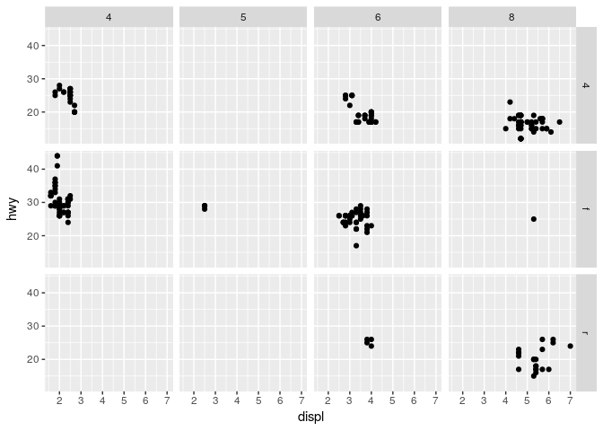

1.  Take the first faceted plot in this section:

``` r
ggplot(data = mpg) + 
  geom_point(mapping = aes(x = displ, y = hwy)) + 
  facet_wrap(~ class, nrow = 2)
```


What are the advantages to using faceting instead of the colour aesthetic? What are the disadvantages? How might the balance change if you had a larger dataset?

1.  Read ?facet\_wrap. What does nrow do? What does ncol do? What other options control the layout of the individual panels? Why doesn’t facet\_grid() have nrow and ncol argument?

2.  When using facet\_grid() you should usually put the variable with more unique levels in the columns. Why?

Geometric objects
-----------------

### Excecises

Statistical transformations
---------------------------

### Excecises

<!-- You can further adjust your plot: -->
<!-- + by adding **statistical summaries** of your raw data. -->
<!-- + using **scale**s to redraw a legend or axes. -->
<!-- + using **facet**ing to break up the data into subsets for display. -->
<!-- + using **theme**s which control plot features like the font size  -->
<!--   and background colour. -->
<!-- ## Scatterplot -->
<!-- To illustrate layer wise plot creation in ggplot: -->
<!-- ```{r} -->
<!-- p <- ggplot(data = mpg) # first add data -->
<!-- p <- p + aes(x = cty, y = hwy) # add aesthetics -->
<!-- p <- p + geom_point() # add geom, specifying plot type  -->
<!-- p + stat_smooth(method = "lm") # add statistical summary -->
<!-- ``` -->
<!-- The **point geom is used to create scatterplots**. -->
<!-- Of course, this result is usually achieved by this one-liner: -->
<!-- ```{r, eval=FALSE} -->
<!-- ggplot(mpg, aes(cty, hwy)) + geom_point() + stat_smooth(method = "lm") -->
<!-- ``` -->
<!-- ## Modify axes, start y or x axis at zero -->
<!-- Axis labels can be changed using `xlab()` and `ylab()`: -->
<!-- ```{r} -->
<!-- p + xlab("City driving (miles per gallon)") + # to set x axis label -->
<!--   ylab("Highway driving (miles per gallon)") # to set y axis label -->
<!-- ``` -->
<!-- The other way around, to remove axis lables, set them to `NULL`: -->
<!-- ```{r} -->
<!-- p + xlab(NULL) + ylab(NULL) -->
<!-- ``` -->
<!-- In many cases proper visual representation of data requires that e.g. y axis starts from zero.  -->
<!-- By default, ggplot zooms only into region where data is located and 0 is dropped from axes.  -->
<!-- To change this behaviour, ggplot has command `expand_limits()` specifying the value(-s) that should be included in each scale: -->
<!-- ```{r} -->
<!-- p + expand_limits(x = 0, y = 0) # upper and lower axis limits can be specified by supplying vector of two values -->
<!-- ``` -->
<!-- `scale_x_continuous()` and `scale_y_continuous()` have argument limits, which can be used to set axis limits, but values remaining outside limits will be set to `NA`: -->
<!-- ```{r, warning=TRUE} -->
<!-- p + scale_y_continuous(limits = c(0, 20)) -->
<!-- ``` -->
<!-- Note the warning! -->
<!-- More simply, we can use `xlim()` and `ylim()`: -->
<!-- ```{r} -->
<!-- p + xlim(15, 20) + ylim(0, 30) -->
<!-- ``` -->
<!-- ## ggsave plot -->
<!-- `ggsave` recognises .eps/ps, .tex (pictex), .pdf, .jpeg, .tiff, .png, .bmp, .svg, and .wmf (windows only) file extensions. To save a plot `p` to e.g. as `.png` file use: -->
<!-- ```{r, eval=FALSE} -->
<!-- ggsave("graphs/my_biutiful_plot.png", plot = p, width = 7, height = 5) -->
<!-- ``` -->
<!-- By default `plot=` is the last plot. -->
<!-- ## Histograms -->
<!-- Differently from base R graphics, where histogram is drawn by a special command, ggplot specifies the type of plot by geoms, like `geom_histogram()`: -->
<!-- ```{r} -->
<!-- df <- tibble(x = rnorm(10000)) # For demo we create tibble with 10000 random numbers from normal distribution -->
<!-- ggplot(df, aes(x)) + geom_histogram() # to plot histogram we specify geom_histogram  -->
<!-- ``` -->
<!-- ggplot says: `stat_bin()` using `bins = 30`. Pick better value with `binwidth`, also help file notes that 'the default is to use bins bins that cover the range of the data. You should always override this value, exploring multiple widths to find the best to illustrate the stories in your data'. OK, Messy Goes to Okido, lets try: -->
<!-- ```{r} -->
<!-- ggplot(df, aes(x)) + geom_histogram(binwidth = 0.1) # for better granularity, we specify binwith = 0.1 -->
<!-- ``` -->
<!-- Alternatively, you can specify the number of bins (and perhaps send some hidden messages along with your visualisation): -->
<!-- ```{r} -->
<!-- ggplot(df, aes(x)) + geom_histogram(bins = 5) # if we want to split data into eg. 5 bins -->
<!-- ``` -->
<!-- For some more practice, lets recreate Tartu Marathon 2013 histogram: -->
<!-- ```{r} -->
<!-- library(lubridate) -->
<!-- load("data/Tartu_Maraton_2013.RData") -->
<!-- ``` -->
<!-- ```{r} -->
<!-- tm <- tm_2013 %>% mutate(Aeg = unclass(as.duration(hms(Aeg)))/3600) %>% filter(complete.cases(.)) -->
<!-- tm %>% ggplot(aes(Aeg)) + geom_histogram(binwidth = 1/12) # we want binwidth ~5 minutes (1/12 hour) -->
<!-- ``` -->
<!-- These were histograms with counts on y-axis, but we may want to plot (kernel) density instead, for this we use `geom_density()`: -->
<!-- ```{r} -->
<!-- ggplot(df, aes(x)) + geom_density() -->
<!-- ``` -->
<!-- Histogram with densities on y-axis: -->
<!-- ```{r} -->
<!-- ggplot(df, aes(x, ..density..)) + geom_histogram() -->
<!-- ``` -->
<!-- Kernel density plot and histogram together:  -->
<!-- ```{r} -->
<!-- ggplot(df, aes(x, ..density..)) +  -->
<!--   geom_histogram(binwidth = 0.1) + -->
<!--   geom_density() -->
<!-- ``` -->
<!-- ```{r} -->
<!-- p <- ggplot(df, aes(x)) +  -->
<!--   geom_histogram(aes(y = ..density..), # note that we specify density here,  -->
<!--                  binwidth = 0.1,  -->
<!--                  fill = "white", color = "black") + -->
<!--   geom_density() -->
<!-- p # we disrected plot to object -->
<!-- ``` -->
<!-- We can add vertical line, denoting mean, to our histogram like this: -->
<!-- ```{r} -->
<!-- p + geom_vline(aes(xintercept = mean(x)), color = "red", linetype = "dashed", size = 1)  -->
<!-- ``` -->
<!-- **To compare distributions** we can overlay histograms and density plots. To demonstrate this, let's create dummy dataset of two normal distributions: -->
<!-- ```{r} -->
<!-- df2 <- tibble(pop = rep(c("N", "S"), each = 1000),  -->
<!--               value = c(rnorm(1000, 20, 3), rnorm(1000, 25, 3))) -->
<!-- df2 -->
<!-- ``` -->
<!-- When overlaying histograms in ggplot, default action is to 'stack' them one to another, making comparison difficult. We have to specify `position = "identity"` to place them directly onto x-axis (each bar starts from y = 0). Also we specify `alpha =` for some transparency: -->
<!-- ```{r} -->
<!-- p1 <- df2 %>% ggplot(aes(value, fill = pop))  -->
<!-- p1 + geom_histogram(position = "identity", alpha = 0.7, binwidth = 0.3) -->
<!-- ``` -->
<!-- Alternatively, it's possible to place comparable bars next to each other by specifying `position = "dodge"`: -->
<!-- ```{r} -->
<!-- p1 + geom_histogram(position = "dodge", binwidth = 1) -->
<!-- ``` -->
<!-- Overlaid kernel density plots: -->
<!-- ```{r} -->
<!-- p2 <- p1 + geom_density(alpha = 0.7) -->
<!-- p2 -->
<!-- ``` -->
<!-- To indicate means for these two distributions, we have to calculate means into a new data frame:  -->
<!-- ```{r} -->
<!-- df2_stats <- df2 %>% group_by(pop) %>% summarise(pop_mean = mean(value)) -->
<!-- p2 + geom_vline(data = df2_stats, aes(xintercept = pop_mean, color = pop), linetype = "dashed", size = 1) -->
<!-- ``` -->
<!-- ##  Boxplots -->
<!-- **Boxplots** are created using `geom_boxplot`: -->
<!-- ```{r} -->
<!-- df2 %>% ggplot(aes(pop, value)) + geom_boxplot() -->
<!-- ``` -->
<!-- ```{r} -->
<!-- p3 <- df2 %>% ggplot(aes(pop, value, fill = pop)) + geom_boxplot() -->
<!-- p3 -->
<!-- ``` -->
<!-- Often, it's a good idea to overlay original values to plot. Specially, if there is only few values. Let's add original data points to previous boxplot: -->
<!-- ```{r} -->
<!-- p3 + geom_point() -->
<!-- ``` -->
<!-- Adding geom_points was not very helpful in this case. -->
<!-- s -->
<!-- We can try to jitter these points, where argument `width=` specifies jitter width (default full boxplot width): -->
<!-- ```{r} -->
<!-- p3 + geom_jitter(width = 0.5) -->
<!-- ``` -->
<!-- As shown previously, we can also add summary data (mean) to this plot (large red dots): -->
<!-- ```{r} -->
<!-- p3 + geom_point(data = df2_stats, aes(y = pop_mean), shape = 16, color = "red", size = 3) -->
<!-- ``` -->
<!-- ## Plotting means and error bars -->
<!-- Summaries and e.g. errorbars can also be calculated on the fly. To illustrate this, we take first smaller sample from our dataset in order to have larger errorbars. Here we add bootstrapped 99% confidence intervals of the mean: -->
<!-- ```{r} -->
<!-- p4 <- df2 %>% sample_n(50) %>% # to have larger error -->
<!--   ggplot(aes(pop, value, fill = pop)) + geom_jitter(color = "gray", width = 1/3)  -->
<!-- p4 + stat_summary(fun.data = "mean_cl_boot", fun.args = list(conf.int = .99), geom = "pointrange") # poinrange is default geom  -->
<!-- ``` -->
<!-- Here we add errorbars, denoting standard error of the mean: -->
<!-- ```{r} -->
<!-- p4 <- p4 + stat_summary(fun.y = mean, geom = "point", shape = 95, color = "red", size = 15) + # mean -->
<!--   stat_summary(fun.data = mean_se, geom = "errorbar", width = 0.25) # standard deviation -->
<!-- p4 -->
<!-- ``` -->
<!-- ## Linegraphs -->
<!-- Now we create line graphs with errorbars, we use `mpg` data. We calculate mean and standard error of the mean for highway fuel consumption (hwy) per year and per number of cylinders: -->
<!-- ```{r} -->
<!-- mpg_sum <- mpg %>%  -->
<!--   filter(cyl %in% c(4,6,8)) %>%  # to include only comparable values -->
<!--   group_by(year, cyl) %>% # to compare two years -->
<!--   summarise(mean_hwy = mean(hwy), # to calculate mean -->
<!--             N = n(), # N to calculate standard error -->
<!--             se_hwy = sd(cty)/sqrt(N)) # standard error -->
<!-- mpg_sum -->
<!-- ``` -->
<!-- `geom_line()` is used to create linegraphs in ggplot. We want two distinct colors for year variable, therefore we coerce year to factor: -->
<!-- ```{r} -->
<!-- p5 <- mpg_sum %>% ggplot(aes(cyl, mean_hwy, color = factor(year)))  -->
<!-- p5 + geom_point() + geom_line() -->
<!-- ``` -->
<!-- Errorbars can be added by using `geom_errorbar`, which needs arguments `ymin` and `ymax`: -->
<!-- ```{r} -->
<!-- p5 + geom_point() + geom_line() + -->
<!--   geom_errorbar(aes(ymin = mean_hwy + se_hwy, ymax = mean_hwy - se_hwy), width = 0.25) -->
<!-- ``` -->
<!-- When the errorbars overlap, use `position_dodge` to move them horizontally. -->
<!-- ```{r} -->
<!-- pd <- position_dodge(0.7) # move them  -->
<!-- ``` -->
<!-- ```{r} -->
<!-- p5 + geom_point(position = pd) +  -->
<!--   geom_line(position = pd) + -->
<!--   geom_errorbar(aes(ymin = mean_hwy + se_hwy, ymax = mean_hwy - se_hwy),  -->
<!--                    width = 0.25,  -->
<!--                    position = pd) -->
<!-- ``` -->
<!-- ## Bargraphs -->
<!-- Bargraphs are created using `geom_bar` and default stat `counts` needs to changed to `identity`: -->
<!-- ```{r} -->
<!-- p6 <- mpg_sum %>% filter(year == 1999) %>%  -->
<!--   ggplot(aes(factor(cyl), mean_hwy)) -->
<!-- p6 + geom_bar(stat = "identity") -->
<!-- ``` -->
<!-- Note that bargraph starts at 0. -->
<!-- When adding additional variables to a bargraphs e.g. via `fill =` you need also unstack the bars by specifying `position = position_dodge()`: -->
<!-- ```{r} -->
<!-- pd <- position_dodge(0.9)  -->
<!-- p6 <- mpg_sum %>% ggplot(aes(factor(cyl), mean_hwy, fill = factor(year))) -->
<!-- p7 <- p6 + geom_bar(stat = "identity", position = pd) -->
<!-- p7 -->
<!-- ``` -->
<!-- ```{r} -->
<!-- p7 + geom_errorbar(aes(ymin = mean_hwy - se_hwy, ymax = mean_hwy + se_hwy), -->
<!--                    position = pd, width = 0.25) -->
<!-- ``` -->
