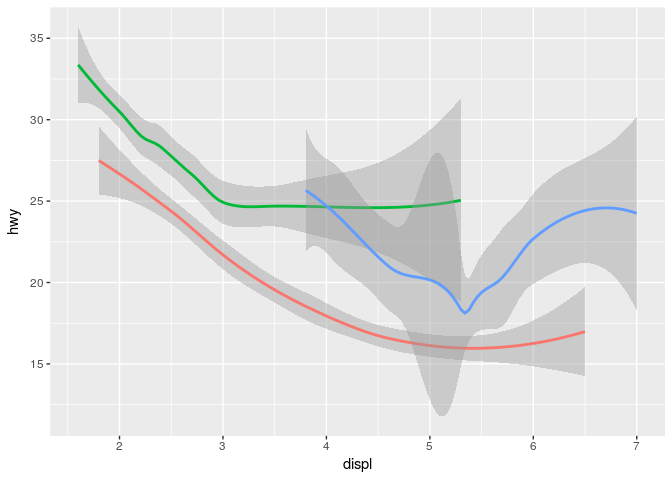

Data visualisation using ggplot2
================
Taavi Päll
19 3 2018

Class I
=======

Visualization of your analysis results or data is not only the matter of taste but must be effective and present your results and data honestly.

Numerical summaries, like arithmetic mean or correlation coefficient, can be deceiving when shape of the data is not known or shown, think of average salary or **datasaurus**.

Therefore, data visualization is natural starting point of every data analysis workflow.

``` r
library(datasauRus)
library(tidyverse)
```

    ## ── Attaching packages ───────────────────────────────────────────────────────────────── tidyverse 1.2.1 ──

    ## ✔ ggplot2 2.2.1     ✔ purrr   0.2.4
    ## ✔ tibble  1.4.2     ✔ dplyr   0.7.4
    ## ✔ tidyr   0.8.0     ✔ stringr 1.3.0
    ## ✔ readr   1.1.1     ✔ forcats 0.3.0

    ## ── Conflicts ──────────────────────────────────────────────────────────────────── tidyverse_conflicts() ──
    ## ✖ dplyr::filter() masks stats::filter()
    ## ✖ dplyr::lag()    masks stats::lag()

``` r
ggplot2::ggplot(datasaurus_dozen) +
  ggplot2::geom_point(ggplot2::aes(x, y)) +
  ggplot2::facet_wrap(~ dataset) +
  ggplot2::labs(title = "Datasurus: these 12 datasets are equal in standard measures:\nmean, standard deviation, and Pearson's correlation")
```


Here we get started with R from the standpoint of visualization. (Luckily for you it's not data structures or subsetting. We leave these topics for later, so don't be worried.)

Sources
-------

-   This tutorial is heavily based on "Data visualization with ggplot2" chapter in [R4DS](http://r4ds.had.co.nz/data-visualisation.html) by G. Grolemund and H. Wickham.
-   [lectures/graafilised-lahendused](https://rstats-tartu.github.io/lectures/graafilised-lahendused.html) and [learn-r/ggplot2](https://tpall.github.io/learn-r/#ggplot2) by Ülo Maiväli and Taavi Päll

ggplot2
-------

**ggplot2** is an R package for producing statistical graphics based on the grammar of graphics (hence the gg!).

Let's start by loading tidyverse (meta) library which provides us with set of necessary packages to start with data analysis and visualizations.

``` r
library(tidyverse)
```

As you can see, running this line of code loads eight different packages (libraries) and warns that some of the functions (filter(), lag()) that were just loaded into namespace have identical name to functions that were already present in namespace. These new functions masked old ones and, in case you want to use these masked functions, you need to call them explicitly by using package where it comes from `stats::filter()`.

If you get error message "there is no package called 'tidyverse'", then you need to install this package and run again `library()`:

``` r
install.packages("tidyverse")
library(tidyverse)
```

First steps
-----------

We need data to create plots! As for start, let's use ggplot2 built in dataset **mpg** with fuel economy data from 1999 and 2008 for 38 models of car:

``` r
mpg # aka ggplot::mpg
```

    ## # A tibble: 234 x 11
    ##    manufacturer model    displ  year   cyl trans   drv     cty   hwy fl   
    ##    <chr>        <chr>    <dbl> <int> <int> <chr>   <chr> <int> <int> <chr>
    ##  1 audi         a4        1.80  1999     4 auto(l… f        18    29 p    
    ##  2 audi         a4        1.80  1999     4 manual… f        21    29 p    
    ##  3 audi         a4        2.00  2008     4 manual… f        20    31 p    
    ##  4 audi         a4        2.00  2008     4 auto(a… f        21    30 p    
    ##  5 audi         a4        2.80  1999     6 auto(l… f        16    26 p    
    ##  6 audi         a4        2.80  1999     6 manual… f        18    26 p    
    ##  7 audi         a4        3.10  2008     6 auto(a… f        18    27 p    
    ##  8 audi         a4 quat…  1.80  1999     4 manual… 4        18    26 p    
    ##  9 audi         a4 quat…  1.80  1999     4 auto(l… 4        16    25 p    
    ## 10 audi         a4 quat…  2.00  2008     4 manual… 4        20    28 p    
    ## # ... with 224 more rows, and 1 more variable: class <chr>

If you worry where this dataset comes from, then there is no magic -- it's bundled with ggplot2 package and will be invisibly loaded every time when ggplot2 library is loaded. mpg invisibility means that, differently from your own R objects, it will not show up in your Environment panel.

For us, key variables in mpg dataset are:

-   `displ` -- engine displacement (L),
-   `hwy` -- highway miles per gallon

Creating a ggplot
-----------------

Simple scatter plot to explore relationship between fuel consumption in highway traffic (hwy) and engine size (displ) is created like this. Here we put displ on the x-axis and hwy on the y-axis:

``` r
ggplot(data = mpg) + 
  geom_point(mapping = aes(x = displ, y = hwy)) +
  labs(x = "Engine displacement",
       y = "Miles per gallon")
```


Here you can see negative relationship between engine size and fuel consumption. It's probably no news to anyone that cars with big engines guzzle more fuel.

-   **ggplot2 works iteratively** -- you start with a layer showing the raw data and then add layers of geoms, annotations, and statistical summaries.

To compose plots, you have to supply minimally:

-   **Data** that you want to visualize and
-   **aes**thetic **mappings** -- what's on x-axis, what's on y-axis, and how to you want to group and color your data. Mapped arguments must be found in your data!
-   **Layers** made up of **geom**etric elements: points, lines, boxes, etc. What's shown on plot.

Visualization of these three components within ggplot context looks like this:

    ggplot(data = <DATA>) +
      <GEOM_FUNCTION>(mapping = aes(<MAPPINGS>))

### Excercises

1.  Run ggplot(data = mpg). What do you see?

``` r
ggplot(data = mpg)
```


1.  How many rows are in mtcars dataset? How many columns?

``` r
mpg
```

    ## # A tibble: 234 x 11
    ##    manufacturer model    displ  year   cyl trans   drv     cty   hwy fl   
    ##    <chr>        <chr>    <dbl> <int> <int> <chr>   <chr> <int> <int> <chr>
    ##  1 audi         a4        1.80  1999     4 auto(l… f        18    29 p    
    ##  2 audi         a4        1.80  1999     4 manual… f        21    29 p    
    ##  3 audi         a4        2.00  2008     4 manual… f        20    31 p    
    ##  4 audi         a4        2.00  2008     4 auto(a… f        21    30 p    
    ##  5 audi         a4        2.80  1999     6 auto(l… f        16    26 p    
    ##  6 audi         a4        2.80  1999     6 manual… f        18    26 p    
    ##  7 audi         a4        3.10  2008     6 auto(a… f        18    27 p    
    ##  8 audi         a4 quat…  1.80  1999     4 manual… 4        18    26 p    
    ##  9 audi         a4 quat…  1.80  1999     4 auto(l… 4        16    25 p    
    ## 10 audi         a4 quat…  2.00  2008     4 manual… 4        20    28 p    
    ## # ... with 224 more rows, and 1 more variable: class <chr>

``` r
class(mpg)
```

    ## [1] "tbl_df"     "tbl"        "data.frame"

1.  What does the drv variable describe? Read help for ?mpg to find out.

``` r
?mpg
```

1.  Make scatterplot of *hwy* vs *cyl* using mpg data:

``` r
ggplot(data = mpg) +
  geom_point(mapping = aes(x = cyl, y = hwy))
```


1.  What happens when you make a scatterplot of *class* versus *drv* using mpg data:

``` r
ggplot(data = mpg) +
  geom_point(mapping = aes(x = class, y = drv))
```


Is it useful?

Aesthetic mappings
------------------

hwy ~ displ scatter plot tells us that there is linear relationship between engine size and fuel consumption: bigger engines use more fuel and are therefore less efficient. Nevertheless, if we look at the cars with huge engines (&gt;5L), it's apparent that there are some outliers (plot below) that perform better than cars in this engine class in general.

What are those cars? Do they have something in common?

``` r
ggplot(data = mpg) +
  geom_point(mapping = aes(x = displ, y = hwy, color = (hwy > 20 & displ > 5)))
```


To get a clue about the nature of these outliers, we would like add more info present in our mpg dataset to plot. To add more variables to 2D scatterplot, we can use additional aesthetic mappings.

Aesthetics like color, shape, fill, and size can be used to add additional variables to a plot.

Let's map color of the points to class variable in mpg dataset to reveal the class of each car:

``` r
ggplot(data = mpg) + 
  geom_point(mapping = aes(x = displ, y = hwy, color = class))
```


We can see that most of the cars with large motors with better fuel efficiency belong to sports cars (2seaters).

Let's recreate previous plot with class mapped to size of each point:

``` r
ggplot(data = mpg) + 
  geom_point(mapping = aes(x = displ, y = hwy, size = class))
```

    ## Warning: Using size for a discrete variable is not advised.


Ouch, we get warning... seems its not a good idea. Why? What's wrong with the next plot where we have four, let's say diameter, categories ("tiny", "small", "big", "very big") and we want to map size aesthetic to diameter

``` r
ggplot(data = data_frame(x = c(1:4), y = 1, diameter = c("tiny", "small", "big", "very big"))) +
  geom_point(mapping = aes(x = x, y = y, size = diameter))
```

    ## Warning: Using size for a discrete variable is not advised.

 Maybe this plot explains why it's generally not a good idea to map categorical variable to size aesthetic.

Excercise
---------

Map **alpha** aesthetic to class:

``` r
ggplot(data = mpg) + 
  geom_point(mapping = aes(x = displ, y = hwy, alpha = class))
```


Map **size** aesthetic to class:

``` r
ggplot(data = mpg) + 
  geom_point(mapping = aes(x = displ, y = hwy, shape = class))
```

    ## Warning: The shape palette can deal with a maximum of 6 discrete values
    ## because more than 6 becomes difficult to discriminate; you have 7.
    ## Consider specifying shapes manually if you must have them.

    ## Warning: Removed 62 rows containing missing values (geom_point).


Is everything OK with shapes?

> When you set your aesthetic via mapping, ggplot automatically takes care of the rest: it finds best scale to display selected aesthetic and draws a legend. Note that this happens only when you map aesthetic within aes() function.

### Set aesthetic manually

You can change the appearance of your plot also manually: change the color or shape of all the points.

For example, let's suppose you want to make all points in plot blue:

``` r
ggplot(data = mpg) + 
  geom_point(mapping = aes(x = displ, y = hwy), colour = "blue") # try HEX code "#0000ff" or rgb(0,0,1)
```


Here, the color is not connected to the variable in your dataset, but just changes the appearance of the plot. Therefore, to change the appearance of the plot, you need to assign value to aesthetic **outside** aes() in geom function.

You just have to pick a value that makes sense for that aesthetic:

-   the name/code of the color as a character string ("blue", "\#0000ff")
-   size of a point in mm
-   shape of a point as a number

### Shape codes

While colors and sizes are intuitive, it seems impossible to remember available point shape codes in R. The quickest way out of this is to know how to generate an example plot of the first 25 shapes quickly. Numbers next to shapes denote R shape number.

``` r
ggplot(data = data_frame(x = rep(1:5, 5), y = rep(5:1, each = 5), shape = c(0:24))) + 
  geom_point(mapping = aes(x = x, y = y, shape = shape), fill = "green", color = "blue", size = 3) +
  geom_text(mapping = aes(x = x, y = y, label = shape), hjust = 1.7) +
  scale_shape_identity() +
  theme(axis.text = element_blank(),
        axis.title = element_blank())
```


Let's use more than 6 shapes:

``` r
ggplot(data = mpg) + 
  geom_point(mapping = aes(x = displ, y = hwy, shape = class), position = position_jitter(0.1)) +
  scale_shape_manual(values = 0:6)
```


Here, we used fill="green", color="blue", to change the appearance of the points, and also adjusted size of the points (size=3) for better visibility. Note the differences how fill and color work on different point shapes! Which is the default point shape in ggplot?

### Excercises

1.  What's wrong with this plot? Why are points not blue? Can you fix the code?

``` r
ggplot(data = mpg) +
  geom_point(mapping = aes(x = displ, y = hwy), color = "blue")
```


1.  Which variables in mpg are categorical? Which variables are continuous? (type ?mpg to read the documentation for the dataset). How can you see when you run mpg?

``` r
mpg
```

    ## # A tibble: 234 x 11
    ##    manufacturer model    displ  year   cyl trans   drv     cty   hwy fl   
    ##    <chr>        <chr>    <dbl> <int> <int> <chr>   <chr> <int> <int> <chr>
    ##  1 audi         a4        1.80  1999     4 auto(l… f        18    29 p    
    ##  2 audi         a4        1.80  1999     4 manual… f        21    29 p    
    ##  3 audi         a4        2.00  2008     4 manual… f        20    31 p    
    ##  4 audi         a4        2.00  2008     4 auto(a… f        21    30 p    
    ##  5 audi         a4        2.80  1999     6 auto(l… f        16    26 p    
    ##  6 audi         a4        2.80  1999     6 manual… f        18    26 p    
    ##  7 audi         a4        3.10  2008     6 auto(a… f        18    27 p    
    ##  8 audi         a4 quat…  1.80  1999     4 manual… 4        18    26 p    
    ##  9 audi         a4 quat…  1.80  1999     4 auto(l… 4        16    25 p    
    ## 10 audi         a4 quat…  2.00  2008     4 manual… 4        20    28 p    
    ## # ... with 224 more rows, and 1 more variable: class <chr>

Homework
--------

1.  Map a continuous variable to color, size, and shape. How do these aesthetics behave differently for categorical vs. continuous variables?

2.  What happens if you map the same variable to multiple aesthetics?

3.  What does the stroke aesthetic do? What shapes does it work with? (Hint: use ?geom\_point)

4.  What happens if you map an aesthetic to something other than a variable name, like aes(colour = displ &lt; 5)?

Class II
========

Adding (more) variables by facet\_wrap
--------------------------------------

We used color, shape and alpha (transparency) to display additional subset in a two-dimensional graph. Using different colours allows visual inference of the distribution of the groups under comparison. But there is apparent limit how much of such information can be accommodated onto one graph before it gets too cluttered.

In addition to reducing visual clutter and overplotting, we can use small subplots just as an another way to bring out subsets from our data. Series of small subplots (multiples) use same scale and axes allowing easier comparisons and are considered very efficient design. Fortunately, ggplot has easy way to do this: facet\_wrap() and facet\_grid() functions split up your dataset and generate multiple small plots arranged in an array. facet\_wrap() works with one variable and facet\_grid() can use two variables.

> At the heart of quantitative reasoning is a single question: Compared to what? Small multiple designs.. answer directly by visually enforcing comparisons of changes, of the differences among objects, of the scope of alternatives. For a wide range of problems in data presentation, small multiples are the best design solution. Edward Tufte (Envisioning Information, p. 67).

Here, we plot each class of cars on a separate subplot and we arrange plots into 2 rows:

``` r
ggplot(data = mpg) + 
  geom_point(mapping = aes(x = displ, y = hwy)) + 
  facet_wrap(~ class, nrow = 2)
```


To plot combination of two variables, we use facet\_grid():

``` r
ggplot(data = mpg) + 
  geom_point(mapping = aes(x = displ, y = hwy)) + 
  facet_grid(drv ~ cyl)
```


Note that the variables, used for splitting up data and arranging facets row and column-wise, are specified in facet\_grid() by formula: facet\_grid(rows ~ columns).

If you want to omit rows or columns in facet\_grid() use `. ~ var` or `var ~ .`, respectively.

``` r
ggplot(data = mpg) + 
  geom_point(mapping = aes(x = displ, y = hwy)) + 
  facet_grid(. ~ cyl)
```


Exercises
---------

1.  What happens if you facet on a continuous variable?

2.  What do the empty cells in plot with facet\_grid(drv ~ cyl) mean? How do they relate to this plot?

``` r
ggplot(data = mpg) + 
  geom_point(mapping = aes(x = drv, y = cyl))
```


1.  What plots does the following code make? What does . do?

``` r
ggplot(data = mpg) + 
  geom_point(mapping = aes(x = displ, y = hwy)) +
  facet_grid(drv ~ .)
```


``` r
ggplot(data = mpg) + 
  geom_point(mapping = aes(x = displ, y = hwy)) +
  facet_grid(. ~ cyl)
```


1.  Take the first faceted plot in this section:

``` r
ggplot(data = mpg) + 
  geom_point(mapping = aes(x = displ, y = hwy)) + 
  facet_wrap(~ class, nrow = 2)
```


What are the advantages to using faceting instead of the colour aesthetic? What are the disadvantages? How might the balance change if you had a larger dataset?

1.  Read ?facet\_wrap. What does nrow do? What does ncol do? What other options control the layout of the individual panels? Why doesn't facet\_grid() have nrow and ncol argument?

2.  When using facet\_grid() you should usually put the variable with more unique levels in the columns. Why?

Geometric objects aka geoms
---------------------------

To change the geom in your plot, change the **geom function** that you add to ggplot().

For instance, to create already familiar dot plot use geom\_point():

``` r
ggplot(data = mpg) + 
  geom_point(mapping = aes(x = displ, y = hwy))
```


To create line graph with loess smooth line fitted to these dots use geom\_smooth():

``` r
ggplot(data = mpg) + 
  geom_smooth(mapping = aes(x = displ, y = hwy))
```

    ## `geom_smooth()` using method = 'loess'


Every geom function in ggplot2 takes a mapping argument.

However, note that **not every aesthetic works with every geom.**

-   You could set the shape of a point, but you couldn't set the "shape" of a line.
-   On the other hand, you could set the linetype of a line.

We can tweak the above plot by mapping each type of drivetrain (drv) to different linetype.

``` r
ggplot(data = mpg) + 
  geom_smooth(mapping = aes(x = displ, y = hwy, linetype = drv))
```

    ## `geom_smooth()` using method = 'loess'


Here, 4 stands for four-wheel drive, f for front-wheel drive, and r for rear-wheel drive.

Four-wheel cars are mapped to "solid" line, front-wheel cars to "dashed" line, and rear-wheel cars to "longdash" line.

For more linetypes and their numeric codes please have a look at R cookbook: <http://www.cookbook-r.com/Graphs/Shapes_and_line_types/>.

Currently, ggplot2 provides over 40 geoms:

``` r
gg2 <- lsf.str("package:ggplot2")
gg2[grep("^geom", gg2)]
```

    ##  [1] "geom_abline"     "geom_area"       "geom_bar"       
    ##  [4] "geom_bin2d"      "geom_blank"      "geom_boxplot"   
    ##  [7] "geom_col"        "geom_contour"    "geom_count"     
    ## [10] "geom_crossbar"   "geom_curve"      "geom_density"   
    ## [13] "geom_density_2d" "geom_density2d"  "geom_dotplot"   
    ## [16] "geom_errorbar"   "geom_errorbarh"  "geom_freqpoly"  
    ## [19] "geom_hex"        "geom_histogram"  "geom_hline"     
    ## [22] "geom_jitter"     "geom_label"      "geom_line"      
    ## [25] "geom_linerange"  "geom_map"        "geom_path"      
    ## [28] "geom_point"      "geom_pointrange" "geom_polygon"   
    ## [31] "geom_qq"         "geom_quantile"   "geom_raster"    
    ## [34] "geom_rect"       "geom_ribbon"     "geom_rug"       
    ## [37] "geom_segment"    "geom_smooth"     "geom_spoke"     
    ## [40] "geom_step"       "geom_text"       "geom_tile"      
    ## [43] "geom_violin"     "geom_vline"

To learn more about any single geom, use help, like: ?geom\_smooth.

Many geoms, like **geom\_smooth(), use a single geometric object to display multiple rows of data**. For these geoms, **you can set the group aesthetic to a categorical variable to draw multiple objects**.

Note that in case of the group aesthetic ggplot2 does not add a legend or distinguishing features to the geoms.

You can plot for example all your bootstrapped linear model fits on one plot to visualize uncertainty, whereas all these lines are of the same color/type.

``` r
ggplot(data = mpg) +
  geom_smooth(mapping = aes(x = displ, y = hwy, group = drv))
```

    ## `geom_smooth()` using method = 'loess'


Other aestheic mappings (color, alpha etc) similarily group your data for display but also add by default legend to the plot. To hide legend, set show.legend to FALSE:

``` r
ggplot(data = mpg) +
  geom_smooth(
    mapping = aes(x = displ, y = hwy, color = drv),
    show.legend = FALSE
  )
```

    ## `geom_smooth()` using method = 'loess'



To display multiple geoms in the same plot, add multiple geom functions to ggplot():

``` r
ggplot(data = mpg) + 
  geom_point(mapping = aes(x = displ, y = hwy)) +
  geom_smooth(mapping = aes(x = displ, y = hwy))
```

    ## `geom_smooth()` using method = 'loess'


Probably you notice, that if we go with aethetic mappings as we used to, by specifing them within geom function, we introduce some code duplication. This can be easily avoided by moving aes() part from geom\_ to the ggplot():

``` r
ggplot(data = mpg, mapping = aes(x = displ, y = hwy)) + 
  geom_point() +
  geom_smooth()
```

    ## `geom_smooth()` using method = 'loess'


Now, ggplot2 uses this mapping globally in all geoms.

If you place mappings in a geom function, ggplot2 will treat them as local mappings for the layer. It will use these mappings to extend or overwrite the global mappings for that layer only. This way it's possible to use different aesthetics in different layers (for example, if you wish to plot model fit over data points).

Here, we map color to the class of cars, whereas geom\_smooth still plots only one line:

``` r
ggplot(data = mpg, mapping = aes(x = displ, y = hwy)) + 
  geom_point(mapping = aes(color = class)) + 
  geom_smooth()
```

    ## `geom_smooth()` using method = 'loess'


Importantly, you can use the same idea to specify different data for each layer:

``` r
ggplot(data = mpg, mapping = aes(x = displ, y = hwy)) + 
  geom_point(mapping = aes(color = class)) + 
  geom_smooth(data = filter(mpg, class == "subcompact"), se = FALSE)
```

    ## `geom_smooth()` using method = 'loess'

 Above, our smooth line displays just a subset of the mpg dataset, the subcompact cars. The local data argument in geom\_smooth() overrides the global data argument in ggplot() for that layer only.

Exercises
---------

1.  What geom would you use to draw a line chart? A boxplot? A histogram? An area chart?

2.  Run this code in your head and predict what the output will look like. Then, run the code in R and check your predictions.

``` r
ggplot(data = mpg, mapping = aes(x = displ, y = hwy, color = drv)) + 
  geom_point() + 
  geom_smooth(se = FALSE)
```

    ## `geom_smooth()` using method = 'loess'


1.  What does show.legend = FALSE do? What happens if you remove it?

2.  What does the se argument to geom\_smooth() do?

3.  Will these two graphs look different? Why/why not?

``` r
ggplot(data = mpg, mapping = aes(x = displ, y = hwy)) + 
  geom_point() + 
  geom_smooth()
```

    ## `geom_smooth()` using method = 'loess'


``` r
ggplot() + 
  geom_point(data = mpg, mapping = aes(x = displ, y = hwy)) + 
  geom_smooth(data = mpg, mapping = aes(x = displ, y = hwy))
```

    ## `geom_smooth()` using method = 'loess'


1.  Recreate the R code necessary to generate the following graphs.

``` r
knitr::include_graphics(glue::glue("plots/fig{1:6}.png"))
```


