ggplot: beyond dotplots
================
Taavi Päll
2018-09-24

## Adding (more) variables by facet\_wrap

We used color, shape and alpha (transparency) to display additional
subset in a two-dimensional graph. Using different colours allows visual
inference of the distribution of the groups under comparison. But there
is apparent limit how much of such information can be accommodated onto
one graph before it gets too cluttered.

In addition to reducing visual clutter and overplotting, we can use
small subplots just as an another way to bring out subsets from our
data. Series of small subplots (multiples) use same scale and axes
allowing easier comparisons and are considered very efficient design.
Fortunately, ggplot has easy way to do this: facet\_wrap() and
facet\_grid() functions split up your dataset and generate multiple
small plots arranged in an array.

facet\_wrap() works with one variable and facet\_grid() can use two
variables.

> At the heart of quantitative reasoning is a single question: Compared
> to what? Small multiple designs.. answer directly by visually
> enforcing comparisons of changes, of the differences among objects, of
> the scope of alternatives. For a wide range of problems in data
> presentation, small multiples are the best design solution. Edward
> Tufte (Envisioning Information,
    p. 67).

``` r
library(tidyverse)
```

    ## -- Attaching packages ------------------------------------------------------------------------------------ tidyverse 1.2.1 --

    ## <U+221A> ggplot2 3.0.0     <U+221A> purrr   0.2.5
    ## <U+221A> tibble  1.4.2     <U+221A> dplyr   0.7.6
    ## <U+221A> tidyr   0.8.1     <U+221A> stringr 1.3.1
    ## <U+221A> readr   1.1.1     <U+221A> forcats 0.3.0

    ## -- Conflicts --------------------------------------------------------------------------------------- tidyverse_conflicts() --
    ## x dplyr::filter() masks stats::filter()
    ## x dplyr::lag()    masks stats::lag()

``` r
library(here)
```

    ## here() starts at C:/Users/taavi/Downloads/making-plots-with-ggplot

Here, we plot each class of cars on a separate subplot and we arrange
plots into 2 rows:

``` r
ggplot(data = mpg) +
  geom_point(mapping = aes(x = displ, y = hwy)) +
  facet_wrap("class")
```

<!-- -->

To plot combination of two variables, we use facet\_grid():

``` r
ggplot(data = mpg) + 
  geom_point(mapping = aes(x = displ, y = hwy)) + 
  facet_grid(drv ~ cyl)
```

<!-- -->

Note that the variables, used for splitting up data and arranging facets
row and column-wise, are specified in facet\_grid() by formula:
facet\_grid(rows \~ columns).

If you want to omit rows or columns in facet\_grid() use `. ~ var` or
`var ~ .`, respectively.

``` r
ggplot(data = mpg) + 
  geom_point(mapping = aes(x = displ, y = hwy)) + 
  facet_grid(. ~ cyl)
```

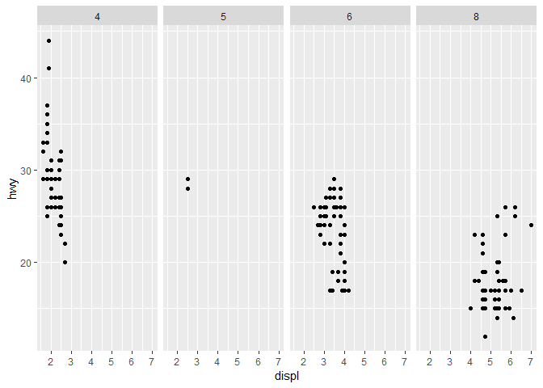<!-- -->

``` r
ggplot(data = mpg) + 
  geom_point(mapping = aes(x = displ, y = hwy)) + 
  facet_grid(drv ~ cyl, scales = "free_y")
```

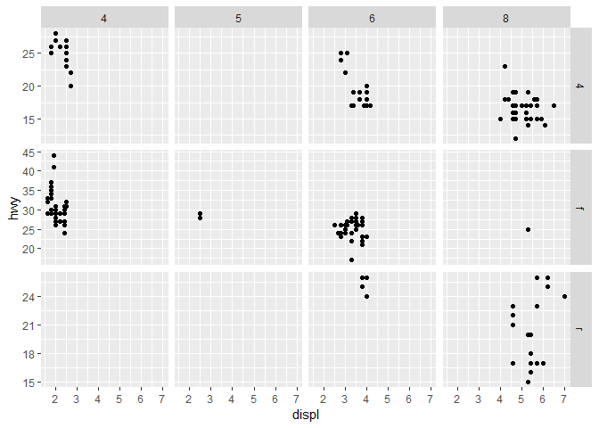<!-- -->

``` r
ggplot(data = mpg) + 
  geom_point(mapping = aes(x = displ, y = hwy)) + 
  facet_grid(drv ~ cyl, scales = "free_x")
```

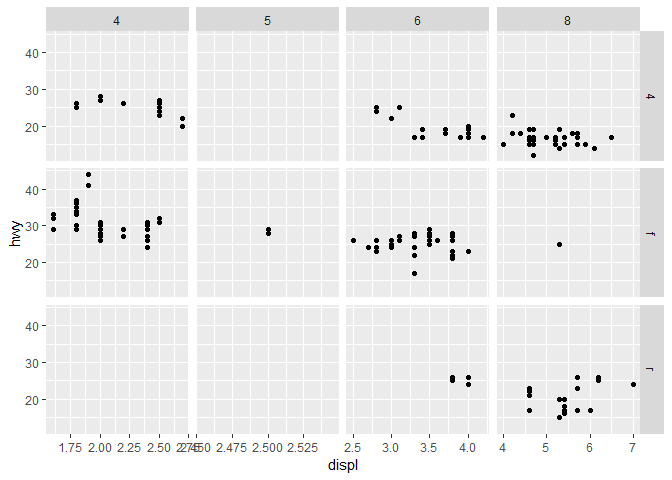<!-- -->

``` r
ggplot(data = mpg) + 
  geom_point(mapping = aes(x = displ, y = hwy)) + 
  facet_grid(drv ~ cyl, scales = "free") # free scale for both: x and y axis
```

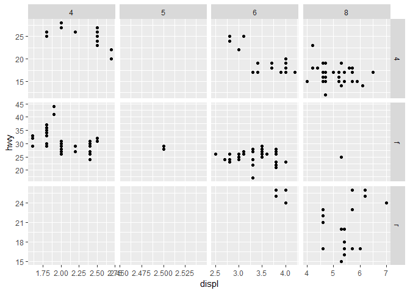<!-- -->

``` r
ggplot(data = mpg) + 
  geom_point(mapping = aes(x = displ, y = hwy)) + 
  facet_wrap("drv", scales = "free_y")
```

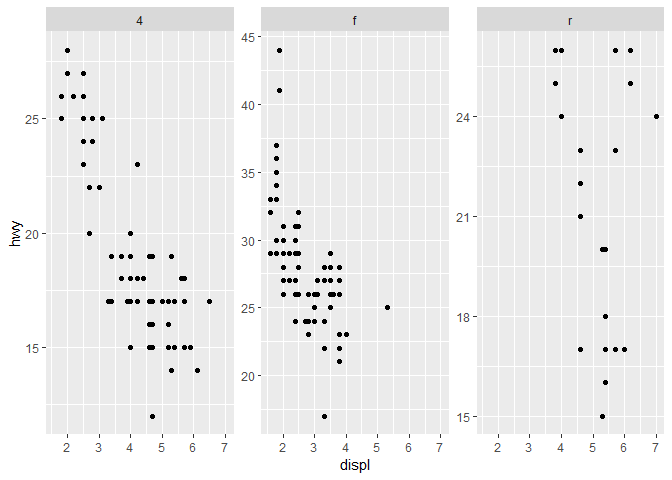<!-- -->

## Exercises

1.  What happens if you facet on a continuous variable?

<!-- end list -->

``` r
mpg
```

    ## # A tibble: 234 x 11
    ##    manufacturer model displ  year   cyl trans drv     cty   hwy fl    cla~
    ##    <chr>        <chr> <dbl> <int> <int> <chr> <chr> <int> <int> <chr> <ch>
    ##  1 audi         a4      1.8  1999     4 auto~ f        18    29 p     com~
    ##  2 audi         a4      1.8  1999     4 manu~ f        21    29 p     com~
    ##  3 audi         a4      2    2008     4 manu~ f        20    31 p     com~
    ##  4 audi         a4      2    2008     4 auto~ f        21    30 p     com~
    ##  5 audi         a4      2.8  1999     6 auto~ f        16    26 p     com~
    ##  6 audi         a4      2.8  1999     6 manu~ f        18    26 p     com~
    ##  7 audi         a4      3.1  2008     6 auto~ f        18    27 p     com~
    ##  8 audi         a4 q~   1.8  1999     4 manu~ 4        18    26 p     com~
    ##  9 audi         a4 q~   1.8  1999     4 auto~ 4        16    25 p     com~
    ## 10 audi         a4 q~   2    2008     4 manu~ 4        20    28 p     com~
    ## # ... with 224 more rows

``` r
ggplot(data = mpg) + 
  geom_point(mapping = aes(x = displ, y = hwy)) + 
  facet_wrap(~ displ)
```

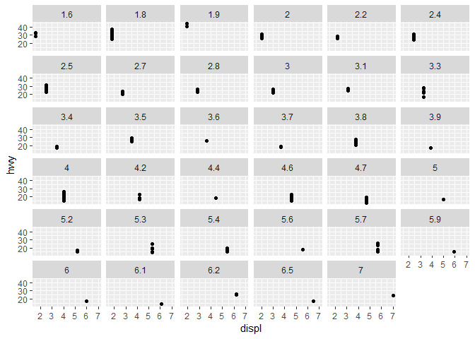<!-- -->
Each raw value is converted to categorical value and gets its own facet?

2.  What do the empty cells in plot with facet\_grid(drv \~ cyl) mean?
    How do they relate to this plot?

<!-- end list -->

``` r
ggplot(data = mpg) + 
  geom_point(mapping = aes(x = drv, y = cyl))
```

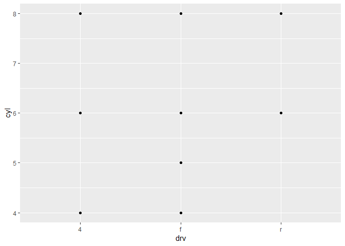<!-- -->

3.  What plots does the following code make? What does . do?

<!-- end list -->

``` r
ggplot(data = mpg) + 
  geom_point(mapping = aes(x = displ, y = hwy)) +
  facet_grid(drv ~ .)
```

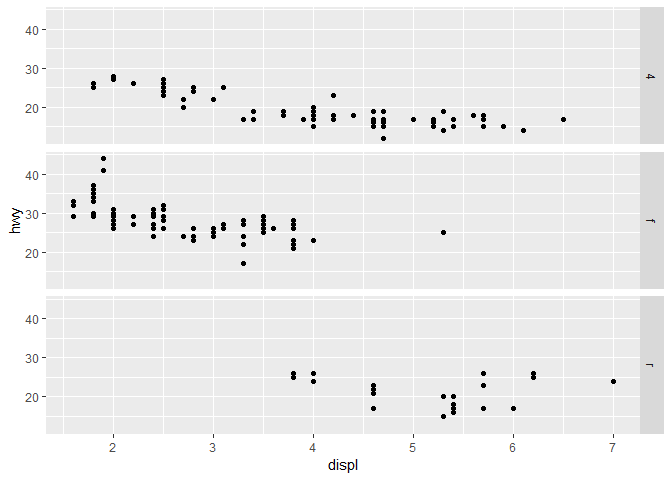<!-- -->

``` r
ggplot(data = mpg) + 
  geom_point(mapping = aes(x = displ, y = hwy)) +
  facet_grid(. ~ cyl)
```

<!-- -->

4.  Read ?facet\_wrap. What does nrow do? What does ncol do? What other
    options control the layout of the individual panels? Why doesn’t
    facet\_grid() have nrow and ncol argument.

<!-- end list -->

``` r
?facet_wrap
```

    ## starting httpd help server ... done

``` r
ggplot(data = mpg) + 
  geom_point(mapping = aes(x = displ, y = hwy)) +
  facet_wrap(~ cyl, nrow = 2, ncol = 3)
```

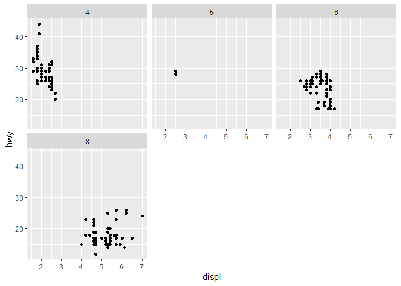<!-- -->

5.  When using facet\_grid() you should usually put the variable with
    more unique levels in the columns. Why?

<!-- end list -->

``` r
ggplot(data = mpg) + 
  geom_point(mapping = aes(x = displ, y = hwy)) + 
  facet_grid(drv ~ cyl)
```

<!-- -->

Not endorsed?

``` r
ggplot(data = mpg) + 
  geom_point(mapping = aes(x = displ, y = hwy)) + 
  facet_grid(cyl ~ drv)
```

<!-- -->

## Geometric objects aka geoms

To change the geom in your plot, change the **geom function** that you
add to ggplot().

For instance, to create already familiar dot plot use geom\_point():

``` r
ggplot(data = mpg) + 
  geom_point(mapping = aes(x = displ, y = hwy))
```

<!-- -->

To create line graph with loess smooth line fitted to these dots use
geom\_smooth():

``` r
ggplot(data = mpg) + 
  geom_smooth(mapping = aes(x = displ, y = hwy))
```

    ## `geom_smooth()` using method = 'loess' and formula 'y ~ x'

<!-- -->

Every geom function in ggplot2 takes a mapping argument.

However, note that **not every aesthetic works with every geom.**

  - You could set the shape of a point, but you couldn’t set the “shape”
    of a line.
  - On the other hand, you could set the linetype of a line.

We can tweak the above plot by mapping each type of drive (drv) to
different linetype.

``` r
ggplot(data = mpg) + 
  geom_smooth(mapping = aes(x = displ, y = hwy, linetype = drv, color = drv)) +
  scale_color_manual(values = viridisLite::viridis(3))
```

    ## `geom_smooth()` using method = 'loess' and formula 'y ~ x'

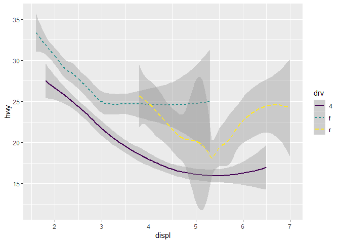<!-- -->

Here, 4 stands for four-wheel drive, f for front-wheel drive, and r for
rear-wheel drive.

Four-wheel cars are mapped to “solid” line, front-wheel cars to “dashed”
line, and rear-wheel cars to “longdash” line.

For more linetypes and their numeric codes please have a look at R
cookbook: <http://www.cookbook-r.com/Graphs/Shapes_and_line_types/>.

Currently, ggplot2 provides over 40 geoms:

``` r
gg2 <- lsf.str("package:ggplot2")
gg2[grep("^geom", gg2)]
```

    ##  [1] "geom_abline"     "geom_area"       "geom_bar"       
    ##  [4] "geom_bin2d"      "geom_blank"      "geom_boxplot"   
    ##  [7] "geom_col"        "geom_contour"    "geom_count"     
    ## [10] "geom_crossbar"   "geom_curve"      "geom_density"   
    ## [13] "geom_density_2d" "geom_density2d"  "geom_dotplot"   
    ## [16] "geom_errorbar"   "geom_errorbarh"  "geom_freqpoly"  
    ## [19] "geom_hex"        "geom_histogram"  "geom_hline"     
    ## [22] "geom_jitter"     "geom_label"      "geom_line"      
    ## [25] "geom_linerange"  "geom_map"        "geom_path"      
    ## [28] "geom_point"      "geom_pointrange" "geom_polygon"   
    ## [31] "geom_qq"         "geom_qq_line"    "geom_quantile"  
    ## [34] "geom_raster"     "geom_rect"       "geom_ribbon"    
    ## [37] "geom_rug"        "geom_segment"    "geom_sf"        
    ## [40] "geom_smooth"     "geom_spoke"      "geom_step"      
    ## [43] "geom_text"       "geom_tile"       "geom_violin"    
    ## [46] "geom_vline"

To learn more about any single geom, use help, like: ?geom\_smooth.

Many geoms, like **geom\_smooth(), use a single geometric object to
display multiple rows of data**. For these geoms, **you can set the
group aesthetic to a categorical variable to draw multiple objects**.

Note that in case of the group aesthetic ggplot2 does not add a legend
or distinguishing features to the geoms.

You can plot for example all your bootstrapped linear model fits on one
plot to visualize uncertainty, whereas all these lines are of the same
color/type.

``` r
ggplot(data = mpg) +
  geom_smooth(mapping = aes(x = displ, y = hwy, group = drv))
```

    ## `geom_smooth()` using method = 'loess' and formula 'y ~ x'

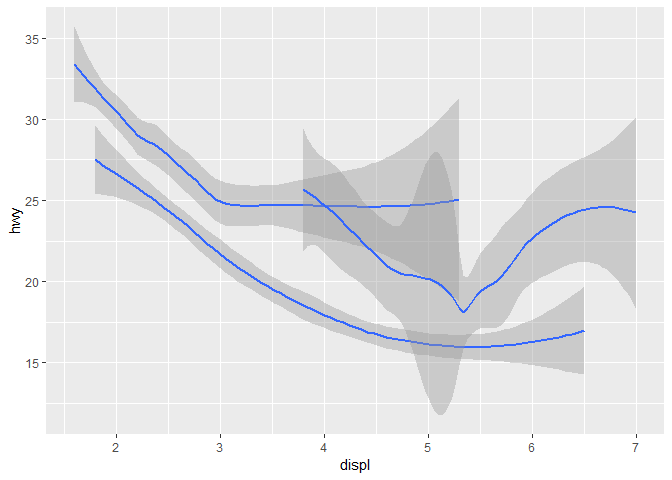<!-- -->

Other aestheic mappings (color, alpha etc) similarily group your data
for display but also add by default legend to the plot. To hide legend,
set show.legend to FALSE:

``` r
ggplot(data = mpg) +
  geom_smooth(
    mapping = aes(x = displ, y = hwy, color = drv),
    show.legend = FALSE
  )
```

    ## `geom_smooth()` using method = 'loess' and formula 'y ~ x'

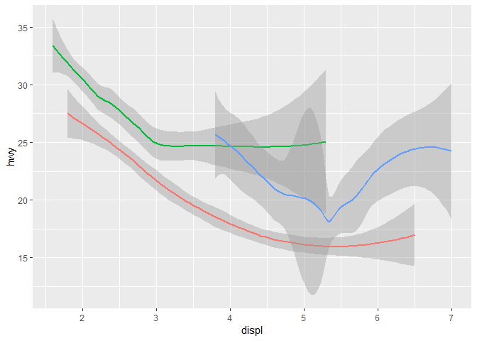<!-- -->

To display multiple geoms in the same plot, add multiple geom functions
to ggplot():

``` r
ggplot(data = mpg) + 
  geom_point(mapping = aes(x = displ, y = hwy)) +
  geom_smooth(mapping = aes(x = displ, y = hwy))
```

    ## `geom_smooth()` using method = 'loess' and formula 'y ~ x'

<!-- -->

Probably you notice, that if we go with aethetic mappings as we used to,
by specifing them within geom function, we introduce some code
duplication. This can be easily avoided by moving aes() part from geom\_
to the ggplot():

``` r
ggplot(data = mpg, mapping = aes(x = displ, y = hwy)) + 
  geom_point() +
  geom_smooth()
```

    ## `geom_smooth()` using method = 'loess' and formula 'y ~ x'

<!-- -->

Now, ggplot2 uses this mapping globally in all geoms.

If you place mappings in a geom function, ggplot2 will treat them as
local mappings for the layer. It will use these mappings to extend or
overwrite the global mappings for that layer only. This way it’s
possible to use different aesthetics in different layers (for example,
if you wish to plot model fit over data points).

Here, we map color to the class of cars, whereas geom\_smooth still
plots only one line:

``` r
ggplot(data = mpg, mapping = aes(x = displ, y = hwy)) + 
  geom_point(mapping = aes(color = class)) + 
  geom_smooth()
```

    ## `geom_smooth()` using method = 'loess' and formula 'y ~ x'

<!-- -->

Importantly, you can use the same idea to specify different data for
each layer:

``` r
ggplot(data = mpg, mapping = aes(x = displ, y = hwy)) + 
  geom_point(mapping = aes(color = class)) + 
  geom_smooth(data = filter(mpg, class == "subcompact"), se = FALSE)
```

    ## `geom_smooth()` using method = 'loess' and formula 'y ~ x'

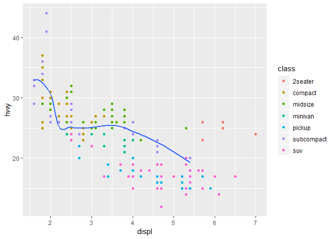<!-- -->
Above, our smooth line displays just a subset of the mpg dataset, the
subcompact cars. The local data argument in geom\_smooth() overrides the
global data argument in ggplot() for that layer only.

## Exercises

1.  What geom would you use to draw a line chart? A boxplot? A
    histogram? An area chart?

2.  Run this code in your head and predict what the output will look
    like. Then, run the code in R and check your predictions.

<!-- end list -->

``` r
ggplot(data = mpg, mapping = aes(x = displ, y = hwy, color = drv)) + 
  geom_point() + 
  geom_smooth(se = FALSE)
```

    ## `geom_smooth()` using method = 'loess' and formula 'y ~ x'

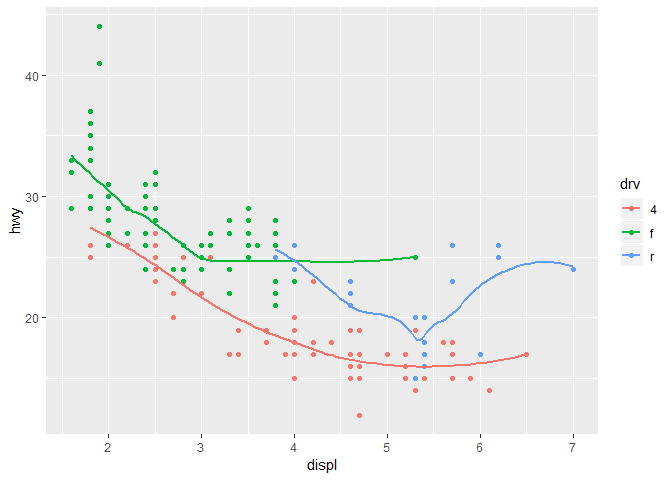<!-- -->

3.  What does show.legend = FALSE do? What happens if you remove it?

4.  What does the se argument to geom\_smooth() do?

5.  Will these two graphs look different? Why/why not?

<!-- end list -->

``` r
ggplot(data = mpg, mapping = aes(x = displ, y = hwy)) + 
  geom_point() + 
  geom_smooth()
```

    ## `geom_smooth()` using method = 'loess' and formula 'y ~ x'

<!-- -->

``` r
ggplot() + 
  geom_point(data = mpg, mapping = aes(x = displ, y = hwy)) + 
  geom_smooth(data = mpg, mapping = aes(x = displ, y = hwy))
```

    ## `geom_smooth()` using method = 'loess' and formula 'y ~ x'

<!-- -->

## Plotting statistical transformations - bar graph tricks

Bar graphs are special among ggplot geoms. This is because by default
they do some calculations with data before plotting. To get an idea,
please have a look at the following bar graph, created by geom\_bar()
function.

The chart below displays the total number of diamonds in the
**diamonds** dataset, grouped by cut.

``` r
ggplot(data = diamonds) + 
  geom_bar(mapping = aes(x = cut))
```

<!-- -->

Let’s have a look at the diamonds dataset, containing the prices and
other attributes of \~54000 diamonds.

``` r
diamonds
```

    ## # A tibble: 53,940 x 10
    ##    carat cut       color clarity depth table price     x     y     z
    ##    <dbl> <ord>     <ord> <ord>   <dbl> <dbl> <int> <dbl> <dbl> <dbl>
    ##  1 0.23  Ideal     E     SI2      61.5    55   326  3.95  3.98  2.43
    ##  2 0.21  Premium   E     SI1      59.8    61   326  3.89  3.84  2.31
    ##  3 0.23  Good      E     VS1      56.9    65   327  4.05  4.07  2.31
    ##  4 0.290 Premium   I     VS2      62.4    58   334  4.2   4.23  2.63
    ##  5 0.31  Good      J     SI2      63.3    58   335  4.34  4.35  2.75
    ##  6 0.24  Very Good J     VVS2     62.8    57   336  3.94  3.96  2.48
    ##  7 0.24  Very Good I     VVS1     62.3    57   336  3.95  3.98  2.47
    ##  8 0.26  Very Good H     SI1      61.9    55   337  4.07  4.11  2.53
    ##  9 0.22  Fair      E     VS2      65.1    61   337  3.87  3.78  2.49
    ## 10 0.23  Very Good H     VS1      59.4    61   338  4     4.05  2.39
    ## # ... with 53,930 more rows

Variable count is nowhere to be found… it’s quite different from other
plot types, like scatterplot, that plot raw values.

Other graphs, like bar charts, calculate new values to plot:

  - bar charts, histograms, and frequency polygons bin your data and
    then plot bin counts, the number of points that fall in each bin.

  - smoothers fit a model to your data and then plot predictions from
    the model.

  - boxplots compute a robust summary of the distribution and then
    display a specially formatted box.

The algorithm used to calculate new values for a graph is called a stat,
short for statistical transformation.

You can learn which stat a geom uses by inspecting the default value for
the stat argument in geom\_ function.

For example, ?geom\_bar shows that the default value for stat is
“count”:

    geom_bar(mapping = NULL, data = NULL, stat = "count",
      position = "stack", ..., width = NULL, binwidth = NULL, na.rm = FALSE,
      show.legend = NA, inherit.aes = TRUE)

You can use geoms and stats interchangeably. For example, you can
recreate the previous plot using stat\_count() instead of geom\_bar():

``` r
ggplot(data = diamonds) + 
  stat_count(mapping = aes(x = cut))
```

<!-- -->

This works because every geom has a default stat; and every stat has a
default geom, meaning that you can use geoms without worrying about its
underlying statistical transformation.

There are three cases when you might want to specify stat explicitly:

1.  You might want to override the default stat. For example you have
    alredy summarised counts or means or whatever, then you need to
    change the default stat in geom\_bar() to “identity”: Let’s create
    summarized dataset (don’t worry about this code yet, we are going to
    this in the next classes):

<!-- end list -->

``` r
diamonds_summarised <- diamonds %>% 
  group_by(cut) %>% 
  summarise(N = n())
diamonds_summarised
```

    ## # A tibble: 5 x 2
    ##   cut           N
    ##   <ord>     <int>
    ## 1 Fair       1610
    ## 2 Good       4906
    ## 3 Very Good 12082
    ## 4 Premium   13791
    ## 5 Ideal     21551

Here we (re)create diamond counts plot using summary data. Note that
here we need to use also y-aesthetic\!

``` r
ggplot(data = diamonds_summarised) +
  geom_bar(mapping = aes(x = cut, y = N), stat = "identity")
```

<!-- -->

2.  You might want to override the default mapping from transformed
    variables to aesthetics. For example, you might want to display a
    bar chart of proportion, rather than count:

<!-- end list -->

``` r
ggplot(data = diamonds) + 
  geom_bar(mapping = aes(x = cut, y = ..prop.., group = 1))
```

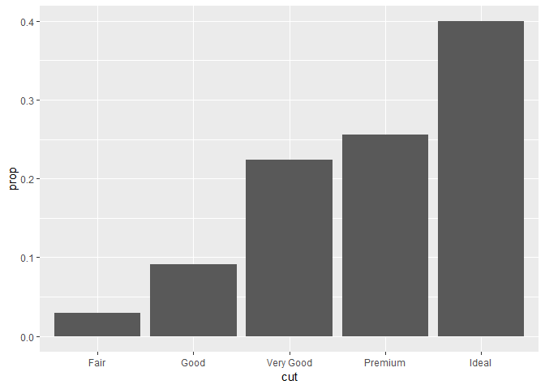<!-- -->

To find the variables computed by the stat, look for the help section
titled “computed variables”.

3.  You might want to draw greater attention to the statistical
    transformation in your code. Meaning basically, that you want to
    plot some summary statistics like median and min/max or mean +/- SE.

Median and min/max:

``` r
ggplot(data = diamonds) + 
  stat_summary(
    mapping = aes(x = cut, y = depth),
    fun.ymin = min,
    fun.ymax = max,
    fun.y = median
  )
```

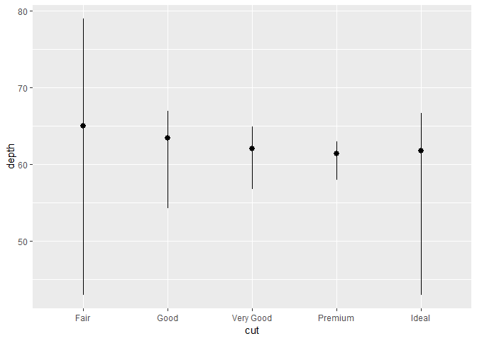<!-- -->

Mean and SE:

``` r
ggplot(data = diamonds) + 
  stat_summary(
    mapping = aes(x = cut, y = depth),
    fun.data = mean_se
  )
```

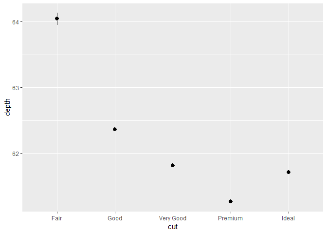<!-- -->

If you want to use mean +/- SD like this, you need mean\_sdl() function
from Hmisc package (meaning, that you need to install Hmisc).

### Homework 2

## Position adjustments - how to get those bars side-by-side

There is more you need to know about bar charts. You can easily update
diamonds cut counts by mapping cut additonally either to color or fill
(whereas fill seems to be more useful):

``` r
ggplot(data = diamonds) + 
  stat_count(mapping = aes(x = cut, fill = cut))
```

<!-- -->

But what happens when we map fill to another variable in diamonds data,
like clarity:

``` r
ggplot(data = diamonds) + 
  stat_count(mapping = aes(x = cut, fill = clarity))
```

<!-- -->

Wow, bars are automatically **stacked** showing the proportions of
different diamond clarity classes within cut quality classes.

If you want to get these stacked bars side-by-side, you need to change
the **position adjustment** argument, which is set to “stacked” by
default. There are three other options: “identity”, “dodge” and “fill”.

  - position = “identity” will place each object exactly where it falls
    in the context of the graph. Its generally not useful with bar
    graphs, as all bars are behind each other and this plot can be
    easily mixed up with position = “stacked”:

<!-- end list -->

``` r
ggplot(data = diamonds) + 
  stat_count(mapping = aes(x = cut, fill = clarity), position = "identity")
```

<!-- -->

Position “stacked” is naturally default in scatterplot.

  - position = “fill” works like stacking, but makes each set of stacked
    bars the same height. This makes it easier to compare proportions
    across groups.

<!-- end list -->

``` r
ggplot(data = diamonds) + 
  geom_bar(mapping = aes(x = cut, fill = clarity), position = "fill")
```

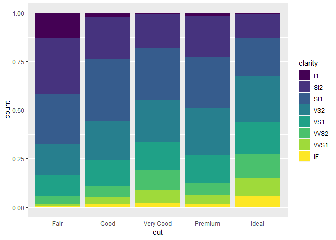<!-- -->

  - position = “dodge” places overlapping objects directly beside one
    another. This makes it easier to compare individual values.

<!-- end list -->

``` r
ggplot(data = diamonds) + 
  geom_bar(mapping = aes(x = cut, fill = clarity), position = "dodge")
```

<!-- -->

There is another position adjustment function for scatterplots that
helps mitigate overplotting: position = “jitter”:

``` r
ggplot(data = mpg) +
  geom_point(mapping = aes(x = displ, y = hwy), position = "jitter")
```

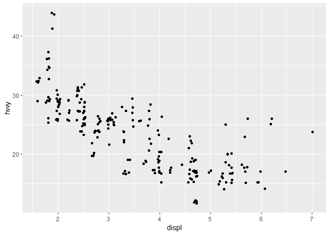<!-- -->

“jitter” adds small amount of random noise to your raw data, so that
each point gets moved away from its original position. This way you can
reveal very similar data points that fall into same place in plot grid.

To learn more about a position adjustment, look up the help page
associated with each adjustment: ?position\_dodge, ?position\_fill,
?position\_identity, ?position\_jitter, and ?position\_stack.

### Exercises

1.  What is the problem with this plot? How could you improve it?

<!-- end list -->

``` r
ggplot(data = mpg, mapping = aes(x = cty, y = hwy)) + 
  geom_point()
```

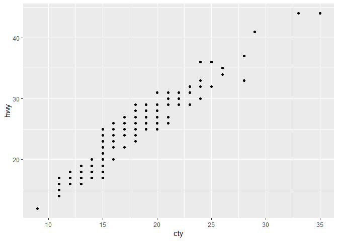<!-- -->

2.  What parameters to geom\_jitter() control the amount of jittering?

3.  What’s the default position adjustment for geom\_boxplot()? Create a
    visualisation of the mpg dataset that demonstrates it.

## Coordinate systems - flip your plot

The default coordinate system of ggplot2 is the Cartesian coordinate
system where the x and y positions act independently to determine the
location of each point.

There are a number of other coordinate systems that are occasionally
helpful.

  - coord\_flip() witches the x and y axes. This is useful if you want
    horizontal boxplots. It’s also very useful for long labels: it’s
    hard to get them to fit without overlapping on the x-axis.

<!-- end list -->

``` r
ggplot(data = mpg, mapping = aes(x = class, y = hwy)) + 
  geom_boxplot() +
  coord_flip()
```

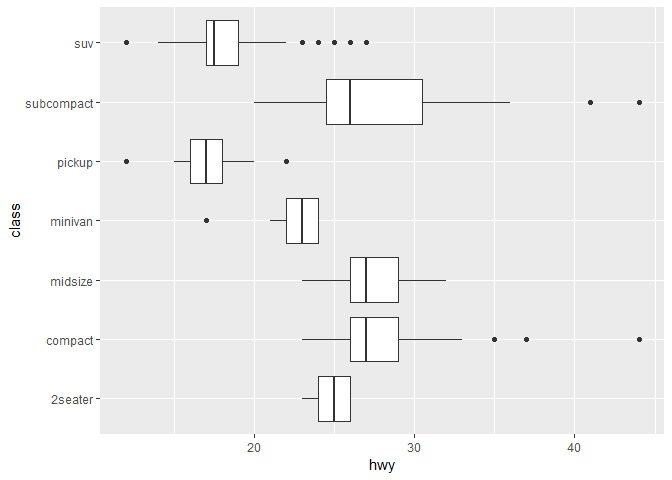<!-- -->

Try to make this plot without flipping… x-axis labels are a mess\!

  - coord\_quickmap() sets the aspect ratio correctly for maps. This is
    very important if you’re plotting spatial data with ggplot2.

<!-- end list -->

``` r
# install.packages("sp")
# level 0 map data was downloaded from http://www.gadm.org/country
# https://biogeo.ucdavis.edu/data/gadm3.6/Rsp/gadm36_EST_0_sp.rds
est <- read_rds(here("data/gadm36_EST_0_sp.rds"))
ggplot(est, aes(long, lat, group = group)) +
  geom_polygon(fill = "white", colour = "black") +
  labs(title = "Unadjusted (inappropriate) lat/lon ratio")
```

    ## Loading required package: sp

    ## Regions defined for each Polygons

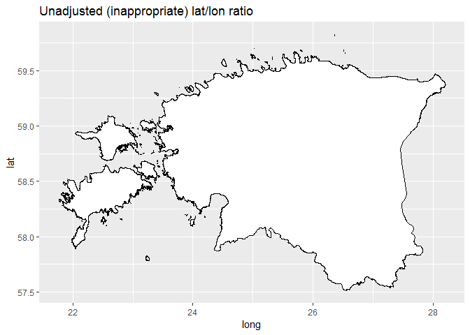<!-- -->

``` r
ggplot(est, aes(long, lat, group = group)) +
  geom_polygon(fill = "white", colour = "black") +
  coord_quickmap() +
  labs(title = "Adjusted lat/lon aspect ratio")
```

    ## Regions defined for each Polygons

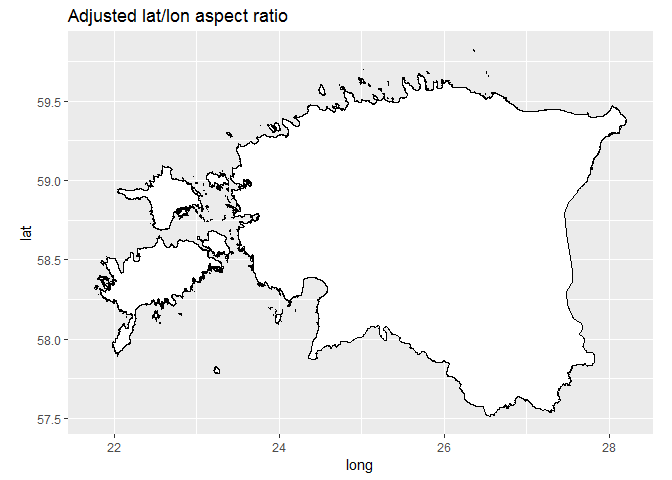<!-- -->

### Excercises

1.  What does labs() do? Read the documentation.

2.  What’s the difference between coord\_quickmap() and coord\_map()?

## Grammar of graphics summary

Constructing ggplot graphs can be reduced to the following template, at
minimum you need data and one geom to produce a plot.

``` r
ggplot(data = <DATA>) + 
  <GEOM_FUNCTION>(
     mapping = aes(<MAPPINGS>),
     stat = <STAT>, 
     position = <POSITION>
  ) +
  <COORDINATE_FUNCTION> +
  <FACET_FUNCTION>
```
