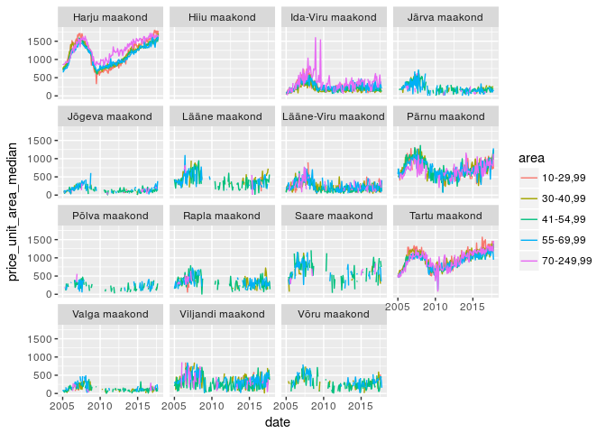
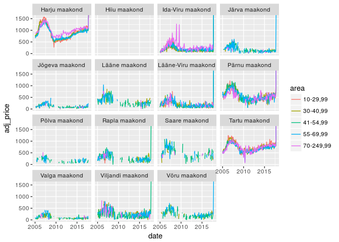
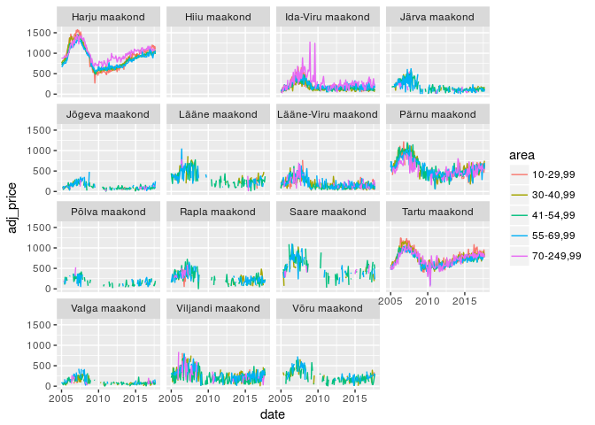
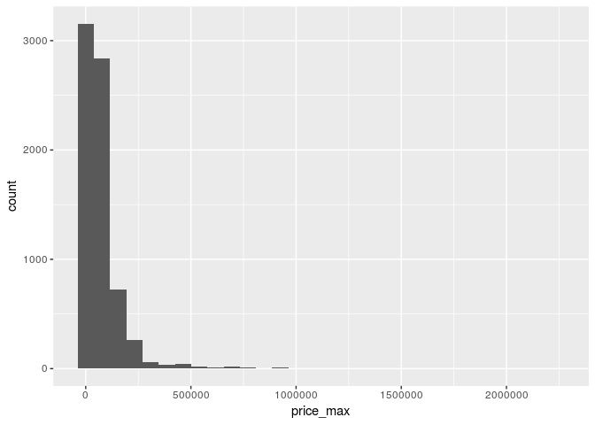
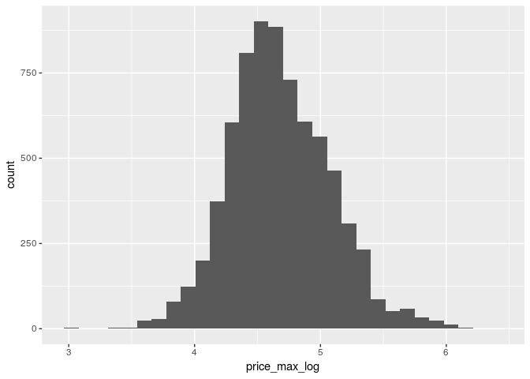
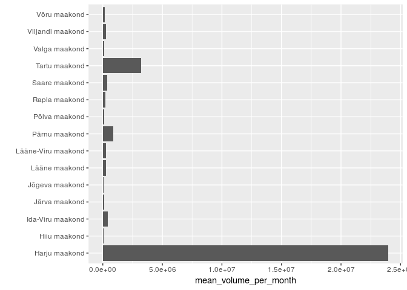

Data transformation using dplyr (aka five verbs)
================
Taavi Päll
1.  April 2018

Introduction
------------

I our previous classes we have been working with small cleaned up dataset to go through steps of creating some of the most common visualization types.

In your workflow you are going to need data visualization at two points, namely during exploratory data analysis where you learn to know your dataset and during report preparation when you try to communicate what have you found. And this is not two stop trip, it's more like a roundabout, an iterative process, where you pass these two point multiple times after you have done some "tweaking" of your data. By "tweaking" I mean here data transformation and/or modeling.

You need to transform your data during analysis, because in real life you rarely start with a dataset that is in the right form for visualization and modeling. So, often you will need to:

-   summarise your data or to
-   create new variables,
-   rename variables, or
-   reorder the observations.

We are going to use the dplyr library from tidyverse to learn how to carry out these tasks.

Sources
-------

Again, we are going to follow closely R4DS book chapter "Data transformation" available from <http://r4ds.had.co.nz/transform.html>. More examples are available from <https://rstats-tartu.github.io/lectures/tidyverse.html#dplyr-ja-selle-viis-verbi>

Class III
---------

Load libraries and datasets:

``` r
library(tidyverse)
```

    ## ── Attaching packages ──────────────────────── tidyverse 1.2.1 ──

    ## ✔ ggplot2 2.2.1     ✔ purrr   0.2.4
    ## ✔ tibble  1.4.2     ✔ dplyr   0.7.4
    ## ✔ tidyr   0.8.0     ✔ stringr 1.3.0
    ## ✔ readr   1.1.1     ✔ forcats 0.3.0

    ## ── Conflicts ─────────────────────────── tidyverse_conflicts() ──
    ## ✖ dplyr::filter() masks stats::filter()
    ## ✖ dplyr::lag()    masks stats::lag()

However, instead of nycflights13 data we are going to use Estonian apartment transactions data. Transactions data contain monthly apartment sales data from January 2005 to January 2017 split up by counties and size of apartments. Price info is available when at least five transactions has been carried out.

``` r
(transactions <- read_csv(file = "data/transactions.csv"))
```

    ## Parsed with column specification:
    ## cols(
    ##   year = col_integer(),
    ##   month = col_integer(),
    ##   county = col_character(),
    ##   area = col_character(),
    ##   transactions = col_integer(),
    ##   area_total = col_double(),
    ##   area_mean = col_double(),
    ##   price_total = col_integer(),
    ##   price_min = col_double(),
    ##   price_max = col_double(),
    ##   price_unit_area_min = col_double(),
    ##   price_unit_area_max = col_double(),
    ##   price_unit_area_median = col_double(),
    ##   price_unit_area_mean = col_double(),
    ##   price_unit_area_sd = col_double(),
    ##   title = col_character(),
    ##   subtitle = col_character(),
    ##   consumer_index = col_double()
    ## )

    ## # A tibble: 12,172 x 18
    ##     year month county  area  transactions area_total area_mean price_total
    ##    <int> <int> <chr>   <chr>        <int>      <dbl>     <dbl>       <int>
    ##  1  2005     1 Harju … 10-2…           65     1419.       21.8     1135773
    ##  2  2005     1 Harju … 30-4…          155     5432.       35.0     4009365
    ##  3  2005     1 Harju … 41-5…          253    12044.       47.6     8674474
    ##  4  2005     1 Harju … 55-6…          230    14516.       63.1    10115291
    ##  5  2005     1 Harju … 70-2…          118    10905.       92.4     9952072
    ##  6  2005     1 Hiiu m… 41-5…            1       51.2      51.2          NA
    ##  7  2005     1 Hiiu m… 55-6…            1       67.6      67.6          NA
    ##  8  2005     1 Ida-Vi… 10-2…           12      329.       27.4       28602
    ##  9  2005     1 Ida-Vi… 30-4…           48     1721.       35.8      117529
    ## 10  2005     1 Ida-Vi… 41-5…           35     1668.       47.6      169411
    ## # ... with 12,162 more rows, and 10 more variables: price_min <dbl>,
    ## #   price_max <dbl>, price_unit_area_min <dbl>, price_unit_area_max <dbl>,
    ## #   price_unit_area_median <dbl>, price_unit_area_mean <dbl>,
    ## #   price_unit_area_sd <dbl>, title <chr>, subtitle <chr>,
    ## #   consumer_index <dbl>

dplyr basics
------------

Most of the data transformation tasks can be carried out using five verbs from dplyr library:

-   Pick observations by their values (filter()).
-   Reorder the rows (arrange()).
-   Pick variables by their names (select()).
-   Create new variables with functions of existing variables (mutate()).
-   Collapse many values down to a single summary (summarise()).

-   These can all be used in conjunction with group\_by() which changes the scope of each function from operating on the entire dataset to operating on it group-by-group.

These six functions provide the verbs for a language of data manipulation.

All verbs work similarly:

The first argument is a data frame.

The subsequent arguments describe what to do with the data frame, using the variable names (without quotes).

The result is a new data frame.

Together these properties make it easy to chain together multiple simple steps to achieve a complex result. Let’s dive in and see how these verbs work.

Filter rows with filter()
-------------------------

filter() allows you to subset observations based on their values. The first argument is the name of the data frame. The second and subsequent arguments are the expressions that filter the data frame.

For example, we can select data on January 2005 with:

``` r
filter(transactions, year == 2005, month == 1)
```

    ## # A tibble: 65 x 18
    ##     year month county  area  transactions area_total area_mean price_total
    ##    <int> <int> <chr>   <chr>        <int>      <dbl>     <dbl>       <int>
    ##  1  2005     1 Harju … 10-2…           65     1419.       21.8     1135773
    ##  2  2005     1 Harju … 30-4…          155     5432.       35.0     4009365
    ##  3  2005     1 Harju … 41-5…          253    12044.       47.6     8674474
    ##  4  2005     1 Harju … 55-6…          230    14516.       63.1    10115291
    ##  5  2005     1 Harju … 70-2…          118    10905.       92.4     9952072
    ##  6  2005     1 Hiiu m… 41-5…            1       51.2      51.2          NA
    ##  7  2005     1 Hiiu m… 55-6…            1       67.6      67.6          NA
    ##  8  2005     1 Ida-Vi… 10-2…           12      329.       27.4       28602
    ##  9  2005     1 Ida-Vi… 30-4…           48     1721.       35.8      117529
    ## 10  2005     1 Ida-Vi… 41-5…           35     1668.       47.6      169411
    ## # ... with 55 more rows, and 10 more variables: price_min <dbl>,
    ## #   price_max <dbl>, price_unit_area_min <dbl>, price_unit_area_max <dbl>,
    ## #   price_unit_area_median <dbl>, price_unit_area_mean <dbl>,
    ## #   price_unit_area_sd <dbl>, title <chr>, subtitle <chr>,
    ## #   consumer_index <dbl>

dplyr runs the filtering operation and returns a new data frame. dplyr functions never modify their inputs, so if you want to save the result, you'll need to use the assignment operator, &lt;-:

``` r
jan2005 <- filter(transactions, year == 2005, month == 1)
```

### Comparisons

What is this == operator above? Why not use = to check equality:

``` r
filter(transactions, year = 2005)
```

It appears that = is another assignment operator besides -&gt;

There's another common problem you might encounter when using ==: floating point numbers. Although, theoretically TRUE, following comparisons return FALSE!

``` r
sqrt(2) ^ 2 == 2
```

    ## [1] FALSE

``` r
1/49 * 49 == 1
```

    ## [1] FALSE

This is because computers and R use finite precision arithmetic and cannot store an infinite number of digits.

This can be overcome by using near() function instead of ==:

``` r
near(sqrt(2) ^ 2,  2)
```

    ## [1] TRUE

``` r
near(1 / 49 * 49, 1)
```

    ## [1] TRUE

### Logical operators

Multiple comparisons within filter() function are combined with comma "," which means "and" (&). In case of "and" all comparisons must evaluate to TRUE for observations to be returned.

Together, logical (boolean) operators are:

-   & is AND,
-   | is OR,
-   ! is NOT

The following code finds all transactions in November OR December:

``` r
filter(transactions, month == 11 | month == 12)
```

    ## # A tibble: 1,889 x 18
    ##     year month county  area  transactions area_total area_mean price_total
    ##    <int> <int> <chr>   <chr>        <int>      <dbl>     <dbl>       <int>
    ##  1  2005    11 Harju … 10-2…          166     3340.       20.1     3732962
    ##  2  2005    11 Harju … 30-4…          278     9786.       35.2    10232826
    ##  3  2005    11 Harju … 41-5…          530    25558.       48.2    24595849
    ##  4  2005    11 Harju … 55-6…          461    28860.       62.6    26653174
    ##  5  2005    11 Harju … 70-2…          338    32617.       96.5    34664200
    ##  6  2005    11 Hiiu m… 30-4…            2       76.1      38.0          NA
    ##  7  2005    11 Hiiu m… 41-5…            3      134.       44.8          NA
    ##  8  2005    11 Hiiu m… 55-6…            1       59.9      59.9          NA
    ##  9  2005    11 Ida-Vi… 10-2…           23      617.       26.8      117442
    ## 10  2005    11 Ida-Vi… 30-4…           83     2987.       36.0      505379
    ## # ... with 1,879 more rows, and 10 more variables: price_min <dbl>,
    ## #   price_max <dbl>, price_unit_area_min <dbl>, price_unit_area_max <dbl>,
    ## #   price_unit_area_median <dbl>, price_unit_area_mean <dbl>,
    ## #   price_unit_area_sd <dbl>, title <chr>, subtitle <chr>,
    ## #   consumer_index <dbl>

You can’t write filter(flights, month == 11 | 12) and in case of numeric months this will give you wrong answer instead of Error, so be careful:

``` r
filter(transactions, month == 11 | 12)
```

A useful short-hand for this problem is x %in% y. This will select every row where x is one of the values in y:

``` r
(nov_dec <- filter(transactions, month %in% c(11, 12)))
```

    ## # A tibble: 1,889 x 18
    ##     year month county  area  transactions area_total area_mean price_total
    ##    <int> <int> <chr>   <chr>        <int>      <dbl>     <dbl>       <int>
    ##  1  2005    11 Harju … 10-2…          166     3340.       20.1     3732962
    ##  2  2005    11 Harju … 30-4…          278     9786.       35.2    10232826
    ##  3  2005    11 Harju … 41-5…          530    25558.       48.2    24595849
    ##  4  2005    11 Harju … 55-6…          461    28860.       62.6    26653174
    ##  5  2005    11 Harju … 70-2…          338    32617.       96.5    34664200
    ##  6  2005    11 Hiiu m… 30-4…            2       76.1      38.0          NA
    ##  7  2005    11 Hiiu m… 41-5…            3      134.       44.8          NA
    ##  8  2005    11 Hiiu m… 55-6…            1       59.9      59.9          NA
    ##  9  2005    11 Ida-Vi… 10-2…           23      617.       26.8      117442
    ## 10  2005    11 Ida-Vi… 30-4…           83     2987.       36.0      505379
    ## # ... with 1,879 more rows, and 10 more variables: price_min <dbl>,
    ## #   price_max <dbl>, price_unit_area_min <dbl>, price_unit_area_max <dbl>,
    ## #   price_unit_area_median <dbl>, price_unit_area_mean <dbl>,
    ## #   price_unit_area_sd <dbl>, title <chr>, subtitle <chr>,
    ## #   consumer_index <dbl>

Sometimes you can simplify complicated subsetting by remembering De Morgan's law: !(x & y) is the same as !x | !y, and !(x | y) is the same as !x & !y. For example, if you wanted to find flights that weren’t delayed (on arrival or departure) by more than two hours, you could use either of the following two filters:

``` r
filter(transactions, !(price_min > 1000 | price_max > 1000))
```

    ## # A tibble: 2 x 18
    ##    year month county   area  transactions area_total area_mean price_total
    ##   <int> <int> <chr>    <chr>        <int>      <dbl>     <dbl>       <int>
    ## 1  2009     4 Valga m… 41-5…            6       278.      46.3        3019
    ## 2  2012     3 Rapla m… 10-2…            7       145.      20.7          NA
    ## # ... with 10 more variables: price_min <dbl>, price_max <dbl>,
    ## #   price_unit_area_min <dbl>, price_unit_area_max <dbl>,
    ## #   price_unit_area_median <dbl>, price_unit_area_mean <dbl>,
    ## #   price_unit_area_sd <dbl>, title <chr>, subtitle <chr>,
    ## #   consumer_index <dbl>

``` r
filter(transactions,  price_min <= 1000, price_max <= 1000)
```

    ## # A tibble: 2 x 18
    ##    year month county   area  transactions area_total area_mean price_total
    ##   <int> <int> <chr>    <chr>        <int>      <dbl>     <dbl>       <int>
    ## 1  2009     4 Valga m… 41-5…            6       278.      46.3        3019
    ## 2  2012     3 Rapla m… 10-2…            7       145.      20.7          NA
    ## # ... with 10 more variables: price_min <dbl>, price_max <dbl>,
    ## #   price_unit_area_min <dbl>, price_unit_area_max <dbl>,
    ## #   price_unit_area_median <dbl>, price_unit_area_mean <dbl>,
    ## #   price_unit_area_sd <dbl>, title <chr>, subtitle <chr>,
    ## #   consumer_index <dbl>

### Missing values

One important feature of R that can make comparison tricky are missing values, or NAs ("not availables"). NA represents an unknown value so missing values are "contagious": almost any operation involving an unknown value will also be unknown.

``` r
NA > 5
```

    ## [1] NA

``` r
10 == NA
```

    ## [1] NA

``` r
NA + 10
```

    ## [1] NA

``` r
NA / 2
```

    ## [1] NA

As Rsudio already might suggest, if you want to determine if a value is missing, use is.na():

``` r
x <- NA
is.na(x)
```

    ## [1] TRUE

Let's use is.na() within filter to remove rows with missing price info:

``` r
filter(transactions, is.na(price_total))
```

    ## # A tibble: 5,216 x 18
    ##     year month county  area  transactions area_total area_mean price_total
    ##    <int> <int> <chr>   <chr>        <int>      <dbl>     <dbl>       <int>
    ##  1  2005     1 Hiiu m… 41-5…            1       51.2      51.2          NA
    ##  2  2005     1 Hiiu m… 55-6…            1       67.6      67.6          NA
    ##  3  2005     1 Jõgeva… 30-4…            2       69.8      34.9          NA
    ##  4  2005     1 Jõgeva… 55-6…            5      313.       62.5          NA
    ##  5  2005     1 Järva … 10-2…            1       26.6      26.6          NA
    ##  6  2005     1 Järva … 30-4…            1       40.4      40.4          NA
    ##  7  2005     1 Järva … 41-5…            3      148.       49.2          NA
    ##  8  2005     1 Järva … 55-6…            2      118.       59.0          NA
    ##  9  2005     1 Järva … 70-2…            1       77.7      77.7          NA
    ## 10  2005     1 Lääne … 55-6…            3      200.       66.8          NA
    ## # ... with 5,206 more rows, and 10 more variables: price_min <dbl>,
    ## #   price_max <dbl>, price_unit_area_min <dbl>, price_unit_area_max <dbl>,
    ## #   price_unit_area_median <dbl>, price_unit_area_mean <dbl>,
    ## #   price_unit_area_sd <dbl>, title <chr>, subtitle <chr>,
    ## #   consumer_index <dbl>

Ok. Now we got all rows with missing price\_total... how would you change this code to really exclude these rows with missing data:

``` r
!FALSE
```

    ## [1] TRUE

``` r
filter(transactions, !is.na(price_total))
```

    ## # A tibble: 6,956 x 18
    ##     year month county  area  transactions area_total area_mean price_total
    ##    <int> <int> <chr>   <chr>        <int>      <dbl>     <dbl>       <int>
    ##  1  2005     1 Harju … 10-2…           65      1419.      21.8     1135773
    ##  2  2005     1 Harju … 30-4…          155      5432.      35.0     4009365
    ##  3  2005     1 Harju … 41-5…          253     12044.      47.6     8674474
    ##  4  2005     1 Harju … 55-6…          230     14516.      63.1    10115291
    ##  5  2005     1 Harju … 70-2…          118     10905.      92.4     9952072
    ##  6  2005     1 Ida-Vi… 10-2…           12       329.      27.4       28602
    ##  7  2005     1 Ida-Vi… 30-4…           48      1721.      35.8      117529
    ##  8  2005     1 Ida-Vi… 41-5…           35      1668.      47.6      169411
    ##  9  2005     1 Ida-Vi… 55-6…           22      1336.      60.7      136657
    ## 10  2005     1 Ida-Vi… 70-2…            9       679.      75.4       71355
    ## # ... with 6,946 more rows, and 10 more variables: price_min <dbl>,
    ## #   price_max <dbl>, price_unit_area_min <dbl>, price_unit_area_max <dbl>,
    ## #   price_unit_area_median <dbl>, price_unit_area_mean <dbl>,
    ## #   price_unit_area_sd <dbl>, title <chr>, subtitle <chr>,
    ## #   consumer_index <dbl>

There is another function that works with data frames to find rows with complete set of observations - complete.cases():

``` r
transactions %>% filter(complete.cases(.))
```

    ## # A tibble: 6,956 x 18
    ##     year month county  area  transactions area_total area_mean price_total
    ##    <int> <int> <chr>   <chr>        <int>      <dbl>     <dbl>       <int>
    ##  1  2005     1 Harju … 10-2…           65      1419.      21.8     1135773
    ##  2  2005     1 Harju … 30-4…          155      5432.      35.0     4009365
    ##  3  2005     1 Harju … 41-5…          253     12044.      47.6     8674474
    ##  4  2005     1 Harju … 55-6…          230     14516.      63.1    10115291
    ##  5  2005     1 Harju … 70-2…          118     10905.      92.4     9952072
    ##  6  2005     1 Ida-Vi… 10-2…           12       329.      27.4       28602
    ##  7  2005     1 Ida-Vi… 30-4…           48      1721.      35.8      117529
    ##  8  2005     1 Ida-Vi… 41-5…           35      1668.      47.6      169411
    ##  9  2005     1 Ida-Vi… 55-6…           22      1336.      60.7      136657
    ## 10  2005     1 Ida-Vi… 70-2…            9       679.      75.4       71355
    ## # ... with 6,946 more rows, and 10 more variables: price_min <dbl>,
    ## #   price_max <dbl>, price_unit_area_min <dbl>, price_unit_area_max <dbl>,
    ## #   price_unit_area_median <dbl>, price_unit_area_mean <dbl>,
    ## #   price_unit_area_sd <dbl>, title <chr>, subtitle <chr>,
    ## #   consumer_index <dbl>

### Exercises - homework

1.  Find all transactions that

-   Had an area\_mean more than one hundred square meters
-   Took place in Saare maakond
-   Were done during summer (July, August, and September)
-   Another useful dplyr filtering helper is between(). What does it do?

``` r
filter(transactions, area_mean > 100, county == "Saare maakond", between(month, 7, 9))
```

    ## # A tibble: 5 x 18
    ##    year month county   area  transactions area_total area_mean price_total
    ##   <int> <int> <chr>    <chr>        <int>      <dbl>     <dbl>       <int>
    ## 1  2009     7 Saare m… 70-2…            2       275.      138.          NA
    ## 2  2010     8 Saare m… 70-2…            2       233.      117.          NA
    ## 3  2012     8 Saare m… 70-2…            7       739.      106.          NA
    ## 4  2017     7 Saare m… 70-2…            7       713.      102.          NA
    ## 5  2017     8 Saare m… 70-2…            3       485.      162.          NA
    ## # ... with 10 more variables: price_min <dbl>, price_max <dbl>,
    ## #   price_unit_area_min <dbl>, price_unit_area_max <dbl>,
    ## #   price_unit_area_median <dbl>, price_unit_area_mean <dbl>,
    ## #   price_unit_area_sd <dbl>, title <chr>, subtitle <chr>,
    ## #   consumer_index <dbl>

1.  How many rows have a missing total\_price? What other variables are missing?

``` r
filter(transactions, is.na(price_total))
```

    ## # A tibble: 5,216 x 18
    ##     year month county  area  transactions area_total area_mean price_total
    ##    <int> <int> <chr>   <chr>        <int>      <dbl>     <dbl>       <int>
    ##  1  2005     1 Hiiu m… 41-5…            1       51.2      51.2          NA
    ##  2  2005     1 Hiiu m… 55-6…            1       67.6      67.6          NA
    ##  3  2005     1 Jõgeva… 30-4…            2       69.8      34.9          NA
    ##  4  2005     1 Jõgeva… 55-6…            5      313.       62.5          NA
    ##  5  2005     1 Järva … 10-2…            1       26.6      26.6          NA
    ##  6  2005     1 Järva … 30-4…            1       40.4      40.4          NA
    ##  7  2005     1 Järva … 41-5…            3      148.       49.2          NA
    ##  8  2005     1 Järva … 55-6…            2      118.       59.0          NA
    ##  9  2005     1 Järva … 70-2…            1       77.7      77.7          NA
    ## 10  2005     1 Lääne … 55-6…            3      200.       66.8          NA
    ## # ... with 5,206 more rows, and 10 more variables: price_min <dbl>,
    ## #   price_max <dbl>, price_unit_area_min <dbl>, price_unit_area_max <dbl>,
    ## #   price_unit_area_median <dbl>, price_unit_area_mean <dbl>,
    ## #   price_unit_area_sd <dbl>, title <chr>, subtitle <chr>,
    ## #   consumer_index <dbl>

1.  Why is NA ^ 0 not missing? Why is NA | TRUE not missing? Why is FALSE & NA not missing? Can you figure out the general rule? (NA \* 0 is a tricky counterexample!)

``` r
NA ^ 0
```

    ## [1] 1

``` r
NA | TRUE
```

    ## [1] TRUE

``` r
NA * 0
```

    ## [1] NA

``` r
NA * FALSE
```

    ## [1] NA

Arrange rows with arrange()
---------------------------

arrange() works similarly to filter() except that instead of selecting rows, it changes their order. It takes a data frame and a set of column names to order by. If you provide more than one column name, each additional column will be used to break ties in the values of preceding columns:

``` r
arrange(transactions, price_unit_area_mean)
```

    ## # A tibble: 12,172 x 18
    ##     year month county  area  transactions area_total area_mean price_total
    ##    <int> <int> <chr>   <chr>        <int>      <dbl>     <dbl>       <int>
    ##  1  2009     4 Valga … 41-5…            6       278.      46.3        3019
    ##  2  2009     4 Järva … 55-6…            5       339.      67.9        6647
    ##  3  2011     4 Järva … 55-6…            6       400.      66.7        8798
    ##  4  2013     5 Rapla … 10-2…            7       140.      20.0        2888
    ##  5  2014     4 Valga … 41-5…            7       322.      46.0        7827
    ##  6  2014     4 Valga … 41-5…            7       322.      46.0        7827
    ##  7  2016     6 Valga … 41-5…            7       327.      46.8        8850
    ##  8  2010    11 Valga … 41-5…           19       885.      46.6       25016
    ##  9  2015     1 Jõgeva… 30-4…            5       188.      37.5        5600
    ## 10  2015     1 Jõgeva… 30-4…            5       188.      37.5        5600
    ## # ... with 12,162 more rows, and 10 more variables: price_min <dbl>,
    ## #   price_max <dbl>, price_unit_area_min <dbl>, price_unit_area_max <dbl>,
    ## #   price_unit_area_median <dbl>, price_unit_area_mean <dbl>,
    ## #   price_unit_area_sd <dbl>, title <chr>, subtitle <chr>,
    ## #   consumer_index <dbl>

Use desc() to re-order by a column in descending order:

``` r
arrange(transactions, desc(price_unit_area_mean))
```

    ## # A tibble: 12,172 x 18
    ##     year month county  area  transactions area_total area_mean price_total
    ##    <int> <int> <chr>   <chr>        <int>      <dbl>     <dbl>       <int>
    ##  1  2013     7 Lääne … 41-5…           10       459.      45.9     1094856
    ##  2  2017     6 Harju … 10-2…           97      2093.      21.6     3966514
    ##  3  2016    12 Harju … 70-2…          272     26283.      96.6    47596187
    ##  4  2016     9 Harju … 70-2…          189     18421.      97.5    33438982
    ##  5  2017    10 Harju … 30-4…           63      2245.      35.6     3954064
    ##  6  2017     1 Harju … 70-2…          227     21650.      95.4    37676026
    ##  7  2016     7 Harju … 70-2…          198     18621.      94.0    32584796
    ##  8  2017    10 Harju … 10-2…           48      1059.      22.0     1844441
    ##  9  2017     9 Harju … 70-2…          237     22531.      95.1    39197461
    ## 10  2017     8 Harju … 10-2…           91      1955.      21.5     3357390
    ## # ... with 12,162 more rows, and 10 more variables: price_min <dbl>,
    ## #   price_max <dbl>, price_unit_area_min <dbl>, price_unit_area_max <dbl>,
    ## #   price_unit_area_median <dbl>, price_unit_area_mean <dbl>,
    ## #   price_unit_area_sd <dbl>, title <chr>, subtitle <chr>,
    ## #   consumer_index <dbl>

Missing values are always sorted at the end, even with desc() function:

``` r
df <- tibble(x = c(5, 2, NA))
arrange(df, x)
```

    ## # A tibble: 3 x 1
    ##       x
    ##   <dbl>
    ## 1    2.
    ## 2    5.
    ## 3   NA

``` r
arrange(df, desc(x))
```

    ## # A tibble: 3 x 1
    ##       x
    ##   <dbl>
    ## 1    5.
    ## 2    2.
    ## 3   NA

### Exercises

1.  How could you use arrange() to sort all missing values to the start? (Hint: use is.na()).

``` r
arrange(df, desc(is.na(x)))
```

    ## # A tibble: 3 x 1
    ##       x
    ##   <dbl>
    ## 1   NA 
    ## 2    5.
    ## 3    2.

``` r
arrange(df, !is.na(x))
```

    ## # A tibble: 3 x 1
    ##       x
    ##   <dbl>
    ## 1   NA 
    ## 2    5.
    ## 3    2.

1.  Sort transactions to find the busiest months in each county.

``` r
arrange(transactions, desc(county), desc(transactions))
```

    ## # A tibble: 12,172 x 18
    ##     year month county  area  transactions area_total area_mean price_total
    ##    <int> <int> <chr>   <chr>        <int>      <dbl>     <dbl>       <int>
    ##  1  2007     5 Võru m… 41-5…           17       795.      46.8      532108
    ##  2  2014     9 Võru m… 41-5…           17       784.      46.1      194900
    ##  3  2014     9 Võru m… 41-5…           17       784.      46.1      194900
    ##  4  2006    10 Võru m… 41-5…           16       766.      47.8      291181
    ##  5  2006    11 Võru m… 41-5…           14       624.      44.6      263636
    ##  6  2014    11 Võru m… 41-5…           14       653.      46.7      126309
    ##  7  2014    11 Võru m… 41-5…           14       653.      46.7      126309
    ##  8  2015    10 Võru m… 41-5…           14       665.      47.5      155300
    ##  9  2015    10 Võru m… 41-5…           14       665.      47.5      155300
    ## 10  2016     9 Võru m… 30-4…           14       518.      37.0      175790
    ## # ... with 12,162 more rows, and 10 more variables: price_min <dbl>,
    ## #   price_max <dbl>, price_unit_area_min <dbl>, price_unit_area_max <dbl>,
    ## #   price_unit_area_median <dbl>, price_unit_area_mean <dbl>,
    ## #   price_unit_area_sd <dbl>, title <chr>, subtitle <chr>,
    ## #   consumer_index <dbl>

We'll come to this question back later...

1.  Sort transactions to find the months with highest mean price payed for price\_unit\_area\_mean.

``` r
arrange(transactions, desc(month), desc(price_unit_area_mean))
```

    ## # A tibble: 12,172 x 18
    ##     year month county  area  transactions area_total area_mean price_total
    ##    <int> <int> <chr>   <chr>        <int>      <dbl>     <dbl>       <int>
    ##  1  2016    12 Harju … 70-2…          272     26283.      96.6    47596187
    ##  2  2014    12 Harju … 70-2…          176     17152.      97.5    30159295
    ##  3  2014    12 Harju … 70-2…          176     17152.      97.5    30159295
    ##  4  2015    12 Harju … 70-2…          295     29325.      99.4    47914944
    ##  5  2015    12 Harju … 70-2…          295     29325.      99.4    47914944
    ##  6  2007    12 Harju … 70-2…          136     13454.      98.9    22820335
    ##  7  2016    12 Harju … 10-2…           87      1808.      20.8     2959513
    ##  8  2016    12 Harju … 55-6…          285     17869.      62.7    28186550
    ##  9  2016    12 Harju … 30-4…          195      6909.      35.4    10935658
    ## 10  2016    12 Harju … 41-5…          296     14074.      47.6    21988015
    ## # ... with 12,162 more rows, and 10 more variables: price_min <dbl>,
    ## #   price_max <dbl>, price_unit_area_min <dbl>, price_unit_area_max <dbl>,
    ## #   price_unit_area_median <dbl>, price_unit_area_mean <dbl>,
    ## #   price_unit_area_sd <dbl>, title <chr>, subtitle <chr>,
    ## #   consumer_index <dbl>

come back again...

1.  Which apartements (size) sold the best in 2017? Which sold worst in 2017?

``` r
arrange(filter(transactions, year == 2017), desc(transactions))
```

    ## # A tibble: 703 x 18
    ##     year month county  area  transactions area_total area_mean price_total
    ##    <int> <int> <chr>   <chr>        <int>      <dbl>     <dbl>       <int>
    ##  1  2017     8 Harju … 41-5…          354     16909.      47.8    27272156
    ##  2  2017     3 Harju … 41-5…          340     16269.      47.8    24936221
    ##  3  2017     3 Harju … 55-6…          312     19479.      62.4    30681997
    ##  4  2017     9 Harju … 41-5…          306     14463.      47.3    22425391
    ##  5  2017     7 Harju … 41-5…          288     13758.      47.8    21255719
    ##  6  2017     4 Harju … 41-5…          267     12700.      47.6    18808982
    ##  7  2017     5 Harju … 41-5…          261     12445.      47.7    18905551
    ##  8  2017     1 Harju … 41-5…          260     12485.      48.0    21694322
    ##  9  2017     6 Harju … 41-5…          259     12234.      47.2    18284988
    ## 10  2017     3 Harju … 70-2…          258     25319.      98.1    41333312
    ## # ... with 693 more rows, and 10 more variables: price_min <dbl>,
    ## #   price_max <dbl>, price_unit_area_min <dbl>, price_unit_area_max <dbl>,
    ## #   price_unit_area_median <dbl>, price_unit_area_mean <dbl>,
    ## #   price_unit_area_sd <dbl>, title <chr>, subtitle <chr>,
    ## #   consumer_index <dbl>

Select columns with select()
----------------------------

select() allows you to rapidly zoom in on a useful subset of columns using operations based on the names of the variables.

Select three columns:

``` r
select(transactions, year, month, transactions)
```

    ## # A tibble: 12,172 x 3
    ##     year month transactions
    ##    <int> <int>        <int>
    ##  1  2005     1           65
    ##  2  2005     1          155
    ##  3  2005     1          253
    ##  4  2005     1          230
    ##  5  2005     1          118
    ##  6  2005     1            1
    ##  7  2005     1            1
    ##  8  2005     1           12
    ##  9  2005     1           48
    ## 10  2005     1           35
    ## # ... with 12,162 more rows

Select columns from year to transactions:

``` r
select(transactions, year:transactions)
```

    ## # A tibble: 12,172 x 5
    ##     year month county           area      transactions
    ##    <int> <int> <chr>            <chr>            <int>
    ##  1  2005     1 Harju maakond    10-29,99            65
    ##  2  2005     1 Harju maakond    30-40,99           155
    ##  3  2005     1 Harju maakond    41-54,99           253
    ##  4  2005     1 Harju maakond    55-69,99           230
    ##  5  2005     1 Harju maakond    70-249,99          118
    ##  6  2005     1 Hiiu maakond     41-54,99             1
    ##  7  2005     1 Hiiu maakond     55-69,99             1
    ##  8  2005     1 Ida-Viru maakond 10-29,99            12
    ##  9  2005     1 Ida-Viru maakond 30-40,99            48
    ## 10  2005     1 Ida-Viru maakond 41-54,99            35
    ## # ... with 12,162 more rows

``` r
select(transactions, 1:5)
```

    ## # A tibble: 12,172 x 5
    ##     year month county           area      transactions
    ##    <int> <int> <chr>            <chr>            <int>
    ##  1  2005     1 Harju maakond    10-29,99            65
    ##  2  2005     1 Harju maakond    30-40,99           155
    ##  3  2005     1 Harju maakond    41-54,99           253
    ##  4  2005     1 Harju maakond    55-69,99           230
    ##  5  2005     1 Harju maakond    70-249,99          118
    ##  6  2005     1 Hiiu maakond     41-54,99             1
    ##  7  2005     1 Hiiu maakond     55-69,99             1
    ##  8  2005     1 Ida-Viru maakond 10-29,99            12
    ##  9  2005     1 Ida-Viru maakond 30-40,99            48
    ## 10  2005     1 Ida-Viru maakond 41-54,99            35
    ## # ... with 12,162 more rows

Exlude columns from area\_total to title:

``` r
select(transactions, -(area_total:title))
```

    ## # A tibble: 12,172 x 7
    ##     year month county           area  transactions subtitle consumer_index
    ##    <int> <int> <chr>            <chr>        <int> <chr>             <dbl>
    ##  1  2005     1 Harju maakond    10-2…           65 Kõik ma…           97.5
    ##  2  2005     1 Harju maakond    30-4…          155 Kõik ma…           97.5
    ##  3  2005     1 Harju maakond    41-5…          253 Kõik ma…           97.5
    ##  4  2005     1 Harju maakond    55-6…          230 Kõik ma…           97.5
    ##  5  2005     1 Harju maakond    70-2…          118 Kõik ma…           97.5
    ##  6  2005     1 Hiiu maakond     41-5…            1 Kõik ma…           97.5
    ##  7  2005     1 Hiiu maakond     55-6…            1 Kõik ma…           97.5
    ##  8  2005     1 Ida-Viru maakond 10-2…           12 Kõik ma…           97.5
    ##  9  2005     1 Ida-Viru maakond 30-4…           48 Kõik ma…           97.5
    ## 10  2005     1 Ida-Viru maakond 41-5…           35 Kõik ma…           97.5
    ## # ... with 12,162 more rows

There are a number of **helper functions you can use within select()**:

-   starts\_with("abc"): matches names that begin with "abc".

-   ends\_with("xyz"): matches names that end with "xyz".

-   contains("ijk"): matches names that contain "ijk".

-   matches("(.)\\1"): selects variables that match a regular expression. This one matches any variables that contain repeated characters. You’ll learn more about regular expressions in strings.

``` r
matches("^abc") # same as starts_with("abc)
matches("xyz$") # same as ends_with("abc)
matches("ijk") # same as contains("ijk)
```

-   num\_range("V", 1:3) matches V1, V2 and V3.

-   everything() is useful if you have a handful of variables you'd like to move to the start of the data frame.

See ?select for more details.

Move column "title" to the start of the data frame.

``` r
select(transactions, title, everything())
```

    ## # A tibble: 12,172 x 18
    ##    title       year month county   area  transactions area_total area_mean
    ##    <chr>      <int> <int> <chr>    <chr>        <int>      <dbl>     <dbl>
    ##  1 Korteriom…  2005     1 Harju m… 10-2…           65     1419.       21.8
    ##  2 Korteriom…  2005     1 Harju m… 30-4…          155     5432.       35.0
    ##  3 Korteriom…  2005     1 Harju m… 41-5…          253    12044.       47.6
    ##  4 Korteriom…  2005     1 Harju m… 55-6…          230    14516.       63.1
    ##  5 Korteriom…  2005     1 Harju m… 70-2…          118    10905.       92.4
    ##  6 Korteriom…  2005     1 Hiiu ma… 41-5…            1       51.2      51.2
    ##  7 Korteriom…  2005     1 Hiiu ma… 55-6…            1       67.6      67.6
    ##  8 Korteriom…  2005     1 Ida-Vir… 10-2…           12      329.       27.4
    ##  9 Korteriom…  2005     1 Ida-Vir… 30-4…           48     1721.       35.8
    ## 10 Korteriom…  2005     1 Ida-Vir… 41-5…           35     1668.       47.6
    ## # ... with 12,162 more rows, and 10 more variables: price_total <int>,
    ## #   price_min <dbl>, price_max <dbl>, price_unit_area_min <dbl>,
    ## #   price_unit_area_max <dbl>, price_unit_area_median <dbl>,
    ## #   price_unit_area_mean <dbl>, price_unit_area_sd <dbl>, subtitle <chr>,
    ## #   consumer_index <dbl>

### Exercises

1.  What happens if you include the name of a variable multiple times in a select() call?

``` r
select(transactions, area_total, area_total)
```

    ## # A tibble: 12,172 x 1
    ##    area_total
    ##         <dbl>
    ##  1     1419. 
    ##  2     5432. 
    ##  3    12044. 
    ##  4    14516. 
    ##  5    10905. 
    ##  6       51.2
    ##  7       67.6
    ##  8      329. 
    ##  9     1721. 
    ## 10     1668. 
    ## # ... with 12,162 more rows

1.  What does the one\_of() function do? Why might it be helpful in conjunction with this vector?

``` r
(vars <- c("year", "month", "county", "area", "price_unit_area_mean", "consumer_index", "foo"))
```

    ## [1] "year"                 "month"                "county"              
    ## [4] "area"                 "price_unit_area_mean" "consumer_index"      
    ## [7] "foo"

``` r
select(transactions, one_of(vars))
```

    ## Warning: Unknown variables: `foo`

    ## # A tibble: 12,172 x 6
    ##     year month county           area      price_unit_area_… consumer_index
    ##    <int> <int> <chr>            <chr>                 <dbl>          <dbl>
    ##  1  2005     1 Harju maakond    10-29,99              767.            97.5
    ##  2  2005     1 Harju maakond    30-40,99              738.            97.5
    ##  3  2005     1 Harju maakond    41-54,99              720.            97.5
    ##  4  2005     1 Harju maakond    55-69,99              700.            97.5
    ##  5  2005     1 Harju maakond    70-249,99             886.            97.5
    ##  6  2005     1 Hiiu maakond     41-54,99               NA             97.5
    ##  7  2005     1 Hiiu maakond     55-69,99               NA             97.5
    ##  8  2005     1 Ida-Viru maakond 10-29,99               86.5           97.5
    ##  9  2005     1 Ida-Viru maakond 30-40,99               66.8           97.5
    ## 10  2005     1 Ida-Viru maakond 41-54,99              102.            97.5
    ## # ... with 12,162 more rows

1.  Select from 'transactions' all variables that contain string 'PRICE' (note case!).

``` r
select(transactions, contains("PRICE"))
```

    ## # A tibble: 12,172 x 8
    ##    price_total price_min price_max price_unit_area_min price_unit_area_max
    ##          <int>     <dbl>     <dbl>               <dbl>               <dbl>
    ##  1     1135773      959.   124628.               81.2                4499.
    ##  2     4009365      639.    62633.               16.5                1606.
    ##  3     8674474     1314.   127823.               29.1                2834.
    ##  4    10115291      639.   137410.               10.6                2114.
    ##  5     9952072      639.   370688.                3.79               2913.
    ##  6          NA       NA        NA                NA                    NA 
    ##  7          NA       NA        NA                NA                    NA 
    ##  8       28602      192.     4793.                6.97                175.
    ##  9      117529      192.     9587.                6.01                266.
    ## 10      169411      192.    15978.                3.96                348.
    ## # ... with 12,162 more rows, and 3 more variables:
    ## #   price_unit_area_median <dbl>, price_unit_area_mean <dbl>,
    ## #   price_unit_area_sd <dbl>

Does the result of running the following code surprise you? How do the select helpers deal with case by default? How can you change that default?

``` r
?select
select(transactions, contains("PRICE", ignore.case = FALSE))
```

    ## # A tibble: 12,172 x 0

Add new variables with mutate()
-------------------------------

Mutate creates new variables (columns) from existing variables (columns). Mutate is used to do calculations columnwise.

To start illustrating what mutate does, let's have a look at the changes of real estate prices in transactions data.

In Estonia, real estate market collapsed after 2008 economic crisis. In 2017, various sources started talking about the new bubble. Are we really near the bubble? We can start elucidating this by looking at the price dynamics.

First, select smaller subset of columns: year to transactions, median price per unit area (ends with median) and consumer index.

``` r
med <- select(transactions, year:transactions, ends_with("median"), consumer_index)
med
```

    ## # A tibble: 12,172 x 7
    ##     year month county  area   transactions price_unit_area… consumer_index
    ##    <int> <int> <chr>   <chr>         <int>            <dbl>          <dbl>
    ##  1  2005     1 Harju … 10-29…           65            717.            97.5
    ##  2  2005     1 Harju … 30-40…          155            746.            97.5
    ##  3  2005     1 Harju … 41-54…          253            713.            97.5
    ##  4  2005     1 Harju … 55-69…          230            663.            97.5
    ##  5  2005     1 Harju … 70-24…          118            852.            97.5
    ##  6  2005     1 Hiiu m… 41-54…            1             NA             97.5
    ##  7  2005     1 Hiiu m… 55-69…            1             NA             97.5
    ##  8  2005     1 Ida-Vi… 10-29…           12             71.8           97.5
    ##  9  2005     1 Ida-Vi… 30-40…           48             41.0           97.5
    ## 10  2005     1 Ida-Vi… 41-54…           35             53.2           97.5
    ## # ... with 12,162 more rows

Let's make a quick plot using Harjumaa data.

Oh, but we want to have time on the x axis. Whereas we have year and month columns in our dataset and these are not in the format that is recognised as time...

We need to convert year and month to time format in the form "2005 Jan" or something..

We are going to use ymd() function from tidyverse lubridate library. ymd recognizes several types of year-month-day strings (like "2018-04-09", "2018 04 09", etc) and converts them to date class. We just have to add also place holder for day for this function to work. We would set day to 1, as first day of month.

First, we construct date string with paste() and then convert this string to date. Note that we can refer to columns that we've just created:

``` r
paste("a", "b", "foo", sep = "-")
```

    ## [1] "a-b-foo"

``` r
paste0("a", "b", "foo")
```

    ## [1] "abfoo"

``` r
library(lubridate)
```

    ## 
    ## Attaching package: 'lubridate'

    ## The following object is masked from 'package:base':
    ## 
    ##     date

``` r
med <- med %>% 
  mutate(date_string = paste(year, month, 1),
         date = ymd(date_string)) %>% 
  select(date_string, date, everything())
med
```

    ## # A tibble: 12,172 x 9
    ##    date_string date        year month county         area     transactions
    ##    <chr>       <date>     <int> <int> <chr>          <chr>           <int>
    ##  1 2005 1 1    2005-01-01  2005     1 Harju maakond  10-29,99           65
    ##  2 2005 1 1    2005-01-01  2005     1 Harju maakond  30-40,99          155
    ##  3 2005 1 1    2005-01-01  2005     1 Harju maakond  41-54,99          253
    ##  4 2005 1 1    2005-01-01  2005     1 Harju maakond  55-69,99          230
    ##  5 2005 1 1    2005-01-01  2005     1 Harju maakond  70-249,…          118
    ##  6 2005 1 1    2005-01-01  2005     1 Hiiu maakond   41-54,99            1
    ##  7 2005 1 1    2005-01-01  2005     1 Hiiu maakond   55-69,99            1
    ##  8 2005 1 1    2005-01-01  2005     1 Ida-Viru maak… 10-29,99           12
    ##  9 2005 1 1    2005-01-01  2005     1 Ida-Viru maak… 30-40,99           48
    ## 10 2005 1 1    2005-01-01  2005     1 Ida-Viru maak… 41-54,99           35
    ## # ... with 12,162 more rows, and 2 more variables:
    ## #   price_unit_area_median <dbl>, consumer_index <dbl>

Let's plot price trend using median price per *m*<sup>2</sup> (price\_unit\_area\_median) placing each county on separate facet:

``` r
ggplot(data = med) +
  geom_line(mapping = aes(x = date, y = price_unit_area_median, color = area)) +
  facet_wrap(~ county)
```

    ## Warning: Removed 8 rows containing missing values (geom_path).



You can check if x = time\_string works in ggplot.

We can see that in "Harju maakond" and "Tartu maakond" the nominal prices are reaching again the levels before the economic crisis. The question is, whether there is still some room to growth?

We can try to answer this question by bringing in also the inflation that helps to understand the real prices. We can adjust prices for inflation by normalizing them with consumer index. Luckily our transactions dataset already contains consumer indices as percent relative to year 2005 (code used to create this dataset is available in file "data-raw/download-apartment-data.R").

Consumer index is expressed as percent relative to year 2005, first we need to convert to proportions and then we can calculate adjusted prices, like so:

``` r
(med_adj <- mutate(med,
  consumer_index = consumer_index / 100,
  adj_price = price_unit_area_median / consumer_index
) %>% 
  select(adj_price, price_unit_area_median, everything()))
```

    ## # A tibble: 12,172 x 10
    ##    adj_price price_unit_area_m… date_string date        year month county 
    ##        <dbl>              <dbl> <chr>       <date>     <int> <int> <chr>  
    ##  1     735.               717.  2005 1 1    2005-01-01  2005     1 Harju …
    ##  2     765.               746.  2005 1 1    2005-01-01  2005     1 Harju …
    ##  3     731.               713.  2005 1 1    2005-01-01  2005     1 Harju …
    ##  4     680.               663.  2005 1 1    2005-01-01  2005     1 Harju …
    ##  5     873.               852.  2005 1 1    2005-01-01  2005     1 Harju …
    ##  6      NA                 NA   2005 1 1    2005-01-01  2005     1 Hiiu m…
    ##  7      NA                 NA   2005 1 1    2005-01-01  2005     1 Hiiu m…
    ##  8      73.6               71.8 2005 1 1    2005-01-01  2005     1 Ida-Vi…
    ##  9      42.1               41.0 2005 1 1    2005-01-01  2005     1 Ida-Vi…
    ## 10      54.5               53.2 2005 1 1    2005-01-01  2005     1 Ida-Vi…
    ## # ... with 12,162 more rows, and 3 more variables: area <chr>,
    ## #   transactions <int>, consumer_index <dbl>

Plot out adjusted prices:

``` r
ggplot(data = med_adj) +
  geom_line(mapping = aes(x = date, y = adj_price, color = area)) +
  facet_wrap(~ county)
```

    ## Warning: Removed 8 rows containing missing values (geom_path).



As we can see, based on real values, there was still some potential for growth in 2017.

But what's the glich at the very end of the lines? We try to find that out using arrange..

``` r
arrange(med_adj, desc(adj_price)) %>% 
  select(adj_price, price_unit_area_median, consumer_index, everything())
```

    ## # A tibble: 12,172 x 10
    ##    adj_price price_unit_area_… consumer_index date_string date        year
    ##        <dbl>             <dbl>          <dbl> <chr>       <date>     <int>
    ##  1       Inf             1784.             0. 2017 10 1   2017-10-01  2017
    ##  2       Inf             1718.             0. 2017 10 1   2017-10-01  2017
    ##  3       Inf             1674.             0. 2017 10 1   2017-10-01  2017
    ##  4       Inf             1559.             0. 2017 10 1   2017-10-01  2017
    ##  5       Inf             1624.             0. 2017 10 1   2017-10-01  2017
    ##  6       Inf              126.             0. 2017 10 1   2017-10-01  2017
    ##  7       Inf              127.             0. 2017 10 1   2017-10-01  2017
    ##  8       Inf              207.             0. 2017 10 1   2017-10-01  2017
    ##  9       Inf              130.             0. 2017 10 1   2017-10-01  2017
    ## 10       Inf              395.             0. 2017 10 1   2017-10-01  2017
    ## # ... with 12,162 more rows, and 4 more variables: month <int>,
    ## #   county <chr>, area <chr>, transactions <int>

Let's fix previous plot by using filter:

``` r
ggplot(data = filter(med_adj, consumer_index > 0)) +
  geom_line(mapping = aes(x = date, y = adj_price, color = area)) +
  facet_wrap(~ county)
```

    ## Warning: Removed 4 rows containing missing values (geom_path).



You can keep only newly created variable by using transmute() function:

``` r
transmute(transactions, 
          adj_price = price_unit_area_median / consumer_index)
```

    ## # A tibble: 12,172 x 1
    ##    adj_price
    ##        <dbl>
    ##  1     7.35 
    ##  2     7.65 
    ##  3     7.31 
    ##  4     6.80 
    ##  5     8.73 
    ##  6    NA    
    ##  7    NA    
    ##  8     0.736
    ##  9     0.421
    ## 10     0.545
    ## # ... with 12,162 more rows

Useful creation functions
-------------------------

There are many functions for creating new variables that you can use with mutate().

> The key property is that the function must be vectorised: it must take a vector of values as input, return a vector with the same number of values as output.

Some of the functions are familiar from base R class: - Arithmetic operators: +, -, \*, /, ^.

Arithmetic operators are also useful in conjunction with the aggregate functions. For example, x / sum(x) calculates the proportion of a total, and y - mean(y) computes the difference from the mean.

-   Modular arithmetic: %/% (integer division) and %% (remainder, modulus), where x == y \* (x %/% y) + (x %% y). Modular arithmetic is a handy tool because it allows you to break integers up into pieces. For example, in the tidyverse flights dataset, you can compute hour and minute from dep\_time with:

To demonstrate modulo and integer division (if you figure out meaningful use of these two operators in transactions, let me know), let's quickly introduce new dataset:

``` r
library(nycflights13)
flights
```

    ## # A tibble: 336,776 x 19
    ##     year month   day dep_time sched_dep_time dep_delay arr_time
    ##    <int> <int> <int>    <int>          <int>     <dbl>    <int>
    ##  1  2013     1     1      517            515        2.      830
    ##  2  2013     1     1      533            529        4.      850
    ##  3  2013     1     1      542            540        2.      923
    ##  4  2013     1     1      544            545       -1.     1004
    ##  5  2013     1     1      554            600       -6.      812
    ##  6  2013     1     1      554            558       -4.      740
    ##  7  2013     1     1      555            600       -5.      913
    ##  8  2013     1     1      557            600       -3.      709
    ##  9  2013     1     1      557            600       -3.      838
    ## 10  2013     1     1      558            600       -2.      753
    ## # ... with 336,766 more rows, and 12 more variables: sched_arr_time <int>,
    ## #   arr_delay <dbl>, carrier <chr>, flight <int>, tailnum <chr>,
    ## #   origin <chr>, dest <chr>, air_time <dbl>, distance <dbl>, hour <dbl>,
    ## #   minute <dbl>, time_hour <dttm>

Here we are, modulo and integer arithmetic operators to wrangle data, note the use of transmute:

``` r
transmute(flights,
  dep_time,
  hour = dep_time %/% 100,
  minute = dep_time %% 100
)
```

    ## # A tibble: 336,776 x 3
    ##    dep_time  hour minute
    ##       <int> <dbl>  <dbl>
    ##  1      517    5.    17.
    ##  2      533    5.    33.
    ##  3      542    5.    42.
    ##  4      544    5.    44.
    ##  5      554    5.    54.
    ##  6      554    5.    54.
    ##  7      555    5.    55.
    ##  8      557    5.    57.
    ##  9      557    5.    57.
    ## 10      558    5.    58.
    ## # ... with 336,766 more rows

-   Logs: log(), log2(), log10(). Note that log() converts to natural logarithm.

To demonstrate logs in action, we can look at the prices. Seems that they are not normally distributed... and most of the values are concentrated at the left side.

``` r
ggplot(data = transactions) +
  geom_histogram(mapping = aes(x = price_max))
```

    ## `stat_bin()` using `bins = 30`. Pick better value with `binwidth`.

    ## Warning: Removed 4955 rows containing non-finite values (stat_bin).



We can have better look at the distibution by using log transformaton.

``` r
price <- transmute(transactions, price_max_log = log10(price_max))
ggplot(data = price) +
  geom_histogram(mapping = aes(x = price_max_log))
```

    ## `stat_bin()` using `bins = 30`. Pick better value with `binwidth`.

    ## Warning: Removed 4955 rows containing non-finite values (stat_bin).



``` r
log(0 + 0.01)
```

    ## [1] -4.60517

-   Offsets: lead() and lag() allow you to refer to leading or lagging values. This allows you to compute running differences (e.g. x - lag(x)) or find when values change (x != lag(x)).

``` r
(x <- 1:10)
```

    ##  [1]  1  2  3  4  5  6  7  8  9 10

``` r
lag(x)
```

    ##  [1] NA  1  2  3  4  5  6  7  8  9

``` r
?lag
```

    ## Help on topic 'lag' was found in the following packages:
    ## 
    ##   Package               Library
    ##   dplyr                 /home/rstudio-user/R/x86_64-pc-linux-gnu-library/3.4
    ##   stats                 /opt/R/3.4.4/lib/R/library
    ## 
    ## 
    ## Using the first match ...

``` r
lead(x)
```

    ##  [1]  2  3  4  5  6  7  8  9 10 NA

-   Cumulative and rolling aggregates: R provides functions for running sums, products, mins and maxes: cumsum(), cumprod(), cummin(), cummax(); and dplyr provides cummean() for cumulative means.

``` r
cumsum(x)
```

    ##  [1]  1  3  6 10 15 21 28 36 45 55

``` r
cummean(x)
```

    ##  [1] 1.0 1.5 2.0 2.5 3.0 3.5 4.0 4.5 5.0 5.5

-   Ranking: there are a number of ranking functions, but you should start with min\_rank(). It does the most usual type of ranking (e.g. 1st, 2nd, 2nd, 4th).

``` r
(y <- c(1, 2, 2, NA, 3, 4))
```

    ## [1]  1  2  2 NA  3  4

``` r
min_rank(y)
```

    ## [1]  1  2  2 NA  4  5

``` r
min_rank(desc(y))
```

    ## [1]  5  3  3 NA  2  1

There are also row\_number(), dense\_rank(), percent\_rank(), cume\_dist(), ntile():

``` r
row_number(y)
```

    ## [1]  1  2  3 NA  4  5

``` r
dense_rank(y)
```

    ## [1]  1  2  2 NA  3  4

``` r
percent_rank(y)
```

    ## [1] 0.00 0.25 0.25   NA 0.75 1.00

``` r
cume_dist(y)
```

    ## [1] 0.2 0.6 0.6  NA 0.8 1.0

### Exercises

-   Currently dep\_time and sched\_dep\_time are convenient to look at, but hard to compute with because they're not really continuous numbers. Convert them to a more convenient representation of number of minutes since midnight.

``` r
flights
```

    ## # A tibble: 336,776 x 19
    ##     year month   day dep_time sched_dep_time dep_delay arr_time
    ##    <int> <int> <int>    <int>          <int>     <dbl>    <int>
    ##  1  2013     1     1      517            515        2.      830
    ##  2  2013     1     1      533            529        4.      850
    ##  3  2013     1     1      542            540        2.      923
    ##  4  2013     1     1      544            545       -1.     1004
    ##  5  2013     1     1      554            600       -6.      812
    ##  6  2013     1     1      554            558       -4.      740
    ##  7  2013     1     1      555            600       -5.      913
    ##  8  2013     1     1      557            600       -3.      709
    ##  9  2013     1     1      557            600       -3.      838
    ## 10  2013     1     1      558            600       -2.      753
    ## # ... with 336,766 more rows, and 12 more variables: sched_arr_time <int>,
    ## #   arr_delay <dbl>, carrier <chr>, flight <int>, tailnum <chr>,
    ## #   origin <chr>, dest <chr>, air_time <dbl>, distance <dbl>, hour <dbl>,
    ## #   minute <dbl>, time_hour <dttm>

### This goes to homework

-   Compare air\_time with arr\_time - dep\_time. What do you expect to see? What do you see? What do you need to do to fix it?

``` r
transmute(flights, air_time, flight_time = arr_time - dep_time)
```

    ## # A tibble: 336,776 x 2
    ##    air_time flight_time
    ##       <dbl>       <int>
    ##  1     227.         313
    ##  2     227.         317
    ##  3     160.         381
    ##  4     183.         460
    ##  5     116.         258
    ##  6     150.         186
    ##  7     158.         358
    ##  8      53.         152
    ##  9     140.         281
    ## 10     138.         195
    ## # ... with 336,766 more rows

``` r
flights
```

    ## # A tibble: 336,776 x 19
    ##     year month   day dep_time sched_dep_time dep_delay arr_time
    ##    <int> <int> <int>    <int>          <int>     <dbl>    <int>
    ##  1  2013     1     1      517            515        2.      830
    ##  2  2013     1     1      533            529        4.      850
    ##  3  2013     1     1      542            540        2.      923
    ##  4  2013     1     1      544            545       -1.     1004
    ##  5  2013     1     1      554            600       -6.      812
    ##  6  2013     1     1      554            558       -4.      740
    ##  7  2013     1     1      555            600       -5.      913
    ##  8  2013     1     1      557            600       -3.      709
    ##  9  2013     1     1      557            600       -3.      838
    ## 10  2013     1     1      558            600       -2.      753
    ## # ... with 336,766 more rows, and 12 more variables: sched_arr_time <int>,
    ## #   arr_delay <dbl>, carrier <chr>, flight <int>, tailnum <chr>,
    ## #   origin <chr>, dest <chr>, air_time <dbl>, distance <dbl>, hour <dbl>,
    ## #   minute <dbl>, time_hour <dttm>

-   Compare dep\_time, sched\_dep\_time, and dep\_delay. How would you expect those three numbers to be related?

``` r
flights
```

    ## # A tibble: 336,776 x 19
    ##     year month   day dep_time sched_dep_time dep_delay arr_time
    ##    <int> <int> <int>    <int>          <int>     <dbl>    <int>
    ##  1  2013     1     1      517            515        2.      830
    ##  2  2013     1     1      533            529        4.      850
    ##  3  2013     1     1      542            540        2.      923
    ##  4  2013     1     1      544            545       -1.     1004
    ##  5  2013     1     1      554            600       -6.      812
    ##  6  2013     1     1      554            558       -4.      740
    ##  7  2013     1     1      555            600       -5.      913
    ##  8  2013     1     1      557            600       -3.      709
    ##  9  2013     1     1      557            600       -3.      838
    ## 10  2013     1     1      558            600       -2.      753
    ## # ... with 336,766 more rows, and 12 more variables: sched_arr_time <int>,
    ## #   arr_delay <dbl>, carrier <chr>, flight <int>, tailnum <chr>,
    ## #   origin <chr>, dest <chr>, air_time <dbl>, distance <dbl>, hour <dbl>,
    ## #   minute <dbl>, time_hour <dttm>

-   Find the 10 most delayed flights using a ranking function. How do you want to handle ties? Carefully read the documentation for min\_rank().

-   What does 1:3 + 1:10 return? Why?

-   What trigonometric functions does R provide?

Grouped summaries with summarise()
----------------------------------

The last key verb is summarise(). It collapses a data frame to a single row:

``` r
summarise(transactions, 
          transactions = mean(transactions),
          price_total = mean(price_total, na.rm = TRUE)
          )
```

    ## # A tibble: 1 x 2
    ##   transactions price_total
    ##          <dbl>       <dbl>
    ## 1         23.0    2060031.

summarise() is not terribly useful unless we pair it with group\_by(). This changes the unit of analysis from the complete dataset to individual groups.

Then, when you use the dplyr verbs on a grouped data frame they'll be automatically applied "by group".

For example, if we applied exactly the same code to a data frame grouped by county, we get the average price volume of transactions per county:

``` r
(by_county <- group_by(transactions, county))
```

    ## # A tibble: 12,172 x 18
    ## # Groups:   county [15]
    ##     year month county  area  transactions area_total area_mean price_total
    ##    <int> <int> <chr>   <chr>        <int>      <dbl>     <dbl>       <int>
    ##  1  2005     1 Harju … 10-2…           65     1419.       21.8     1135773
    ##  2  2005     1 Harju … 30-4…          155     5432.       35.0     4009365
    ##  3  2005     1 Harju … 41-5…          253    12044.       47.6     8674474
    ##  4  2005     1 Harju … 55-6…          230    14516.       63.1    10115291
    ##  5  2005     1 Harju … 70-2…          118    10905.       92.4     9952072
    ##  6  2005     1 Hiiu m… 41-5…            1       51.2      51.2          NA
    ##  7  2005     1 Hiiu m… 55-6…            1       67.6      67.6          NA
    ##  8  2005     1 Ida-Vi… 10-2…           12      329.       27.4       28602
    ##  9  2005     1 Ida-Vi… 30-4…           48     1721.       35.8      117529
    ## 10  2005     1 Ida-Vi… 41-5…           35     1668.       47.6      169411
    ## # ... with 12,162 more rows, and 10 more variables: price_min <dbl>,
    ## #   price_max <dbl>, price_unit_area_min <dbl>, price_unit_area_max <dbl>,
    ## #   price_unit_area_median <dbl>, price_unit_area_mean <dbl>,
    ## #   price_unit_area_sd <dbl>, title <chr>, subtitle <chr>,
    ## #   consumer_index <dbl>

``` r
summarise(by_county, 
          transactions = mean(transactions),
          price_total = mean(price_total, na.rm = TRUE)
          )
```

    ## # A tibble: 15 x 3
    ##    county             transactions price_total
    ##    <chr>                     <dbl>       <dbl>
    ##  1 Harju maakond            173.     12464014.
    ##  2 Hiiu maakond               1.64      74290.
    ##  3 Ida-Viru maakond          33.2      463700.
    ##  4 Järva maakond              5.77     102058.
    ##  5 Jõgeva maakond             4.75      71684.
    ##  6 Lääne maakond              4.89     189558.
    ##  7 Lääne-Viru maakond        11.1      198653.
    ##  8 Pärnu maakond             18.3      781649.
    ##  9 Põlva maakond              3.44      92120.
    ## 10 Rapla maakond              5.06     152517.
    ## 11 Saare maakond              4.09     253902.
    ## 12 Tartu maakond             37.0     1942179.
    ## 13 Valga maakond              4.91      67378.
    ## 14 Viljandi maakond           6.99     182474.
    ## 15 Võru maakond               4.62     112925.

> Together group\_by() and summarise() provide one of the tools that you'll use most commonly when working with dplyr: grouped summaries.

Combining multiple operations with the pipe
-------------------------------------------

Imagine that we want to explore the mean\_volume\_per\_month per county for large apartments (area == "70-249,99"). Using what you know about dplyr, you might write code like this:

``` r
by_county <- group_by(transactions, county, area)
volume <- summarise(by_county, mean_volume_per_month = mean(price_total, na.rm = TRUE))
volume <- filter(volume, area == "70-249,99")
(volfirst <- select(volume, mean_volume_per_month, everything()))
```

    ## # A tibble: 15 x 3
    ## # Groups:   county [15]
    ##    mean_volume_per_month county             area     
    ##                    <dbl> <chr>              <chr>    
    ##  1             23970388. Harju maakond      70-249,99
    ##  2                67107. Hiiu maakond       70-249,99
    ##  3               440119. Ida-Viru maakond   70-249,99
    ##  4                99160. Järva maakond      70-249,99
    ##  5                67905. Jõgeva maakond     70-249,99
    ##  6               283807. Lääne maakond      70-249,99
    ##  7               253634. Lääne-Viru maakond 70-249,99
    ##  8               880344. Pärnu maakond      70-249,99
    ##  9               139393. Põlva maakond      70-249,99
    ## 10               195182. Rapla maakond      70-249,99
    ## 11               343959. Saare maakond      70-249,99
    ## 12              3209140. Tartu maakond      70-249,99
    ## 13               121971. Valga maakond      70-249,99
    ## 14               253006. Viljandi maakond   70-249,99
    ## 15               150238. Võru maakond       70-249,99

``` r
transactions %>% 
  group_by(county, area) %>% 
  summarise(mean_volume_per_month = mean(price_total, na.rm = TRUE)) %>% 
  filter(area == "70-249,99") %>% 
  select(mean_volume_per_month, everything()) %>% 
  ggplot() +
  geom_col(mapping = aes(x = county, y = mean_volume_per_month)) +
  coord_flip() +
  labs(x = "")
```



There are four steps to prepare this data:

-   Group transactions by county and area.

-   Summarise to compute total volume.

-   Filter to include only large 70-245 m2 apartments.

-   we rearranged column order by select + everything

This code is a little frustrating to write because we have to give each intermediate data frame a name, even though we don't care about it. Naming things is hard, so this slows down our analysis.

There's another way to tackle the same problem with the pipe, %&gt;%:

``` r
volume <- transactions %>% 
  group_by(county, area) %>% 
  summarise(mean_volume_per_month = mean(price_total, na.rm = TRUE)) %>% 
  filter(area == "70-249,99")
volume
```

    ## # A tibble: 15 x 3
    ## # Groups:   county [15]
    ##    county             area      mean_volume_per_month
    ##    <chr>              <chr>                     <dbl>
    ##  1 Harju maakond      70-249,99             23970388.
    ##  2 Hiiu maakond       70-249,99                67107.
    ##  3 Ida-Viru maakond   70-249,99               440119.
    ##  4 Järva maakond      70-249,99                99160.
    ##  5 Jõgeva maakond     70-249,99                67905.
    ##  6 Lääne maakond      70-249,99               283807.
    ##  7 Lääne-Viru maakond 70-249,99               253634.
    ##  8 Pärnu maakond      70-249,99               880344.
    ##  9 Põlva maakond      70-249,99               139393.
    ## 10 Rapla maakond      70-249,99               195182.
    ## 11 Saare maakond      70-249,99               343959.
    ## 12 Tartu maakond      70-249,99              3209140.
    ## 13 Valga maakond      70-249,99               121971.
    ## 14 Viljandi maakond   70-249,99               253006.
    ## 15 Võru maakond       70-249,99               150238.

This focuses on the transformations, not what's being transformed, which makes the code easier to read. You can read it as a series of imperative statements: group, then summarise, then filter. As suggested by this reading, a good way to pronounce %&gt;% when reading code is "then".

> Behind the scenes, x %&gt;% f(y) turns into f(x, y), and x %&gt;% f(y) %&gt;% g(z) turns into g(f(x, y), z) and so on. You can use the pipe to rewrite multiple operations in a way that you can read left-to-right, top-to-bottom.

Missing values
--------------

What about this na.rm argument in summary function. What happens if we don't set it?

We get a lot of missing values! That's because aggregation functions obey the usual rule of missing values: if there’s any missing value in the input, the output will be a missing value.

Counts
------

Whenever you do any aggregation, it's always a good idea to include either a count (n()), or a count of non-missing values (sum(!is.na(x))).

``` r
transactions %>% 
  group_by(county, area) %>% 
  summarise(Av_total_price = mean(price_total, na.rm = TRUE),
            N = n())
```

    ## # A tibble: 75 x 4
    ## # Groups:   county [?]
    ##    county        area      Av_total_price     N
    ##    <chr>         <chr>              <dbl> <int>
    ##  1 Harju maakond 10-29,99        2297348.   178
    ##  2 Harju maakond 30-40,99        6476780.   178
    ##  3 Harju maakond 41-54,99       14352939.   178
    ##  4 Harju maakond 55-69,99       15222615.   178
    ##  5 Harju maakond 70-249,99      23970388.   178
    ##  6 Hiiu maakond  10-29,99            NaN     27
    ##  7 Hiiu maakond  30-40,99            NaN     84
    ##  8 Hiiu maakond  41-54,99          79024.   114
    ##  9 Hiiu maakond  55-69,99          70782.   110
    ## 10 Hiiu maakond  70-249,99         67107.    65
    ## # ... with 65 more rows

Useful summary functions
------------------------

Just using means, counts, and sum can get you a long way, but R provides many other useful summary functions:

-   Measures of location: we've used mean(x), but median(x) is also useful. It's sometimes useful to combine aggregation with logical subsetting.
