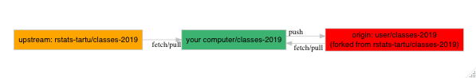

# Materials

## Introduce yourself to Github

If you working from Rstudio (Cloud), since this might be your first communication attempt with Github, please update your email address and your name and enter these two lines to terminal: 

```
git config --global user.email "your@email"  
git config --global user.name "Your Name"
```

## Add rstats-tartu/classes-2019 repo to your local repo as 'upstream'

After you have forked rstats-tartu/classes-2019 to your own GH account, you can set rstats-tartu/classes-2019 as an upstream remote repo from where you can pull updates to your computer (local).

```
git remote add upstream https://github.com/rstats-tartu/classes-2019.git
```



## Update your repo from upstream

```
git pull upstream master
```

## Data visualisation using ggplot2
Why visualisation matters slides: https://taltech19-visualisation-matters.netlify.com/#1

1. components and layers of ggplot plot, scatterplots, aesthetics: color, size, shape.

2. facetting, combining different types of geoms, plotting statistical summaries.

## Tidy-data
You will learn how to read plain-text rectangular files and excel into R.

After import, you might need to wrangle your dataset into tidy format.
There are three interrelated rules which make a dataset tidy:

- Each variable must have its own column.
- Each observation must have its own row.
- Each value must have its own cell.

# Data transformation using dplyr (aka five verbs)
You need to transform your data during analysis, because in real life you rarely start with a dataset that is in the right form for visualization and modeling. 

So, often you will need to:

- summarise your data or to 
- create new variables, 
- rename variables, or 
- reorder the observations. 

We are going to use the dplyr library from tidyverse to learn how to carry out these tasks. 

## Sources
Again, we are follow closely R4DS book, chapter "Data transformation", available from http://r4ds.had.co.nz/transform.html. More examples from https://rstats-tartu.github.io/lectures/tidyverse.html#dplyr-ja-selle-viis-verbi

## Datasets
### Hip-fractures dataset
Please read [hf-data/README.md](hf-data/README.md).

### Virus datasets

`viruses.csv` virus genome summary dataset was downloaded from NCBI ftp site ftp://ftp.ncbi.nlm.nih.gov/genomes/GENOME_REPORTS/viruses.txt and cleaned up with `R/download_virus_genomes_info.R` script.   

```
> viruses
# A tibble: 28,740 x 15
   organism_name tax_id bioproject_acce~ bioproject_id group subgroup size_kb    gc host 
   <chr>          <int> <chr>                    <int> <chr> <chr>      <dbl> <dbl> <chr>
 1 Escherichia ~ 1.44e6 PRJNA485481             485481 dsDN~ Podovir~   76.2   42.4 bact~
 2 Enterovirus J 1.33e6 PRJNA485481             485481 ssRN~ Picorna~    7.35  45.3 vert~
 3 Bacilladnavi~ 2.27e6 PRJNA393166             393166 ssDN~ Bacilla~    5.27  45.9 diat~
 4 Invertebrate~ 1.30e6 PRJNA485481             485481 dsDN~ Iridovi~  205.    30.3 inve~
 5 Invertebrate~ 3.46e5 PRJNA485481             485481 dsDN~ Iridovi~  199.    28.1 inve~
 6 Bacillus pha~ 1.41e6 PRJNA485481             485481 dsDN~ Siphovi~   80.4   35.2 bact~
 7 Salmonella p~ 1.41e6 PRJNA485481             485481 dsDN~ Ackerma~  155.    45.6 bact~
 8 Brevibacillu~ 1.30e6 PRJNA485481             485481 dsDN~ Myoviri~   45.8   39.1 bact~
 9 Mycobacteriu~ 1.08e6 PRJNA485481             485481 dsDN~ Siphovi~   59.7   66.6 bact~
10 Mycobacteriu~ 1.07e6 PRJNA485481             485481 dsDN~ Siphovi~   57.4   61.4 bact~
# ... with 28,730 more rows, and 6 more variables: segments <chr>, genes <chr>, proteins <chr>,
#   release_date <date>, modify_date <date>, status <chr>
```

`virus_genome_tables.csv` is cleaned up virus and host database from https://www.genome.jp/viptree.    

```
> genome_tables
# A tibble: 9,274 x 13
   ID     taxid  taxid2  length name     nuctype Htaxid Hname    Vfamily Hgroup  hosttype seq_ids order
   <chr>  <chr>  <chr>   <chr>  <chr>    <chr>   <chr>  <chr>    <chr>   <chr>   <chr>    <chr>   <chr>
 1 KF981~ 14533~ 145333~ 95702  Mycobac~ dsDNA   1762   -        Siphov~ -       Prokary~ KF9818~ 1    
 2 NC_02~ 13279~ 132795~ 95705  Mycobac~ dsDNA   1762   -        Siphov~ -       Prokary~ NC_023~ 2    
 3 NC_00~ 173824 173824~ 31007  Methano~ dsDNA   145261 Methano~ Siphov~ Euryar~ Prokary~ NC_002~ 3    
 4 NC_00~ 77048  77048-1 26111  Methano~ dsDNA   2159   -        Siphov~ -       Prokary~ NC_001~ 4    
 5 NC_03~ 16472~ 164728~ 83324  Gordoni~ dsDNA   410332 Gordoni~ Siphov~ Actino~ Prokary~ NC_030~ 5    
 6 NC_02~ 15669~ 156699~ 71200  Arthrob~ dsDNA   1667   Arthrob~ Myovir~ Actino~ Prokary~ NC_026~ 6    
 7 NC_03~ 17969~ 179699~ 51290  Arthrob~ dsDNA   17719~ Arthrob~ Myovir~ Actino~ Prokary~ NC_031~ 7    
 8 NC_01~ 11832~ 118323~ 43788  Salisae~ dsDNA   10897~ Salisae~ -       Bacter~ Prokary~ NC_017~ 8    
 9 NC_01~ 491893 491893~ 34952  Abalone~ dsDNA   37770  Halioti~ -       Mollus~ Eukaryo~ NC_011~ 9    
10 NC_03~ 18159~ 181596~ 103445 Salmone~ dsDNA   286783 Salmone~ Myovir~ Gammap~ Prokary~ NC_031~ 10   
# ... with 9,264 more rows
```


`virushostdb.tsv` is the original source for the `virus_genome_tables.csv` data, downloaded from ftp://ftp.genome.jp.   


`virus_genome_tables.csv` and `virushostdb.tsv` were generated with `R/download_virus_genome_tables.R` script.


