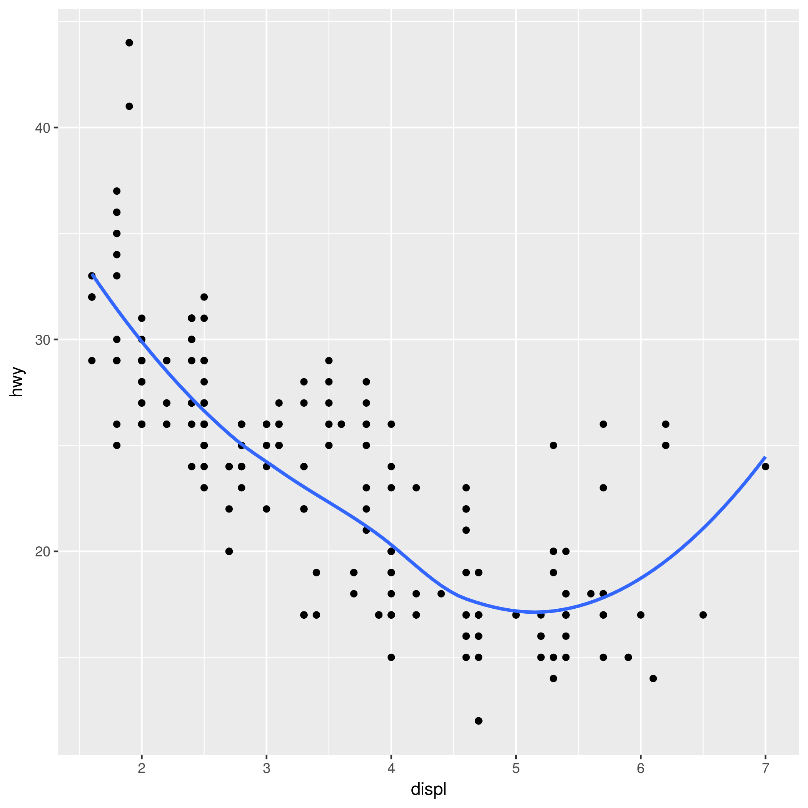
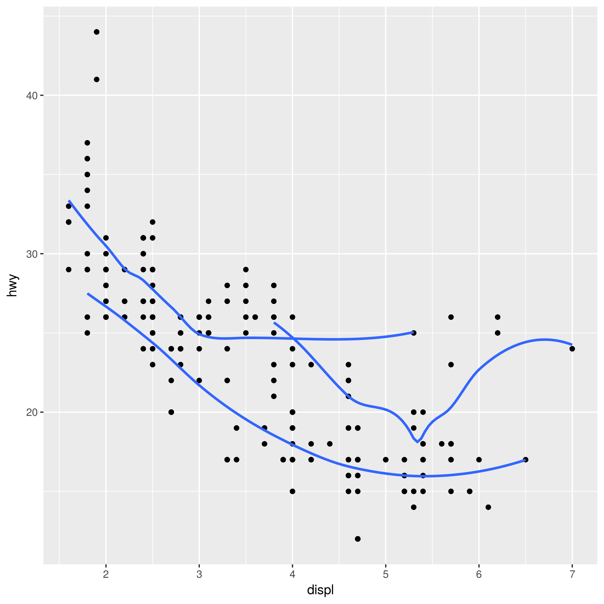
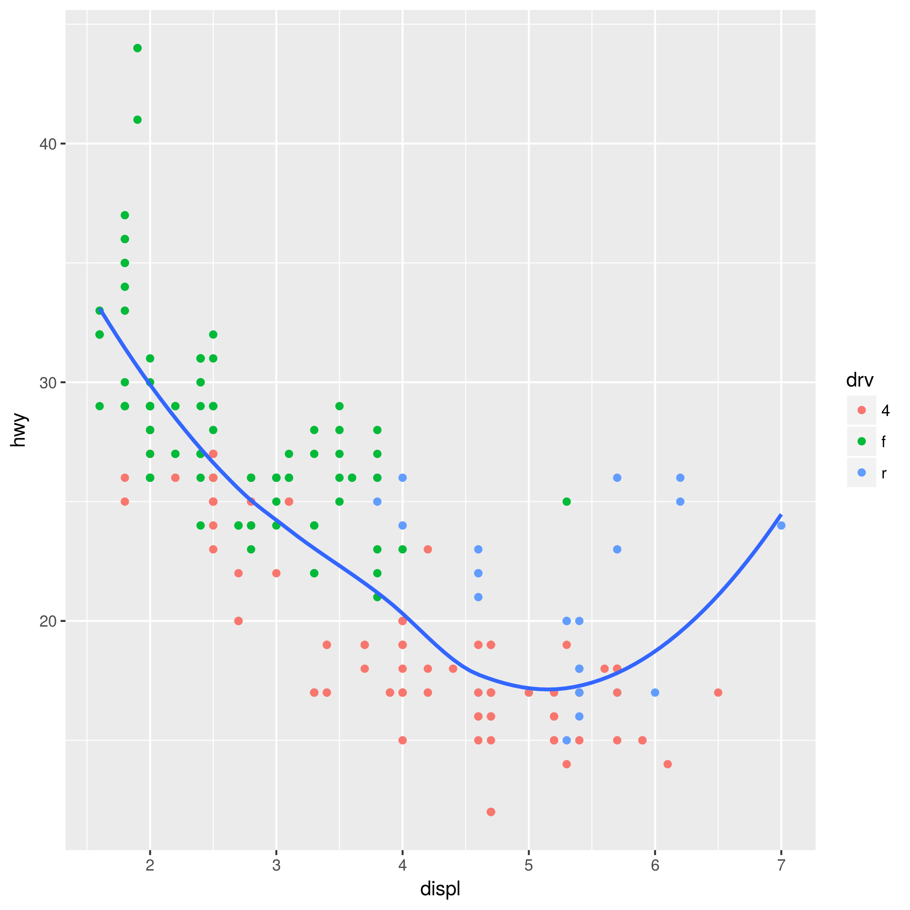
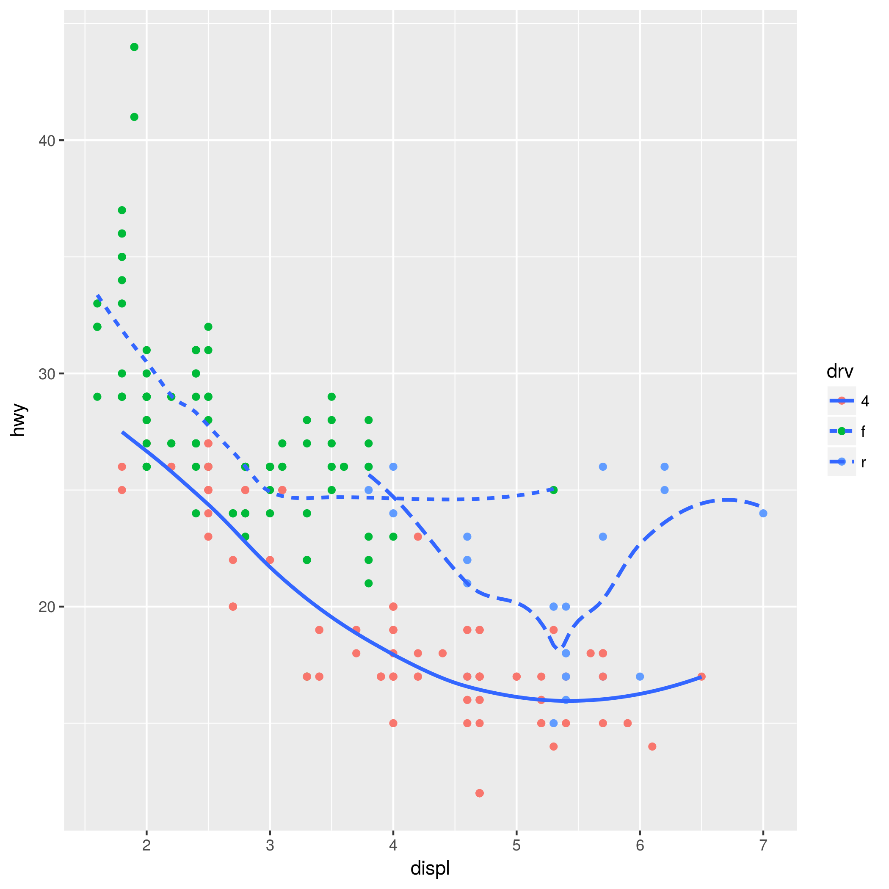
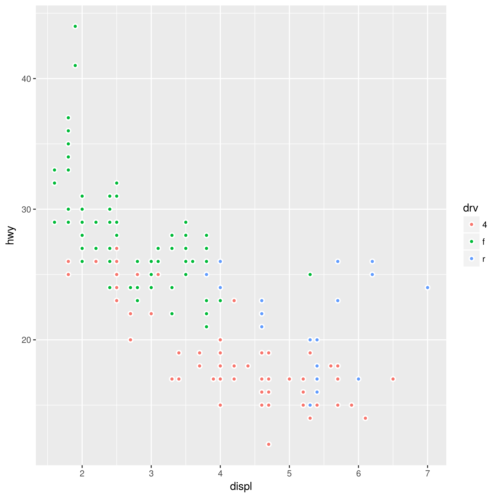
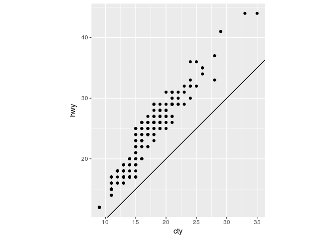
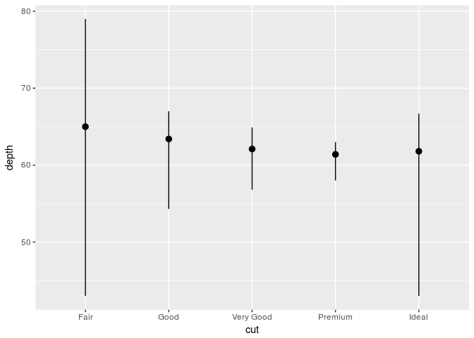

Untitled
================
Taavi Päll
26 3 2018

``` r
library(tidyverse)
```

    ## ── Attaching packages ────────────────────────────────────── tidyverse 1.2.1 ──

    ## ✔ ggplot2 2.2.1     ✔ purrr   0.2.4
    ## ✔ tibble  1.4.2     ✔ dplyr   0.7.4
    ## ✔ tidyr   0.8.0     ✔ stringr 1.3.0
    ## ✔ readr   1.1.1     ✔ forcats 0.3.0

    ## ── Conflicts ───────────────────────────────────────── tidyverse_conflicts() ──
    ## ✖ dplyr::filter() masks stats::filter()
    ## ✖ dplyr::lag()    masks stats::lag()

1.  Take the first faceted plot in this section:

``` r
ggplot(data = mpg) + 
  geom_point(mapping = aes(x = displ, y = hwy)) + 
  facet_wrap(~ class, nrow = 2)
```


What are the advantages to using faceting instead of the colour aesthetic? What are the disadvantages? How might the balance change if you had a larger dataset?

1.  Recreate the R code necessary to generate the following graphs.

``` r
knitr::include_graphics(glue::glue("plots/fig{1:6}.png"))
```



1.  Most geoms and stats come in pairs that are almost always used in concert. Read through the documentation and make a list of all the pairs. What do they have in common?

2.  Compare and contrast geom\_jitter() with geom\_count().

3.  What does the plot below tell you about the relationship between city and highway mpg (fuel consumption)? Why is coord\_fixed() important? What does geom\_abline() do?

``` r
ggplot(data = mpg, mapping = aes(x = cty, y = hwy)) +
  geom_point() + 
  geom_abline() +
  coord_fixed()
```



1.  What is the default geom associated with stat\_summary()?

``` r
ggplot(data = diamonds) + 
  stat_summary(
    mapping = aes(x = cut, y = depth),
    fun.ymin = min,
    fun.ymax = max,
    fun.y = median
  )
```

 How could you rewrite the previous plot to use that geom function instead of the stat function?

1.  What does geom\_col() do? How is it different to geom\_bar()?

2.  What variables does stat\_smooth() compute? What parameters control its behaviour?

3.  In our proportion bar chart, we need to set group = 1. Why? In other words what is the problem with these two graphs?

``` r
ggplot(data = diamonds) + 
  geom_bar(mapping = aes(x = cut, y = ..prop..))
```


``` r
ggplot(data = diamonds) + 
  geom_bar(mapping = aes(x = cut, fill = color, y = ..prop..))
```


